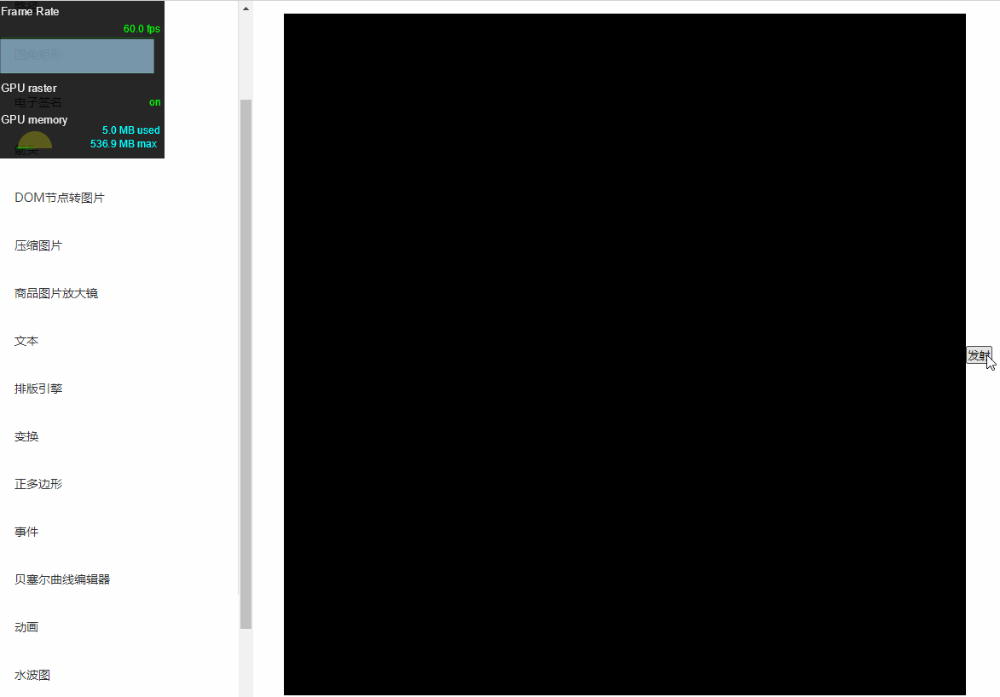

我们都知道在页面中如果DOM节点的数量非常多会造成页面的卡顿，实际上在`canvas`中当你绘制的图形数量足够多时也是很容易出现卡顿的情况的，尤其是在动画的场景中，在上一个实战案例【放一个烟花】中当碎片的数量比较多时很明显会出现卡顿掉帧的情况：



可以看到在烟花绽放前帧率是稳定在`60`左右的，但是当后面多个烟花同时绽放时帧率直线下降，最低都已经降到了`40`多，已经是肉眼可见的卡顿了，实际上我们同一时间存在的图形数量也不过万级，按理说，这个数量级远谈不上庞大，如果连这么点数量的图形渲染都如此卡顿，那么`canvas`还有什么大用处呢，所以问题肯定出在了我们自己这里。

出现了问题不可怕，想办法解决它就可以了，实际上`canvas`的性能优化是存在一些常见方法的，接下来简单了解一下。

# 使用requestAnimationFrame不要使用定时器

# 对象池

对象池维护一个装着空闲对象的池子，如果需要对象的时候，不是直接new，而是从对象池中取出，如果对象池中没有空闲对象，则新建一个空闲对象。

减少内存的使用。每次创建一个对象，都需要分配一点内存，而由于浏览器的回收机制，导致会有大量无用的对象的累加，白白消耗大量的内存。

# 避免浮点运算

canvas都是像素拆分都是整数，浏览器会为了抗锯齿对浮点数进行额外的运算，使用整数可以减少开销。

# 画布外的不绘制

# 分层绘制

clip裁剪绘制一部分，，不变的东西单独canvas绘制

# 局部绘制

# 减少绘制指令的调用

看了下fps 已经成功升到了30fps, 这是为什么呢， 第一段我们在循环中去做绘图操作， 循环一次， stoke() 一次，这显然是不合理的，第二个直接把stoke（） ，放到循环外，其实就调用了一次，所以我们可以得出减少绘图指令是可以提高**canvas的性能的**

# 使用缓存

drawImage 

- 如果绘制图形状态（形状、颜色）非常多，需要创建大量离屏canvas，对内存消耗很大，反而降低了性能
- 只适用于**图形状态本身不变**的图形元素，状态经常发生改变的图形，缓存必须一直更新，反而因为增加了一条drawImage而产生了更大开销
- fillText渲染文字、绘制一个图形有较大缩放时，直接绘制的时矢量图，通过缓存drawImage的时位图，清晰度不是很好

1. 分层渲染：将不变元素与变化元素进行分层处理


# 合理选择绘制API

canvas 绘制圆（arc）相比绘制矩形（rect）会消耗更多的性能，arc 每次绘制都要开启、闭合路径，而 rect 则直接绘制。在图形体积较小时，圆和矩形的视觉差距不大，可以使用性能更好的rec替换。

1. 在每一帧中，尽可能减少调用渲染相关 API 的次数（通常是以计算的复杂化为代价的）。
2. 在每一帧中，尽可能调用那些渲染开销较低的 API。
3. 在每一帧中，尽可能以「导致渲染开销较低」的方式调用渲染相关 API。

将渲染阶段的开销转嫁到计算阶段之上。

使用多个分层的 Canvas 绘制复杂场景。

不要频繁设置绘图上下文的 font 属性。

不在动画中使用 putImageData 方法。

通过计算和判断，避免无谓的绘制操作。

将固定的内容预先绘制在离屏 Canvas 上以提高性能。

使用 Worker 和拆分任务的方法避免复杂算法阻塞动画运行。

只要没有，fill和stroke等绘制操作，都很快，并且少改变canvas的状态，性能可以显著提升，一般对于大数据量，采用合并绘制


使用 **OffscreenCanvas API** 将离屏 Canvas 完整地运行在 worker 线程，有效减少主线程的性能开销。

采用离屏canvas + webworker 来解决这种失去响应。

通过transferToImageBitmap函数可以从OffscreenCanvas对象的绘制内容创建一个ImageBitmap对象。该对象可以用于到其他canvas的绘制。

，一个离屏可能也会造成画面卡顿的其情况，这时候，我们就可以把离屏规划给小对象，让每个对象都拥有一个自己的绘制环境


canvas绘制圆（arc）相比绘制矩形（rect）会消耗更多的性能，arc 每次绘制都要开启、闭合路径，而 rect 则直接绘制。

当粒子数量过多时会有明显的**性能差异**，且在较小比例的情况下圆和矩形视觉上是类似的，所以可以用fillRect(...) 替换 arc(...)。


# Worker


# 烟花效果优化

前面讲了那么多优化方式，不实战永远都是纸上谈兵，所以现在我们

就来使用前面所学知识来尝试对烟花实战的效果进行优化，看看能不能把它的`fps`提升到正常的`60`。

## 避免使用浮点数

因为我们的位置生成及计算都可能会生成小数，所以统一把它们改为整数：

```js
// 发射器类
class Launcher {
    constructor(opt = {}) {
        // 初始位置
        this.x = Math.floor(opt.x || canvasWidth * getRandom(0.2, 0.8))
        this.y = Math.floor(opt.y || 0)
        // 目标位置
        this.ty = Math.floor(canvasHeight * getRandom(0.6, 0.8))
    }
    
    update() {
        let y = easingFunctions.easeOutCubic(
            Date.now() - this.startTime,
            this.y,
            this.ty - this.y,
            this.duration
        )
        y = Math.floor(y)
        y = Math.min(y, this.ty)
        // ...
    }
}
```

这里以发射器类为例，其他几个类的处理也是类似，把所有可以改成整数的地方都改为整数。

将*globalAlpha*改为通过rgba颜色值


多次绘制操做进行合并，通过缓存canvas


通过任务队列，每次刷新时只取出其中部分的任务