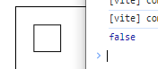
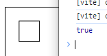
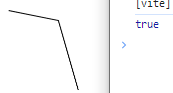
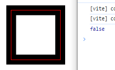
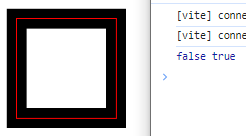
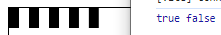
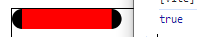
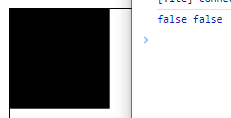
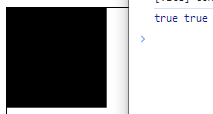

# 事件

到目前为止，我们所做的事情都还只是在`canvas`上绘制图形，并不能和已绘制的图形产生任何的交互，比如我们想点击了某个图形时改变它的颜色，或者想拖拽移动某个图形的位置，要做到这些，首先要能知道我们的鼠标有没有点击到了图形，在`HTML`中要做到这个很简单，给元素绑定鼠标事件就可以了，但是对于`canvas`来说，你可以给`canvas`元素绑定事件，但是无法给任何`canvas`上绘制的图形绑定，因为图形一旦绘制上去了那就是一张图片，你点击一张图片当然不知道是否点击到了其中的某个图形。

对于一些规则的图形，比如矩形、圆，我们可以手动进行计算，但是假如它放大了或者旋转了呢？更别提其他不规则的图形，所以肯定需要有通用的方法解决这个问题。

这就需要用到`isPointInPath`和`isPointInStroke`两个方法。

## isPointInPath

`isPointInPath`方法可以判断在当前路径中是否包含检测点，更具体来说是路径所包含的区域，它的传参有几种形式：

```js
ctx.isPointInPath(x, y)
ctx.isPointInPath(x, y, fillRule)
```

`x`、`y`代表我们想检测的坐标点，`fillRule`是一个可选参数，用来指定判断的规则，默认为`nonzero`，即应用非零环绕规则，还有一个值为`evenodd`，代表奇偶环绕原则。

这个方法检测的是当前绘制的路径，如果绘制了多段路径，检测的就是最后一段：

```js
ctx.beginPath()
ctx.moveTo(20, 20)
ctx.lineTo(50, 20)
ctx.lineTo(50, 50)
ctx.lineTo(20, 50)
ctx.closePath()
ctx.stroke()
console.log(ctx.isPointInPath(25, 25))
```



奇怪，明明点`[25,25]`是在路径内部的啊，为什么返回的是`false`，这其实是因为我们一开始对画布进行了放大，但是`isPointInPath`方法是不考虑缩放的，假设放大了两倍，我们`moveTo(20, 20)`，实际上对于未放大的画布来说是`moveTo(40, 40)`，当然`isPointInPath(25, 25)`检测出来是`false`了，所以我们传递给`isPointInPath`方法的坐标都需要进行相应的放大：

```js
console.log(ctx.isPointInPath(25 * ratio, 25 * ratio))
```



方便起见，我们可以把它封装成一个函数：

```js
const isPointInPath = (x, y) => {
    return ctx.isPointInPath(x * ratio, y * ratio)
}
```

`isPointInPath`方法会自动帮我们闭合路径，所以即使我们绘制的是一段非闭合路径，也没有调用`closePath`方法，`isPointInPath`方法也是有效的：

```js
ctx.beginPath()
ctx.moveTo(100, 120)
ctx.lineTo(150, 130)
ctx.lineTo(170, 200)
ctx.stroke()
console.log(isPointInPath(140, 140))
```



不过最好还是对闭合路径使用`isPointInPath`方法。

接下来看一个描边线很粗的情况：

```js
ctx.save()
ctx.beginPath()
ctx.moveTo(100, 100)
ctx.lineTo(200, 100)
ctx.lineTo(200, 200)
ctx.lineTo(100, 200)
ctx.closePath()
ctx.lineWidth = 20
ctx.stroke()
console.log(isPointInPath(95, 95))
ctx.restore()

ctx.beginPath()
ctx.moveTo(100, 100)
ctx.lineTo(200, 100)
ctx.lineTo(200, 200)
ctx.lineTo(100, 200)
ctx.closePath()
ctx.strokeStyle = 'red'
ctx.stroke()
```



可以看到，`lineWidth`属性设置的线宽是沿着路径两端发散的，此时检测在路径外，但在描边线上的点时是检测不到的，那么怎么办，很简单，可以使用下面要介绍的`isPointInStroke`方法。

## isPointInStroke

`isPointInStroke`方法可以检测某个点是否在路径的描边线上：

```js
ctx.isPointInStroke(x, y)
```

和`isPointInPath`一样，它也不会考虑画布的缩放，所以也需要将检测的点手动进行缩放，那么也可以封装成一个函数：

```js
const isPointInStroke = (x, y) => {
    return ctx.isPointInStroke(x * ratio, y * ratio)
}
```

这个方法检测的是点是否在描边线上，所以跟线宽属性`lineWidth`是息息相关的，现在就可以解决前面`isPointInPath`无法检测在路径外但再路径描边线上的点的问题：

```js
console.log(isPointInPath(99, 99), isPointInStroke(99, 99))
```



实际场景中，比如我们要点击选中某一根线段，但是由于它本身很细很难被鼠标点击到，那么就可以绘制一根同样路径，但线宽更宽的路径来检测鼠标的点击事件。

接下来看一下虚线的情况：

```js
ctx.beginPath()
ctx.moveTo(0, 10)
ctx.lineTo(100, 10)
ctx.lineWidth = 20
ctx.setLineDash([10, 10])
ctx.stroke()
console.log(isPointInStroke(5, 10), isPointInStroke(15, 10))
```



可以看到在虚线的实线段上的点是可以检测到的，在间隙上的点是检测不到的，但是对于实际需求来说，即使点的是间隙我们也会认为是点击到了线段，那么可以跟前面说的一样，创建一根同样路径大小的实线路径来检测鼠标点击事件。

最后来看看`lineCap`属性：

```js
ctx.save()
ctx.beginPath()
ctx.moveTo(10, 10)
ctx.lineTo(100, 10)
ctx.lineCap = 'round'
ctx.lineWidth = 20
ctx.stroke()
console.log(isPointInStroke(5, 10))
ctx.restore()

ctx.beginPath()
ctx.moveTo(10, 10)
ctx.lineTo(100, 10)
ctx.lineWidth = 20
ctx.strokeStyle = 'red'
ctx.stroke()
```



可以看到通过`lineCap`属性延伸出来的一段描边线上的点是可以被检测到的。

## 其他图形的检测

前面了解了如何通过`isPointInPath`和`isPointInStroke`方法检测一个点是否在路径内和路径上，接下来我们来看看一些其他`canvas`绘制的图形如何检测。

### fillRect方法

因为`fillRect`方法是直接在画布上绘制一个填充矩形，并不改变当前路径，所以也不会创建路径，那么自然就无法通过前面的方法来检测了：

```js
ctx.fillRect(0, 0, 100, 100)
console.log(isPointInPath(50, 50), isPointInStroke(0, 0))
```



此时可以自己根据鼠标的位置和矩形的位置大小来计算，也可以避免使用`fillRect`方法来创建矩形，统一使用路径的方式。

### 文字

绘制文字有两个方法：`fillText`和`strokeText`，这两个方法和`fillRect`方法一样都是直接在画布上绘制图形，不会创建和改变当前路径，所以也是无法使用前面的方法检测的，如果要实现文字检测需求，可以计算出文字的位置和大小，然后绘制一个矩形路径矩形检测。

### 图像

绘制图像的`drawImage`方法依旧不会创建路径，所以也无法被检测到，解决方式也是一样的，自己计算或者创建一段和图像位置大小一样的矩形路径来检测。

## Path2D

`Path2D`之前的章节已经简单介绍过了，它是新出来的特性，如果你的项目支持的浏览器支持`Path2D`的话可以直接通过它来创建可复用的路径。

如果不用`Path2D`，我们绘制了一个图形，然后再要进行检测，需要再把这个图形的路径绘制一遍，属实是比较麻烦，如果你绘制图形使用的是`Path2D`，那么就可以直接将这个路径传递给`isPointInPath`和`isPointInStroke`方法进行检测：

```js
ctx.isPointInPath(path, x, y)
ctx.isPointInStroke(path, x, y)
```

```js
const path = new Path2D()
path.moveTo(0, 0)
path.lineTo(100, 0)
path.lineTo(100, 100)
path.lineTo(0, 100)
path.closePath()

ctx.fill(path)
console.log(isPointInPath(10, 10, path), isPointInStroke(0, 0, path))
```



是不是方便了很多。

## 总结

本节我们了解了如何检测一个点是否在某个图形内，下一节我们就来做个简单的实战案例来巩固一下。

本节示例地址：[event](https://wanglin2.github.io/canvas-demos/#/event)。