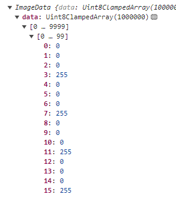
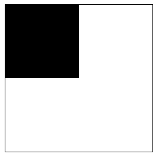
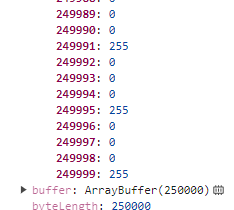
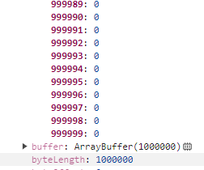
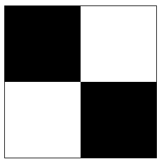
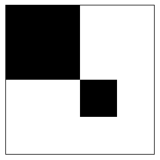
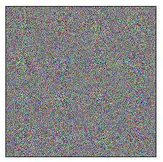

# 像素操作

`Canvas`给了我们操作像素的能力，我们可以获取到画布的所有像素数据，也可以向画布写入像素数据。

## 获取像素数据

要获取画布上的像素数据可以通过`getImageData`方法，这个方法可以获取画布上一块矩形区域的像素，接收四个参数，都是必填的：

- `sx`：矩形区域的左上角的`x`坐标；

- `sy`：矩形区域的左上角的`y`坐标；

- `sw`：矩形区域的宽度；

- `sh`：矩形区域的高度；

如果要获取整个画布的像素，那么`sx,sy`传为`0`，`sw,sh`传画布的宽高即可：

```js
ctx.getImageData(0, 0, width, height)
```

这个方法返回的是一个`ImageData`对象，存在几个属性：

- `data`：一个数组，存储着像素点的数据；

- `width`：像素区域的宽度；

- `height`：像素区域的高度；

`data`是一个一维数组，依次存储着矩形区域从左到右，从上到下每一个像素点的`rgba`数值：



以上是填充了黑色的画布的像素数据，所以数组中的四项代表一个像素点，不过和我们平常使用的颜色还是有一点不同，透明度`a`不是`0-1`，而是`0-255`。

要获取指定位置`[x, y]`的像素数据可以通过下面这个公式：

```js
const index = y * width * 4 + x * 4
const r = data[index]
const g = data[index + 1]
const b = data[index + 2]
const a = data[index + 3]
```

现在来思考一个问题，为了解决画布的清晰度问题，我们的画布`css`大小和实际大小是不一致的，比如`css`设置的大小是`250`，但是画布的大小设置的是`500`，然后通过放大画布坐标系两倍来实现正常绘图，那么此时我们想获取画布的全部像素数据，是传`css`大小，还是画布大小呢，来看一个例子：

```js
ctx.fillStyle = '#000'
ctx.fillRect(0, 0, 125, 125)

console.log(ctx.getImageData(0, 0, 250, 250))
```



绘制了一个画布四分之一大小的黑色的矩形，我们传入`css`大小获取到的像素数据如下：



可以看到最后一个像素点是`0,0,0,255`，代表黑色，但是实际上空白画布的像素点都是`0,0,0,0`，所以这就说明我们传入的`css`大小获取到的并不是完整的画布像素，改成传入画布大小试试：

```js
console.log(ctx.getImageData(0, 0, 500, 500))
```



可以看到此时获取到的是准确的，通过这个小例子我们会发现`getImageData`方法是不受画布的变换影响的，所以参数需要以画布实际的像素大小为准。

同时要考虑两种大小很容易搞乱，所以我们也可以像之前的章节中对`isPointInPath`方法的处理一样封装一下：

```js
const getImageData = (sx, sy, sw, sh) => {
    return ctx.getImageData(sx * ratio, sy * ratio, sw * ratio, sh * ratio)
}
```

这样就和我们绘图的大小一致了。

## 写入像素数据

可以获取画布像素，当然也可以重新写入像素，这意味着我们可以把画布的像素数据取出来处理一下，然后又还给画布，或者把其他画布的内容写入到该画布。

要写入像素数据可以使用`putImageData`方法，有两种传参方式：

1.三个参数

前三个参数为必传参数：

- `imagedata`：像素数据；
- `dx`：要写入到画布指定的`x`位置；
- `dy`：要写入到画布指定的`y`位置；

```js
const putImageData = (imageData, dx, dy) => {
    ctx.putImageData(imageData, dx * ratio, dy * ratio)
}

ctx.fillStyle = '#000'
ctx.fillRect(0, 0, 125, 125)

const imageData = getImageData(0, 0, 125, 125)
putImageData(imageData, 125, 125)
```



这个例子里我们把左上角的四分之一矩形复制一份渲染到了右下角。

2.七个参数

剩余四个可选参数用于指定要从源像素数据中取出指定矩形区域的像素，参数如下：

- `ox`：指定矩形区域的左上角的`x`坐标；
- `oy`：指定矩形区域的左上角的`y`坐标；
- `ow`：指定矩形区域的宽度；
- `oh`：指定矩形区域的高度；

```js
const putImageData = (imageData, dx, dy, ox = 0, oy = 0, ow, oh) => {
    ow = ow === undefined ? imageData.width : ow * ratio
    oh = oh === undefined ? imageData.height : oh * ratio
    ctx.putImageData(
        imageData,
        dx * ratio,
        dy * ratio,
        ox * ratio,
        oy * ratio,
        ow,
        oh
    )
}

const imageData = getImageData(0, 0, 125, 125)
putImageData(imageData, 125, 125, 0, 0, 125 / 2, 125 / 2)
```



这个例子中我们只取出了左上角四分之一矩形的四分之一进行渲染。

## 创建像素数据

除了从画布中获取像素数据，当然我们也可以直接创建像素数据，可以使用`createImageData`方法：

```js
const imageData = ctx.createImageData(width, height)
```

指定要创建的宽高，会返回`imageData`对象，这样创建的是全部填充了透明色的像素。

我们可以自己设置像素数据，下面这个例子会随机填充每个像素的颜色值：

```js
const imageData = createImageData(250, 250)
for (let i = 0; i < imageData.data.length; i += 4) {
    imageData.data[i] = getRandom(0, 255)
    imageData.data[i + 1] = getRandom(0, 255)
    imageData.data[i + 2] = getRandom(0, 255)
    imageData.data[i + 3] = 255
}
putImageData(imageData, 0 , 0)

const createImageData = (w, h) => {
    return ctx.createImageData(w * ratio, h * ratio)
}

const getRandom = (min, max) => {
    return Math.floor(Math.random() * (max - min) + min)
}
```

遍历像素点可以用`for`循环，因为一个像素点包含四个通道的值，所以每次迭代`i+4`。



看，得到了一个电视机的雪花屏。

## 总结

本节我们学习了在`Canvas`中操作像素的方法，虽然方法都非常简单，但是这个能力却是非常重要的，可以实现一些非常有趣的效果、常用的功能。

本节示例地址：[filter](https://wanglin2.github.io/canvas-demos/#/filter)。