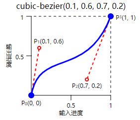

# 动画

到现在我们已经知道了如何在`canvas`上绘制我们想要的图形，也能通过鼠标事件来和图形产生一些交互，现在是时候让它自己动起来了。

动画片大家都看过，本质上就是快速的播放一张张图片，在`canvas`中要实现动画效果，同样也是这个原理，当我们把图形绘制到`canvas`上，它就变成了一张图片，不会再改变，我们可以修改图形的位置和样式属性，然后把画布清空，再重新绘制，就得到了一张新的图片，我们可以不断的重复这个过程，快速的擦除重绘就得到了动画的效果。

## 定时重绘

要定时执行重绘代码，最简单的方法就是使用`setInterval`和`setTimeout`定时器，我们只要指定一个时间间隔，浏览器就会每隔一段时间执行一次我们的代码，这个时间需要我们自己来设置，按照一般显示器`60Hz`的刷新频率来说，也就是每秒重绘60次，那么间隔时间需要设置为`1000 / 60 = 16ms` ，但是对于刷新频率更高的显示器来说这个频率就不够了，会导致动画不流畅。你可以通过下面这个代码来简单的查看当前的刷新频率：

```js
let lastTime = Date.now()
const draw = () => {
    const curTime = Date.now()
    console.log('fps：', 1000 / (curTime - lastTime))
    lastTime = curTime
    window.requestAnimationFrame(draw)
}
window.requestAnimationFrame(draw)
```

当然，`chrome`浏览器也自带了查看帧率的工具：


按照图上的路径打开就可以在当前页面上看到一个帧率显示器了：


另外`setInterval`和`setTimeout`不会考虑页面当前正在做什么，即使正在执行一些比较耗时的任务，它也会在间隔时间到了把回调函数放到执行队列里执行，这也会导致动画不流畅。

最后，即使页面处于非活动状态，这两个定时器依旧会继续执行，不仅浪费资源，而且很容易导致动画出现异常。

所以最好的选择是使用`requestAnimationFrame`方法，这个方法是专门用于动画的，相当于我们用这个方法告诉浏览器，我们正在执行一个动画，请在下一次重绘之前调用我的回调函数更新动画，一般情况下，函数执行次数会和屏幕刷新次数一致，当然浏览器也会根据当前的情况来调整，尽量保证我们动画的平缓和流畅。如果页面处于非活动状态，浏览器也会自动暂停调用我们的回调函数。

接下来简单尝试一下，让一个矩形动起来。

```js
let left = 0
const draw = () => {
    ctx.clearRect(0, 0, canvasWidth, canvasHeight)
    ctx.fillRect(left, 100, 20, 20)
    left += 2
    window.requestAnimationFrame(draw)
}
draw()
```

不断的改变矩形的`x`坐标，然后清空画布重绘就行了：


动图里看着比较卡顿，实际上是非常流畅的。

这里介绍一个有趣的特性，我们可以通过`fillRect`来代替`clearRect`清空画布，`fillRect`是绘制矩形的方法，不过我们可以把填充颜色设置成半透明的，这样就会形成【长尾效果】：

```js
const draw = () => {
    ctx.save()
    ctx.fillStyle = 'rgba(255,255,255,0.3)'
    ctx.fillRect(0, 0, canvasWidth, canvasHeight)
    ctx.restore()
    ctx.fillRect(left, 100, 20, 20)
    left += 2
    window.requestAnimationFrame(draw)
}
```

通过一个半透明的颜色来填充画布这样不断叠加，越早绘制图形的地方就会慢慢看不见，形成了一个渐变：


可以利用这个特性做出很多有趣的效果。

上面我们是在每一帧里修改动画属性，意味着动画是基于帧的，那么速度的单位就是`px/帧`，这样的动画是不够精确的，比如我和你在同一个游戏动画里，我的浏览器刷新频率比你高就比你走的快，显然是不合理的，更准确的动画应该是基于时间的，速度单位为`px/时间`，比如`10px/s`，代表无论刷新频率是多少，每秒都走`10`像素，接下来我们把上面的动画修改为基于时间的：

```js
let left = 0
let lastTime = Date.now()
const v = 100 // 100px/s
const draw = () => {
    ctx.clearRect(0, 0, canvasWidth, canvasHeight)
    ctx.fillRect(left, 100, 20, 20)
    const curTime = Date.now()
    left += ((curTime - lastTime) / 1000) * v
    lastTime = curTime
    window.requestAnimationFrame(draw)
}
draw()
```

假设速度为`100px/s`，然后通过一个变量记录上一帧的时间，这样就能计算出上一帧到这一帧经过的时间，这样获取到的是毫秒数，所以需要除以`1000`得到秒，再乘以速度就得到了这次时间间隔动画的距离。这样动画就变得可预测了，即使浏览器突然卡住了，等到恢复了动画依旧会到它原本应该到的位置，因为时间是继续在流动的。

另外对于我们这个动画，前面基于帧的动画你很难知道矩形什么时候会移出画布，但是基于时间就很容易，画布宽度为`250`，速度为`100px/s`，那么`250/100=2.5s`后矩形就会移出：


所以在对动画精确度要求比较高的地方你都应该使用基于时间的动画。

## 变速运动

前面我们实现的是匀速运动，也就是随着时间的变化，物体运动的速度是不变的，在大自然中更常见的其实是变速运动，也就是速度会随着时间改变，速度的改变量用加速度来描述，即速度变化量与发生这一变化所用时间的比值，在现实生活中，单位是`米/平方秒`，在网页里我们可以使用`像素/平方秒`。

变速运动分为两种，一是匀变速运动，二是变加速运动。

### 匀变速运动

匀变速运动是速度均匀变化的运动，也就是加速度不变，它的公式如下：

```
v = v0 + a * t
```

`v0`代表初始速度，`a`代表加速度，`t`代表经过的时间。

```js
let left = 0
let startTime = Date.now()
let lastTime = Date.now()
let a = 1 // 1px/s2
const draw = () => {
    ctx.clearRect(0, 0, canvasWidth, canvasHeight)
    ctx.fillRect(left, 100, 20, 20)
    const curTime = Date.now()
    const v = 0 + a * (curTime - startTime)
    left += ((curTime - lastTime) / 1000) * v
    lastTime = curTime
    window.requestAnimationFrame(draw)
}
draw()
```

在这个示例中，我们指定加速度为`1px/平方秒`，然后初始速度设置为`0`，这样就能计算出某一时刻的速度：


### 变加速运动

变加速运动就是加速度也会随着时间变化的运动，加速度是矢量，既有大小又有方向，所以只要其中之一改变了就代表是变加速运动。

```js
let left = 0
let startTime = Date.now()
let lastTime = Date.now()
let a = 3
const draw = () => {
    ctx.clearRect(0, 0, canvasWidth, canvasHeight)
    ctx.fillRect(left, 100, 20, 20)
    const curTime = Date.now()
    const v = 0 + a * (curTime - startTime)
    left += ((curTime - lastTime) / 1000) * v
    lastTime = curTime
    a -= 0.1// 加速度改变
    window.requestAnimationFrame(draw)
}
draw()
```

这个示例里我们让加速度不断减小：


可以看到矩形速度从快到慢，然后当加速度小于0就开始反向运动了。

## 缓动函数

除了我们自己修改动画的速度实现变速运动，也可以使用缓动函数。所谓缓动函数，也就是可以自定义进度随时间变化的速率，也叫时间曲线函数，本质上是数学公式，上一个实战案例【实现一个贝塞尔曲线编辑器】中给元素的`transition-timing-function`属性设置的就是时间曲线函数。

缓动函数一般接收四个参数：

```
t: 动画开始以来经过的时间
b: 动画的起点
c: 从起点到终点的差值
d: 完成动画所需的时间
```

然后返回当前时间对应的动画进度值。

所以一般我们会定义一个动画的起点和距离，以及动画的时间，让我们修改前面的动画示例：

```js
let start = 0// 动画开始的位置
let offset = 230// 动画的距离
let target = start + offset// 动画的结束位置
let startTime = Date.now()// 动画开始的时间
let duration = 1000// 动画的持续时间
const draw = () => {
    // ...
    // 时间进度
    const process = (Date.now() - startTime) / duration
    // 位置进度
    let x = start + offset * process
    x = Math.min(target, x)
    ctx.fillRect(x, 100, 20, 20)
    if (x >= target) return
    window.requestAnimationFrame(draw)
}
draw()
```

定义了动画开始的位置、动画的距离以及动画的持续时间，然后根据动画进行中的耗时除以总的持续时间计算出当前的时间进度，这个时间进度和动画距离相乘就得到了当前时间点矩形应该到达的位置，同时为了防止动画超出设定的距离，也根据当前的动画进度和动画的目标值进行判断是否结束动画：


现在再让我们把它改写成时间曲线函数：

```js
const linear = (t, b, c, d) => {
    return c * t / d + b
}
```

然后就可以这么使用：

```js
const draw = () => {
	// ...
    let x = linear(Date.now() - startTime, start, offset, duration)
    x = Math.min(target, x)
    ctx.fillRect(x, 100, 20, 20)
    if (x >= target) return
    window.requestAnimationFrame(draw)
}
```

效果和前面是一样的。

除了线性，还有其他很多缓动函数，下面是几个常见的三次方缓动函数：

```js
// ease-in：慢速开始
const easeInCubic = (t, b, c, d) => {
    return c * (t /= d) * t * t + b
}

// ease-out：慢速结束
const easeOutCubic = (t, b, c, d) => {
    return c * ((t = t / d - 1) * t * t + 1) + b
}

// ease-in-out：慢速开始和结束
const easeInOutCubic = (t, b, c, d) => {
    if ((t /= d / 2) < 1) return c / 2 * t * t * t + b
    return c / 2 * ((t -= 2) * t * t + 2) + b
}
```

除了三次方，还有二次方、正弦曲线、指数曲线等等类型的，有兴趣可以搜索一下了解更多。

使用`easeInOutCubic`试试：

```js
const draw = () => {
	// ...
    const x = easeInOutCubic(Date.now() - startTime, start, offset, duration)
    // ...
}
```


前面只是定义了有限的缓动函数，在上一个实战案例【实现一个贝塞尔曲线编辑器】中可以给元素的`transition-timing-function`属性设置任意的三次贝塞尔曲线作为缓动函数，那么我们是不是也可以使用三次贝塞尔曲线作为缓动函数呢，答案是明显的，对于贝塞尔曲线来说`x`轴就是我们的时间进度，这个是已知的，`y`轴是动画进度，是我们想要的，那么只要能求出`x`坐标对应的曲线上这一点的`y`坐标就行了：



虽然三次贝塞尔曲线存在对应的数学公式：


但是这个公式中的`t`参数并不是`x`轴的坐标，而是曲线长度的比例值，范围在`[0, 1]`，比如`t=0.5`，代表该曲线长度`50%`的地方的点，所以想要实现根据`x`坐标来计算曲线的`y`坐标并不是一件简单的事情，好在开源社区已经给我们提供了解决方案[bezier-easing](https://github.com/gre/bezier-easing)，这个库提供了一个等价于`CSS`中`cubic-bezier`的函数，通过它我们就可以直接使用三次贝塞尔曲线来作为缓动函数了：

```js
import BezierEasing from 'bezier-easing'

let start = 0
let offset = 230
let target = start + offset
let startTime = Date.now()
let duration = 1000
let easing = BezierEasing(.47,1.7,.72,-0.68)// 指定控制点
const draw = () => {
    ctx.clearRect(0, 0, canvasWidth, canvasHeight)
    const process = easing(Math.min((Date.now() - startTime) / duration, 1))// 根据时间进度获取动画进度
    let x = process * offset + start
    x = Math.min(target, x2)
    ctx.fillRect(x, 100, 20, 20)
    if (x >= target) {
        return
    }
    window.requestAnimationFrame(draw)
}
draw()
```


## 总结

本节我们了解如何在`canvas`中实现动画，也了解了如何使用各种缓动函数和三次贝塞尔曲线实现不同速度的动画效果，下一节开始我们就来看几个动画相关的实战案例。

本节示例地址：[animation](https://wanglin2.github.io/canvas-demos/#/animation)