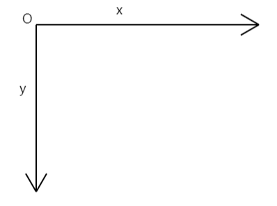
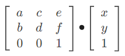

# 变换

`CSS3`的变换相信大家都很熟悉了，`translate`、`scale`、`roate`等等，已经成为我们页面元素动画必不可少的一部分，`Canvas` 同样也支持标准的平移、旋转和缩放变换，不过和`CSS`不同的是，`CSS`的变换属性是应用到某个元素上，而`canvas`是应用到整个画布上。

## 平移

- `translate(x, y)`

将画布的原点平移指定的位置。

```js
ctx.fillRect(0, 0, 50, 50)
ctx.translate(50, 50)
ctx.fillRect(0, 0, 50, 50)
```


注意`translate`方法的效果是在当前的变换上继续叠加的：

```js
ctx.fillRect(0, 0, 50, 50)
ctx.translate(50, 50)
ctx.fillRect(0, 0, 50, 50)
ctx.translate(50, 50)
ctx.fillRect(0, 0, 50, 50)
```


所以如果你想要恢复到之前的变换，可以通过负数抵消掉：

```js
ctx.fillRect(0, 0, 50, 50)
ctx.translate(50, 50)
ctx.fillRect(0, 0, 50, 50)
ctx.translate(-50, -50)
ctx.fillRect(25, 25, 50, 50)
```


不过更好的方法是通过`save`和`restore`方法来保存和恢复画布状态：

```js
ctx.fillRect(0, 0, 50, 50)

ctx.save()
ctx.translate(50, 50)
ctx.fillRect(0, 0, 50, 50)
ctx.restore()

ctx.fillRect(25, 25, 50, 50)
```

## 旋转

- `rotate(angle)`

将画布以原点为中心顺时针旋转指定角度，单位为弧度。

一定要记得它是以画布原点为中心进行旋转，而不是以要绘制的图形的中心，比如我们想画一个旋转了45度的矩形，我们可能会这么写：

```js
ctx.fillRect(100, 100, 50, 50)
ctx.rotate(Math.PI / 4)
ctx.fillRect(100, 100, 50, 50)
```


这并不符合我们的本意，要实现这个效果我们可以先把画布原点移动到矩形的中心点位置，再进行旋转：

```js
ctx.fillRect(100, 100, 50, 50)
ctx.translate(125, 125)
ctx.rotate(Math.PI / 4)
ctx.fillRect(-25, -25, 50, 50)
```

因为`fillRect`方法是以画布原点进行绘制的，所以还需要修改`x`、`y`坐标为矩形宽高的一半达到画布原点在矩形中点的效果：


通过这个例子你应该也能发现，`canvas`的各种变换方法效果都是叠加的，如果我先旋转再平移，那么平移就是在旋转后的原点的基础上进行的，反之也是一样，所以除非是你故意为之的，否则最好都通过`save`和`restore`方法进行状态保存和恢复，不然很快你就会迷失在各种变换中无法自拔。

## 缩放

- `scale(x, y)`

这个方法在最开始的小节中我们就已经用过了，用来解决画布的模糊问题。它可以将画布缩小或放大指定倍数，大于1为放大，小于1为缩小，如果传的是负数，相当于翻转，比如`X`传的是`-2`，那么相当于画布以`x`轴为对称轴镜像反转后再放大两倍，基于此我们可以改变`canvas`的坐标系：

默认的坐标系如下所示：



我们可以通过变换将它改为我们更为熟悉的笛卡尔坐标系：

```js
ctx.translate(0, canvasHeight)
ctx.scale(1, -1)
```

首先将原点由左上角移到左下角，然后将`y`轴向上翻转即可。

```js
ctx.translate(0, canvasHeight)
ctx.scale(1, -1)
ctx.fillRect(0, 0, 50, 50)
```


同样需要注意缩放也是以原点为中心进行的，如果你想要以画布为中心进行缩放，需要先把画布原点移动到画布中心。

## 变换矩阵

前面都是单独修改某个维度的变换属性，当然也提供了直接修改整个变换矩阵的方法：

- `transform(a, b, c, d, e, f)`

`a`：水平方向的缩放

`b`：竖直方向的倾斜偏移

`c`：水平方向的倾斜偏移

`d`：竖直方向的缩放

`e`：水平方向的移动

`f`：竖直方向的移动

该方法使用一个新的变换矩阵与当前变换矩阵进行乘法运算。想要知道怎么使用这个方法，需要对变换矩阵的知识有一定了解。

在数学中，所有图形的变换都能用下面这个`3X3`的矩阵来表示：


`a`、`c`、`b`、`d`代表线性变换，`e`、`f`代表平移变换，最后一行是固定的`001`，如果你要对一个坐标`[x, y]`应用变换，那么将变换矩阵和该坐标对应的矩阵相乘即可：



对于平移操作，`translate(x, y)`等价于下面的矩阵：


```js
// 将原点向右移50，向下移100
ctx.transform(1, 0, 0, 1, 50, 100)
ctx.fillRect(0, 0, 50, 50)
```


对于缩放操作，`scale(x, y)`等价于下面的矩阵：


```js
// 水平放大2倍，垂直放大3倍
ctx.transform(2, 0, 0, 3, 0, 0)
ctx.fillRect(0, 0, 50, 50)
```


对于旋转操作，`rotate(a)`等价于下面的矩阵：


```js
// 旋转45度
const a = degToRad(45)
ctx.transform(Math.cos(a), Math.sin(a), -Math.sin(a), Math.cos(a), 0, 0)
ctx.fillRect(100, 100, 50, 50)
```


还有一种是倾斜操作，对应于`CSS3`中的`skew(a, b)`，`canvas`并没有提供该方法，它对应于下面的矩阵：


```js
// 水平倾斜45度
const a = degToRad(45)
ctx.transform(1, 0, Math.tan(a), 1, 0, 0)
ctx.fillRect(0, 0, 50, 50)
```


前面说了`transform`方法会用一个新的变换矩阵和当前的变换矩阵相乘，那么如果我想直接改为当前的矩阵怎么办，`canvas`提供了一个`setTransform`方法：

```js
setTransform(a, b, c, d, e, f)
```

这个方法会先将画布当前的变换矩阵重置为单位矩阵，也就是重置为`(1, 0, 0, 1, 0, 0)`矩阵，然后再将我们传入的参数调用`transform`方法。

```js
ctx.transform(1, 0, 0, 1, 50, 100)
ctx.fillRect(0, 0, 50, 50)
ctx.setTransform(2, 0, 0, 3, 0, 0)
ctx.fillRect(0, 0, 50, 50)
```


重置当前的变换矩阵可以调用`transform(1, 0, 0, 1, 0, 0)`方法，也可以通过`canvas`提供的`resetTransform`方法来实现：

```js
ctx.transform(1, 0, 0, 1, 50, 100)
ctx.fillRect(0, 0, 50, 50)
ctx.resetTransform()
ctx.transform(2, 0, 0, 3, 0, 0)
ctx.fillRect(0, 0, 50, 50)
```

效果和前面的是一样的。

最后，如果你想获取画布当前的变换矩阵可以使用`getTransform`方法：

```js
ctx.translate(0, canvasHeight)
ctx.scale(1, -1)
console.log(ctx.getTransform())
```


为什么是两倍呢，不要忘了一开始我们就对画布放大了两倍来解决模糊问题哦。

# 总结

本节我们学习了`canvas`的变换操作，这个是很强大的能力，但也有点复杂，用好了可以让复杂图形的绘制变得简单。

本节示例地址：[transform](https://wanglin2.github.io/canvas-demos/#/transform)。


