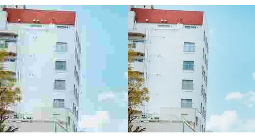

# 绘制图像

在`canvas`中绘制图像只提供了一个`drawImage`方法，但是这个方法参数众多，接下来我们一一拆解。

## 图像源

第一个参数是固定的，就是要绘制的图像来源。

最常见的情况肯定是给你一个图片的`url`，然后把它绘制出来，但是直接把`url`扔给`drawImage`方法是没用的，可以通过`HTML`的`img`标签先加载图片，然后再把这个图片对象传递给`canvas`：

```js
const url = 'xxx'
const img = new Image()
img.onload = () => {
    ctx.drawImage(img, 0, 0)
}
img.src = url
```

这样就会在画布的`0,0`坐标处渲染一张原图片大小的图片。

需要注意的是必须要等图片加载完成才能进行绘制，否则是渲染不出来的。


你也可以接受另一个`canvas`元素作为图像源：

```js
ctx2.drawImage(canvas, 0, 0)
```


另外你还可以把一个`video`元素作为来源，它会截取视频的当前帧作为一个图像。

## 接收三个参数

`drawImage`方法接收三个参数的形式如下所示：

```js
drawImage(image, dx, dy)
```

上一小节里使用的就是三个参数的情况，第一个参数为图像源，第二、三个参数代表在画布的哪个位置绘制图片，无法省略。绘制时会保持原图片的大小，所以如果你的画布比图片小，那么图片将无法完整的显示出来。

## 接收五个参数

`drawImage`方法接收五个参数的形式如下所示：

```js
ctx.drawImage(image, dx, dy, dWidth, dHeight)
```

相比上一种形式，多了两个参数，`dWidth`代表将图片绘制到`canvas`上的宽度，`dHeight`代表将图片绘制到`canvas`上的高度，本质上是对图片进行缩放。

## 接收九个参数

`drawImage`方法接收九个参数的形式如下所示：

```js
drawImage(image, sx, sy, sWidth, sHeight, dx, dy, dWidth, dHeight)
```

在上一种形式的基础上又增加了四个参数，代表从原图片中裁剪部分图片绘制到`canvas`中，`sx`、`sy`指定从什么位置开始裁剪，`sWidth`、`sHeight`指定要裁剪的区域的宽高。

# 导出画布

`canvas`画布是可以导出的，提供了个两个导出方法：

- 导出为[Blob](https://developer.mozilla.org/zh-CN/docs/Web/API/Blob)

```js
canvas.toBlob(callback, type, quality)
```

参数分别为：回调函数、图片格式、图片质量

- 导出为[data URI](https://developer.mozilla.org/zh-CN/docs/Web/HTTP/Basics_of_HTTP/Data_URLs)

```js
canvas.toDataURL(type, quality)
```

参数分别为：图片格式、图片质量

一个异步函数，一个同步函数，根据你需要的导出的文件类型选择对应的方法。

`type`和`quality`参数都是可选的，`type`默认为`image/png`，`quality`可以设置导出的图片的质量，不过仅在`jpeg、webp`等非`png`的格式下可用，接收`0-1`之间的小数。下图中左边的是`0.1`的质量，右边为`1`的质量：



另外需要注意的一个点是，如果图片是跨域图片，那么可以在画布中渲染，但是无法被导出，会报一个画布被污染的错误，如果你确认该图片是允许跨域访问的，也就是服务器返回了允许跨域的响应头，那么你可以在加载图片时给图片元素添加如下属性

```js
const img = new Image()
img.crossOrigin = "Anonymous"
```

这样就可以正常导出。

# 总结

本节我们了解如何在`canvas`中绘制图片，以及如何将`canvas`导出为图片，接下来我们会通过几个小案例来看一下它的实际使用场景。

