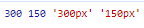
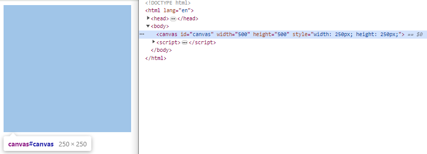
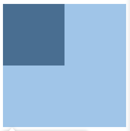
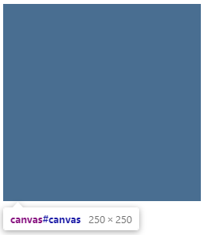
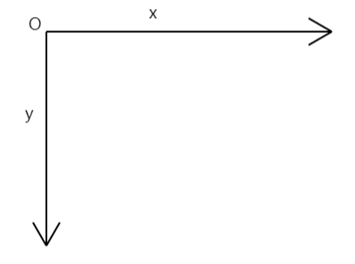
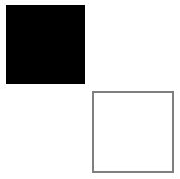
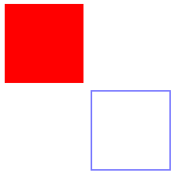
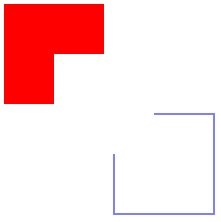

# 基本使用

## 画布大小

`Canvas`的基本使用很简单，`HTML`方面只需要创建一个`canvas`标签即可：

```html
<canvas id="canvas"></canvas>
```

它只有两个属性：`width`、`height`，默认大小为`300*150`。

需要注意的是这两个属性和`CSS`的`width`、`height`是不同的，当然默认情况下它们的大小是一样的：

```js
const canvas = document.getElementById('canvas')
console.log(canvas.width, canvas.height, window.getComputedStyle(canvas).width)
```



那么如果我们把这两种大小设置为不一样会发生什么呢，尝试一下：

```js
const canvas = document.getElementById('canvas')
canvas.width = 500
canvas.height = 500
canvas.style.width = '250px'
canvas.style.height = '250px'
```



`Canvas`大小设置为500，`CSS`大小设置为250，可以看到最终在页面上显示的大小为`CSS`大小，现在再让我们用后面会介绍的方法绘制一个矩形看看：

```js
const ctx = canvas.getContext('2d')
ctx.fillRect(0, 0, 250, 250)
```



我们设想的是绘制一个250像素大小的矩形，按理说应该会填满整个`canvas`，但是并没有，实际上`canvas`有两套尺寸，一套是`canvas`元素的尺寸，一套是我们绘图画布的尺寸，如果我们只设置`canvas`大小，它会同时帮我们也设置`CSS`大小，但是设置`CSS`大小却不会影响绘图尺寸。

我们绘制是在画布的尺寸上进行绘制，绘制完了以后可以理解成它就是一张图片，这张图片要放到`CSS`大小的容器里，并且铺满，所以当我们把`css`尺寸和`canvas`尺寸设置的不一样，图片就会被缩放至`CSS`的尺寸，这就可以理解为什么我们把`Canvas`大小设置为500，`CSS`大小设置为250后，绘制的250大小的矩形只显示为125像素大小的矩形，因为画布缩小了0.5倍。

如果设置的`css`尺寸和`canvas`尺寸长宽比例也不同的话，很明显，绘制出来的图形将会发生变形。

现在如果我们想绘制一个填满画布的矩形，可以将矩形的大小改为原来的两倍，当然还有更简单的方法，直接将画布放大两倍：

```js
const ctx = canvas.getContext('2d')
ctx.scale(2, 2)
ctx.fillRect(0, 0, 250, 250)
```



可以看到现在绘制一切正常了，实际上，这个方法就是用来解决在高清屏上`canvas`显示模糊的问题。你可以像前面一样直接放大两倍，也可以根据当前的设备像素比来设置：

```js
const canvas = document.getElementById('canvas')

const canvasWidth = 250
const canvasHeight = 250
const ratio = Math.max(window.devicePixelRatio, 2)// 最小为2
canvas.width = canvasWidth * ratio
canvas.height = canvasHeight * ratio
canvas.style.width = canvasWidth + 'px'
canvas.style.height = canvasHeight + 'px'

const ctx = canvas.getContext('2d')
ctx.scale(ratio, ratio)
```

后续只要正常的进行绘图就可以了。

`canvas`标签提供了一个空白的画布，`getContext`方法是用来获取画笔的方法，因为我们使用的是`2D`的绘图`api`，所以需要传入一个`2d`参数，我们对画布的任何绘图操作都是通过返回的`ctx`对象来进行的，

除了`getContext`方法，`canvas`元素还有几个方法，在后面的章节里会陆续介绍。

## 坐标系

要想正确的进行绘图，首先要知道画布的坐标系，`Canvas`默认的坐标系和页面是一样的，原点在左上角，向右为`x`轴正方向，向下为`y`轴正方向：



当然你也可以改变它的坐标系，实际上要实现一些复杂的绘图，通过改变坐标系会比自己计算要简单很多。

## 形状

`Canvas`只提供了绘制矩形的方法，其他形状都需要自己实现。

绘制矩形有两个方法，一是前面使用过的`fillRect`方法，顾名思义就是填充方式绘制一个矩形：

```js
ctx.fillRect(0, 0, 100, 100)
```

四个参数分别为：矩形的起点位置、矩形的宽高。

另一个方法为`strokeRect`，参数和`fillRect`是一样的，显然，它是以描边方式绘制一个矩形：

```js
ctx.strokeRect(110, 110, 100, 100)
```



当然，填充或描边的样式是可以修改的：

```js
ctx.fillStyle = 'red'
ctx.fillRect(0, 0, 100, 100)
ctx.strokeStyle = 'blue'
ctx.strokeRect(110, 110, 100, 100)
```

在绘制前通过上下文对象的样式属性设置一下即可，`fillStyle`和`strokeStyle`可以设置为任何有效的颜色值，当然，还可以设置为渐变样式、图案模式，这些后面的章节中会介绍。



矩形相关的最后一个方法是用来擦除画布上的某个区域，相当于橡皮擦：

```js
ctx.clearRect(50, 50, 100, 100)
```

参数和前两个方法依旧是一样的。



可以看到，位置在`50,50`处，大小为`100`的矩形区域被擦除了。

## 总结

`Canvas`的基本使用就介绍到这里，是不是还挺简单的，下一节我们会利用`clearRect`方法制作一个简单的橡皮擦效果。

本节示例地址：[basicUse](https://wanglin2.github.io/canvas-demos/#/basicUse)。