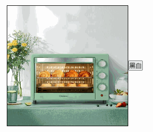
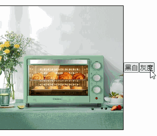
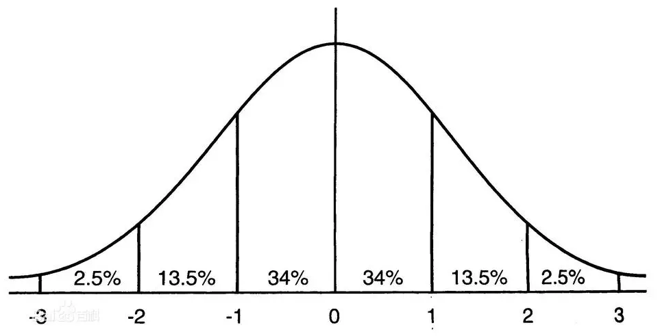
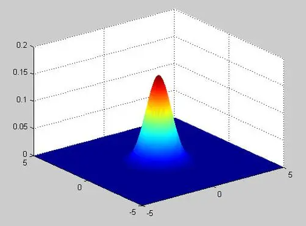
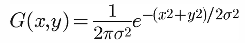
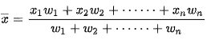
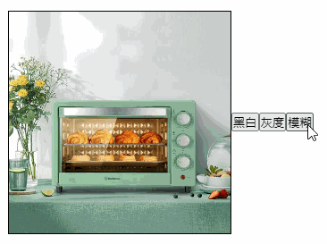
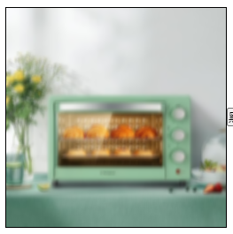
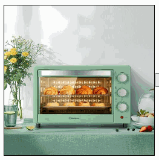

# 图片滤镜

`Canvas`读取和写入像素的功能非常适合用来实现图片的滤镜功能，本节我们就来实现几个常见的滤镜效果。

## 黑白

黑白滤镜顾名思义就是只有黑和白两种颜色，所以我们要做的就是遍历画布上的所有像素点，然后把每个像素要么改成黑的，要么改成白的，判断方法可以取该像素点的`rgb`的平均值，小于127就改成黑的，大于就改成白的：

```js
// 黑白
const blackWhite = imageData => {
    for (let i = 0; i < imageData.data.length; i += 4) {
        const r = imageData.data[i]
        const g = imageData.data[i + 1]
        const b = imageData.data[i + 2]
        const ava = (r + g + b) / 3
        if (ava > 127) {
            imageData.data[i] = 255
            imageData.data[i + 1] = 255
            imageData.data[i + 2] = 255
        } else {
            imageData.data[i] = 0
            imageData.data[i + 1] = 0
            imageData.data[i + 2] = 0
        }
    }
}
```

修改像素的方法有了，我们只要取出画布的像素数据，然后处理完再写回去即可：

```js
const imageData = getImageData(0, 0, 250, 250)
blackWhite(imageData)
putImageData(imageData, 0, 0)
```



## 灰度

所谓灰度就是将像素点的`rgb`都设置为相同的值，最简单的就是设置为`rgb`三个值的平均值：

```js
// 灰度
const grey = imageData => {
    for (let i = 0; i < imageData.data.length; i += 4) {
        const r = imageData.data[i]
        const g = imageData.data[i + 1]
        const b = imageData.data[i + 2]
        const ava = (r + g + b) / 3
        imageData.data[i] = ava
        imageData.data[i + 1] = ava
        imageData.data[i + 2] = ava
    }
}
```



## 高斯模糊

接下来看一个稍微复杂点的滤镜：高斯模糊。

所谓模糊，就是一个像素点取它周围像素点的【平均值】，所以第一个变量就是这个周围的半径，半径越大，模糊程度越高。

第二个问题是这个所谓的【平均值】怎么计算，最简单的方法就是取周围点的简单平均值，但是这样并不是很合理，因为离该像素点越近的像素点和它的关系越密切，那么相应的权重应该更大，所以应该使用加权平均的方式。

那么第三个问题就是每个像素点的权重值怎么计算，这里使用的是正态分布，也叫高斯分布，这个就是名称的由来了：



从图可以看出，离中心点越远曲线越矮，对应到我们的像素数据中，就是离当前中心点像素越远权重越低，因为我们的像素数据是二维的，所以需要使用二维的正态分布：



公式如下：



- `x、x`代表像素坐标，也就是我们要计算权重的像素点；
- `σ`代表标准差，`σ2`则为方差，描述正态分布的离散程度，`σ`越大，数据分布越分散，`σ`越小，数据分布越集中，也叫形状参数，`σ`越大，曲线越扁平，反之，曲线越瘦高，这个值我们可以自己设置；
- 实际上还有一个`μ`参数，代表期望值，是正态分布的位置参数，与`μ`邻近的值的概率大，而离`μ`越远的值的概率越小，正态分布以`x=μ`为对称轴，左右完全对称，那么当对称轴为`y`轴时，`μ`则为`0`，上述公式就是`μ`为`0`时的公式；
- 当`μ`为`0`，`σ`为`1`代表标准正态分布；

原理了解清楚了，接下来就可以通过代码来实现了。

我们使用标准正态分布，然后取作为5个像素作为半径：

```js
// 高斯模糊
const blur = imageData => {
    const σ = 1
    const r = 5
}
```

无论我们计算哪个像素点，都是以这个像素点为中心进行计算，所以周围像素点的权重值都是一样的，那么我们可以一开始就计算出周围所有像素点的权重：

```js
const blur = imageData => {
    const σ = 1
    const r = 5
    // 计算权重矩阵
    const weightList = []
    const weightSum = 0 // 权重总和
    for (let i = -r; i <= r; i++) {
        for (let j = -r; j <= r; j++) {
            // 根据二维正态分布函数计算
            const res =
                  (1 / (2 * Math.PI * σ * σ)) * Math.exp(-(i * i + j * j) / (2 * σ * σ))
            weightList.push(res)
            weightSum += res
        }
    }
    for (let i = 0; i < weightList.length; i++) {
        weightList[i] /= weightSum
    }
}
```

首先根据二维正态分布函数计算出每个位置的权重值。

简单介绍一下加权平均值，就是每个值和它对应的权重相乘，然后计算它们的总和，接下来怎么平均呢，简单平均值是除以值的数量，而加权平均值是除以权重的总和，公式如下：



所以计算每个位置的权重时，我们还顺带着计算了权重的总和，并且紧接着就遍历权重列表，将每个权重值和权重总和相除，这样后续计算像素加权平均值时只做乘法和加法就行了。

```js
const blur = imageData => {
    // ...
    // 遍历每个像素点
    const width = imageData.width
    const height = imageData.height
    for (let x = 0; x < width; x++) {
        for (let y = 0; y < height; y++) {
            let r = 0
            let g = 0
            let b = 0
            // 遍历周边像素
            let weightIndex = 0
            for (let i = -radius; i <= radius; i++) {
                const nx = x + i
                for (let j = -radius; j <= radius; j++) {
                    const ny = j + y
                    // 对应的权重
                    const weight = weightList[weightIndex++]
                    // 当前周围的像素点
                    const nindex = ny * width * 4 + nx * 4
                    // 像素点的每个通道都和权重相乘，并且累加
                    r += imageData.data[nindex] * weight
                    g += imageData.data[nindex + 1] * weight
                    b += imageData.data[nindex + 2] * weight
                }
            }
            // 修改当前中心点像素
            const index = y * width * 4 + x * 4
            imageData.data[index] = r
            imageData.data[index + 1] = g
            imageData.data[index + 2] = b
        }
    }
}
```

接着就是开始遍历画布的每一个像素点，并且遍历每个像素点的周边的点，取出该周边像素点的权重值，然后相乘，并且累加起来得到最终的加权平均值。

最后将这个计算出来的每个通道的平均值设置为当前像素点新通道值。

如果运行这个函数，你会发现没有效果，为什么呢，因为我们没有考虑到边界的情况，画布四周的像素点，有些周边的点是缺失的，比如第一个像素点，它左边和上面并没有像素，所以我们需要处理一下这种边界的情况，处理方法也很简单，如果某一侧的像素点缺失，那么就取对称的像素点：

```js
for (let i = -radius; i <= radius; i++) {
    let nx = x + i
    if (nx < 0 || nx >= width) {
        nx = x + -i
    }
    for (let j = -radius; j <= radius; j++) {
        let ny = j + y
        if (ny < 0 || ny >= height) {
            ny = y + -j
        }
        // 对应的权重
        // ...
    }
}
```

很简单，判断计算出来的某个周边的像素点的`x`或`y`坐标是否超出了画布的边界，是的话就将距离取反，这样得到对称的点。现在来看看效果：



可以看到确实有模糊效果了，不过模糊程度并不高，不太明显，前面说过，模糊半径越大，模糊程度越高，但是半径越大，计算量也会成指数增加，这样会导致计算时间太长，其实不要忘了，`σ`参数也会影响模糊程度，我们可以把`σ`调大，这样正态曲线就会变得扁平，意味着离得远的像素点权重也增加了，那么相应的就会更模糊了，下面是`σ`为`10`的效果：



是不是模糊了很多？当然，这个值的影响是有上限的，毕竟模糊半径摆在这里，权重再怎么调也就是平均这么一点像素，所以要达到非常模糊的效果，还是只能增加半径。

## 马赛克

最后我们来实现一下马赛克的效果，所谓马赛克，就是将画面分成一个个小块，称为马赛克块，这一小块区域的颜色统一设置为这一区域像素的平均值，马赛克块越大，马赛克效果越明显。

实现上我们只要以马赛克块的大小为步长遍历所有像素点，然后计算每一块区域的像素平均值，再更新这块区域的像素即可。

```js
// 马赛克
const mosaic = imageData => {
    // 遍历每个像素点
    const width = imageData.width
    const height = imageData.height
    const size = 10 // 马赛克块的大小
    for (let x = 0; x < width; x += size) {
        for (let y = 0; y < height; y += size) {
            let r = 0
            let g = 0
            let b = 0
            let count = 0
            // 遍历当前马赛克块内的像素
            for (let i = 0; i < size; i++) {
                const nx = x + i
                for (let j = 0; j < size; j++) {
                    const ny = y + j
                    // 当前像素点
                    const nindex = ny * width * 4 + nx * 4
                    // 计算总和
                    r += imageData.data[nindex]
                    g += imageData.data[nindex + 1]
                    b += imageData.data[nindex + 2]
                    // 计算数量
                    count++
                }
            }
            // 计算平均值
            const ra = r / count
            const ga = g / count
            const ba = b / count
            // 更新当前马赛克块的像素
            for (let i = 0; i < size; i++) {
                const nx = x + i
                for (let j = 0; j < size; j++) {
                    const ny = y + j
                    const nindex = ny * width * 4 + nx * 4
                    imageData.data[nindex] = ra
                    imageData.data[nindex + 1] = ga
                    imageData.data[nindex + 2] = ba
                }
            }
        }
    }
}
```

效果如下：



## 总结

本节介绍了几种常见的图片滤镜的实现方式，可以看到`Canvas`给前端的能力边界延伸了很多，之前很多无法实现的功能现在都能轻松拿下。

本节示例地址：[filter](https://wanglin2.github.io/canvas-demos/#/filter)。