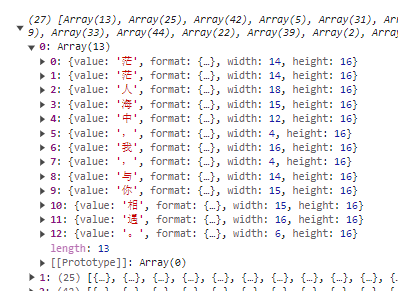
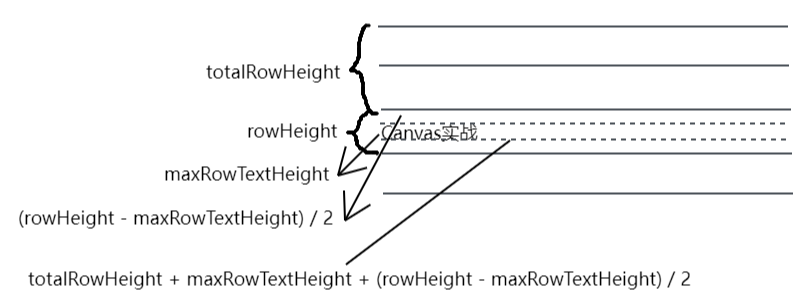
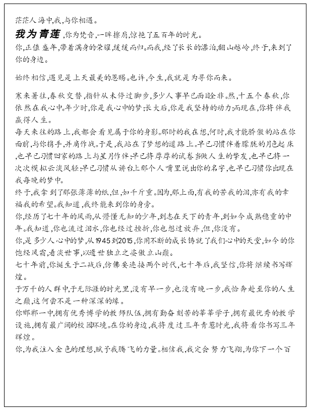
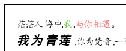
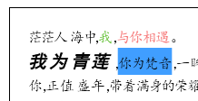
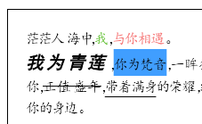
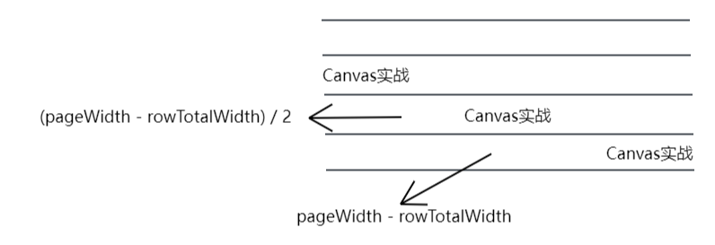
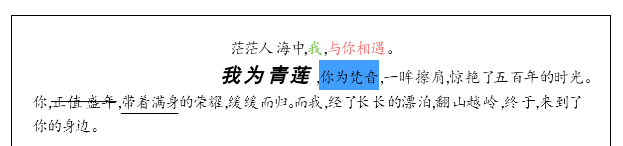

# 实现一个排版引擎

本节我们来做一个简单的文本排版引擎，包括换行，以及绘制出文本的字体、字号、颜色等样式。

## 数据格式

首先要说明的是我们要绘制的源数据不是一段纯文本，因为纯文本无法携带格式，而`HTML`格式又太复杂，所以我们规定为如下格式的`JSON`数据：

```js
[
    {
        value: '实',
        format: {
            fontFaimly: 'serif',
            fontSize: 16,
            fontWeight: 'bold',
            fontStyle: '',
            lineHeight: 1.5,// 只支持倍数
            textDecoration: 'line-through',// line-through、underline
            color: '#000',
            backgroundColor: 'red',
            textAlign: 'right'// left、center、right
        }
    }，
    {
    	value: '站'
    },
    {
    	value: '\n'
    }
]
```

每个字符单独作为一项，通过`value`字段存储，该字符对应的样式通过`format`字段来存储。

上述涵盖了大部分常用的格式，有些比较简单，比如字体、字号、颜色等等，有些需要计算，比如行高、对齐等，行高为了简单起见，我们只支持倍数的方式。

如果`value`为`\n`代表另起一段。

## 绘制逻辑

要将字符在`canvas`上绘制出来，归根结底是要计算出每一个字符的坐标。

对于某个字符的`x`坐标来说，就是它所在行前面的所有字符的宽度总合。

对于某个字符的`y`坐标来说，它首先是在所在行中垂直居中的，所以需要先计算出所在行的`y`坐标，这个也很简单，就是前面所有行的总高度。对于每一行的高度，其实是这一行所有字符的高度的最大值和这一行所有字符的行高的最大值的乘积。行的`y`坐标和实际高度都有了，那么计算字符的`y`坐标也不是什么难事。

那么整体绘制逻辑如下：

1.从头遍历源数据，获取每一项字符数据的宽高，同时根据画布宽度，计算出一行所能容纳的数据项，从而得到一个二维行数组；

2.从上到下，从左到右进行绘制，也就是遍历行数组，再遍历行中的每一项数据，根据前面介绍的方法计算出每一个字符的坐标进行绘制；

接下来根据上述逻辑来完成代码的编写。

## 计算行数据

因为文字直接贴着画布边缘绘制不太好看，所以我们加点内边距：

```js
const padding = 20 // 内边距
const pageWidth = canvasWidth - padding * 2 // 画布减去内边距可用的宽度作为页面宽度
```

计算行数据的代码如下：

```js
// 计算行数据
const computeRowData = data => {
    const rows = [] // 行数组
    let curRow = [] // 当前行
    let curRowTotalWidth = 0 // 当前行当前的总宽度
    data.forEach(item => {
        // 遇到换行符，那么直接新开一行
        if (item.value === '\n') {
            rows.push(curRow)
            curRow = []
            curRowTotalWidth = 0
            return
        }
        // 测量文本宽高
        ctx.save()
        ctx.font = getFont(item.format || {})
        const textMetrics = ctx.measureText(item.value)
        ctx.restore()
        const width =
              textMetrics.actualBoundingBoxLeft + textMetrics.actualBoundingBoxRight
        const height =
              textMetrics.fontBoundingBoxAscent + textMetrics.fontBoundingBoxDescent
        // 将源信息和宽高信息一起保存起来
        const itemData = {
            ...item,
            width,
            height
        }
        // 如果加上当前字符的宽度依旧小于页面宽度，那么可以继续追加到当前行中
        if (curRowTotalWidth + width <= pageWidth) {
            curRow.push(itemData)
            // 更新当前行的总宽度
            curRowTotalWidth += width
        } else {
            // 否则需要创建新行
            rows.push(curRow)
            curRow = [itemData]
            curRowTotalWidth = width
        }
    })
    return rows
}

// 拼接字体属性
const getFont = ({
    fontSize = 16,
    fontFamily = '楷体, 楷体_GB2312, SimKai, STKaiti',
    fontWeight = '',
    fontStyle = ''
} = {}) => {
    return `${fontStyle} ${fontWeight} ${fontSize}px ${fontFamily}`
}
```

通过注释应该很容易理解，首先定义了三个变量，一个是总的行数据，一个是当前的行数据，以及一个记录当前行当前字符的总宽度，用于判断是否换行。

然后遍历每个字符数据，先设置当前字符的字体属性，然后调用`measureText`方法测量字符的宽高信息，为了不影响其他字符，我们使用了`save`和`restore`方法来保存和恢复画布状态。计算文本的宽度和高度使用了上一节中介绍的方法。

打印看看我们收集到的行数组：



## 绘制行

得到了每一行的数据，接下来就可以遍历进行绘制：

```js
const drawRow = rows => {
    let totalRowHeight = padding
    ctx.save()
    ctx.textBaseline = 'bottom'
    rows.forEach((row, index) => {

    })
    ctx.restore()
}
```

定义了一个变量用来记录当前已经绘制完的行的总高度，因为设置了内边距，所以初始值就是内边距的大小。

因为文本的字号可能不一样，而不同字号的文本通常都是底边对齐的，所以把文本基线设置为`bottom`会简单一点。

最后就是开始遍历每一行：

```js
rows.forEach((row, index) => {
    // 当前行所有字符高度的最大值
    const maxRowTextHeight = getRowMaxTextHeight(row)
    // 当前行所有字符行高的最大值
    const maxRowLineHeight = getRowMaxLineHeight(row)
    // 字符高度 * 行高 得到该行实际高度
    const rowHeight = maxRowTextHeight * maxRowLineHeight
    // ...
    totalRowHeight += rowHeight// 更新所有行的总高度
})
```

如上所示，找到某一行中字符高度的最大值，以及行高的最大值，相乘即可得到该行的实际高度，`getRowMaxTextHeight`和`getRowMaxLineHeight`方法：

```js
// 获取行所有字符高度的最大值
const getRowMaxTextHeight = row => {
    let res = 0
    row.forEach(item => {
        if (item.height > res) {
            res = item.height
        }
    })
    return res
}

// 获取行所有字符行高的最大值
const getRowMaxLineHeight = row => {
    let res = 0
    row.forEach(item => {
        if (item.format && item.format.lineHeight > res) {
            res = item.format.lineHeight
        }
    })
    return res === 0 ? 1.5 : res
}
```

行高默认设为了`1.5`，避免太紧凑。

知道了每一行的高度以及行的`y`坐标，接下来就可以计算行中每个字符的坐标了：

```js
// 当前行所有字符的y坐标
const y = totalRowHeight + maxRowTextHeight + (rowHeight - maxRowTextHeight) / 2
// 当前行已绘制字符的总宽度
let curRowTotalWidth = padding

row.forEach(text => {
    const x = curRowTotalWidth
    // ...
    curRowTotalWidth += text.width
})
```

`x`坐标就是所在行前面已经绘制的字符总宽度。

因为字符是在行中垂直居中的，所以行的高度减去字符的高度除以二得到上方的剩余高度，又因为我们设置的文本基线是`bottom`，所以还需要加上字符的高度，当然这个是相对于行的顶部的，所以还要加上行本身的`y`坐标，才是相对于画布的坐标。



### 绘制文本

坐标有了接下来就可以进行绘制了：

```js
row.forEach(text => {
    const x = curRowTotalWidth
    
    ctx.save()
    if (text.format) {
      // 字体样式
      ctx.font = getFont(text.format)
    }
    ctx.fillText(text.value, x,  y)
    ctx.restore()
    
    curRowTotalWidth += text.width
})
```

效果如下：



可以看到字体、字号、斜体、加粗、行高都已经生效 了，接下来继续完善一下其他样式。

### 文字颜色

这个很简单，判断一下当前字符是否存在颜色属性，再设置一下填充的样式即可：

```js
row.forEach(text => {
    // ...
    if (text.format) {
      // ...
      if (text.format.color) ctx.fillStyle = text.format.color
    }
    // ...
})
```



### 背景颜色

`canvas`本身没有提供背景颜色的属性，所以需要我们自己绘制，背景颜色其实可以理解为一个带颜色的矩形：

```js
row.forEach(text => {
    // ...
    if (text.format) {
      // ...
      if (text.format.backgroundColor) {
        ctx.save()
        ctx.fillStyle = text.format.backgroundColor
        ctx.fillRect(x, totalRowHeight, text.width, rowHeight)
        ctx.restore()
      }
    }
    // ...
})
```

背景颜色区域的宽度就是字符的宽度，但是高度是行的高度，所以它的`y`坐标和字符的`y`坐标是不一样的，需要和行的`y`坐标一致。



### 下划线和删除线

同样`canvas`也没有提供文本划线的属性，但本质上它也就是一根线段，自己绘制也很简单，下划线和删除线不同点在于`y`坐标不一样，下划线在所在行的底部，而删除线在行的中间：

```js
row.forEach(text => {
    // ...
    if (text.format) {
        // ...
        // 下划线
        if (text.format.textDecoration === 'underline') {
            ctx.save()
            ctx.beginPath()
            ctx.moveTo(x, totalRowHeight + rowHeight)
            ctx.lineTo(x + text.width, totalRowHeight + rowHeight)
            ctx.stroke()
            ctx.restore()
        }
        // 删除线
        if (text.format.textDecoration === 'line-through') {
            ctx.save()
            ctx.beginPath()
            ctx.moveTo(x, totalRowHeight + rowHeight / 2)
            ctx.lineTo(x + text.width, totalRowHeight + rowHeight / 2)
            ctx.stroke()
            ctx.restore()
        }
    }
    // ...
})
```



### 文本对齐

`canvas`虽然提供了对齐的属性，但是是基于提供的`x`坐标进行对齐的，我们倒是可以把`x`坐标改为页面的左中右三个点，但问题是我们是逐个字符进行绘制的，所以完全用不了。

其实自己计算也不难，默认左对齐时是从页面的最左边开始绘制的，也就是：

```js
let curRowTotalWidth = padding
```

居中对齐时，只要把初始值改为页面宽度减去当前行字符总宽度差值的一半即可，居右对齐也类似：



```js
rows.forEach((row, index) => {
    // ...
    
    const textAlign = getRowTextAlign(row)
    // 居中对齐
    if (textAlign === 'center') {
        const rowTotalWidth = getRowTotalWidth(row)
        curRowTotalWidth = padding + (pageWidth - rowTotalWidth) / 2
    } else if (textAlign === 'right') {
        // 右对齐
        const rowTotalWidth = getRowTotalWidth(row)
        curRowTotalWidth = padding + (pageWidth - rowTotalWidth)
    }
    
    // ...
})
```

`getRowTextAlign`方法用来获取当前行的对齐属性，如果同一行中存在多个字符都设置了对齐属性，那么取最后一个：

```js
const getRowTextAlign = row => {
    let res = 'left'
    row.forEach(item => {
        if (item.format && item.format.textAlign) {
            res = item.format.textAlign
        }
    })
    return res
}
```

`getRowTotalWidth`方法会遍历行数据，计算出当前行所有字符的总宽度：

```js
const getRowTotalWidth = row => {
    return row.reduce((sum, cur) => {
        return (sum += cur.width)
    }, 0)
}
```



到这里，所有的样式属性都已全部支持了。

# 总结

本节我们做了一个非常简单的文本排版引擎，实际上再增加上编辑的能力，就相当于一个简单的富文本编辑器了，有兴趣的朋友可以尝试一下。

本节示例地址：[layoutEngine](https://wanglin2.github.io/canvas-demos/#/layoutEngine)。