# 实现一个探照灯

本节我们来实现一个探照灯效果，具体来说就是画面其他地方都是暗的，只有灯光照到的地方是亮的。

在上一个案例【绘制一个水波图】中介绍了裁剪`clip`方法的使用方式，使用它来实现探照灯是非常合适的，只要裁剪出我们灯的形状，然后绘制要显示的图形，这样就只有被裁剪的区域会显示出来，然后不断改变裁剪区域的位置，并清空重绘就得到了探照灯的效果。

## 裁剪区域

假设我们要探照的是一张图片，所以先写一个加载图片的方法：

```js
const loadImage = callback => {
    const img = new Image()
    img.onload = () => {
        callback(img)
    }
    img.src = '/pic2.webp'
}
```

我们的逻辑都在图片加载完成后执行，这样不用每次都加载一次图片：

```js
loadImage(img => {
    // 绘制图片
    const drawImage = () => {
        ctx.drawImage(img, 0, 0, canvasWidth, canvasHeight)
    }
    drawImage()
})
```

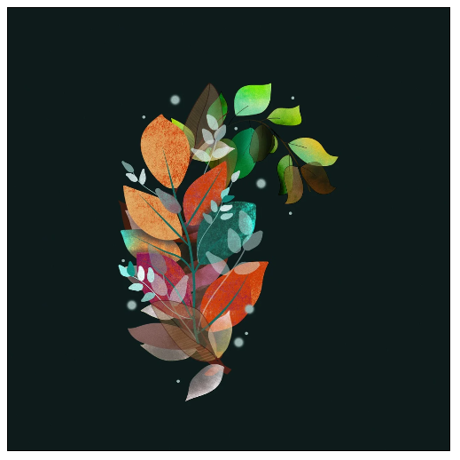

然后我们创建一个探照灯类：

```js
class Searchlight {
    constructor(opt) {
        // 画布宽高
        this.canvasWidth = opt.canvasWidth
        this.canvasHeight = opt.canvasHeight
        // 画布上下文
        this.ctx = opt.ctx
        // 探照灯中心点
        this.cx = opt.cx === undefined ? 0 : opt.cx
        this.cy = opt.cy === undefined ? 0 : opt.cy
        // 探照灯半径
        this.radius = opt.radius === undefined ? 70 : opt.radius
    }
}
```

假设探照灯是一个圆形灯，所以给它定义了中心点和半径的属性。接下来增加一个裁剪的方法：

```js
class Searchlight {
    clip() {
        this.ctx.beginPath()
        this.ctx.arc(this.cx, this.cy, this.radius, 0, Math.PI * 2)
        this.ctx.clip()
    }
}
```

然后就可以创建一个实例来看看了：

```js
const searchlight = new Searchlight({
    canvasWidth,
    canvasHeight,
    ctx,
    cx: canvasWidth / 2,
    cy: canvasHeight / 2,
})

const draw = () => {
    // 清空画布
    ctx.clearRect(0, 0, canvasWidth, canvasHeight)
    // 将画布填充为黑色
    ctx.fillRect(0, 0, canvasWidth, canvasHeight)
    ctx.save()
    searchlight.clip()
    drawImage()
    ctx.restore()
}
draw()
```

首先我们创建了一个探照灯实例，将探照灯的中心点设置为画布的中心点，然后我们将画布填充为黑色，模拟晚上黑暗的环境，这样探照灯没照到的区域就是黑的，接着调用裁剪方法，最后绘制图片。

另外我们裁剪和绘制图片的逻辑放在`save`和`restore`之间，这样不会影响对画布的其他绘制操作。

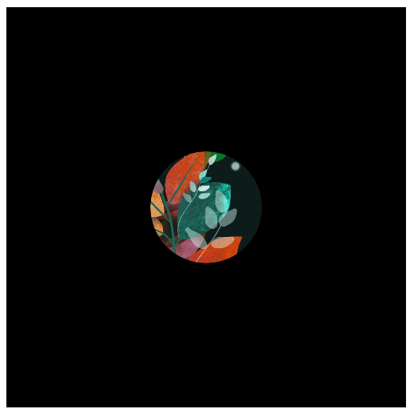

可以看到确实只有探照灯的位置渲染出了图片，但是目前整个探照灯的区域亮度都是一样的，按理说，应该是灯光的中心点最亮，然后向周围延伸逐渐变暗，要实现这个效果，我们可以使用`canvas`的渐变效果。

## 渐变效果

`canvas`提供了两种渐变，一是线性渐变：

```js
ctx.createLinearGradient(x0, y0, x1, y1)
```

根据两个给定的坐标值所构成的线段创建一个渐变，参数分别是起点和终点的坐标。

二是径向渐变：

```js
ctx.createRadialGradient(x0, y0, r0, x1, y1, r1)
```

根据两个圆绘制放射性渐变，从第一个圆渐变到第二个圆。

这两个方法都会返回一个` CanvasGradient`对象，可以通过这个对象的`addColorStop`方法来添加颜色：

```js
gradient.addColorStop(position, color)
```

`position` 必须是一个 `0` 与 `1`之间的数值，表示渐变中颜色所在的相对位置，`color`就是这个位置的颜色值，你可以添加任意个颜色。

我们可以将`gradient`对象赋值为`fillStyle`或`strokeStyle`属性，然后描边或填充时就会应用我们设置的渐变样式。

要注意的是这两个方法的坐标都相对于画布，比如说：

```js
const gradient = ctx.createLinearGradient(100, 0, 200, 0)
gradient.addColorStop(0, '#fff')
gradient.addColorStop(1, '#000')
ctx.fillStyle = gradient
ctx.fillRect(0, 0, canvasWidth, canvasHeight)
```

我们创建了一段从`(100,0)`到`(200,0)`坐标的渐变，然后用这个渐变样式绘制了一个和画布一样大小的矩形：

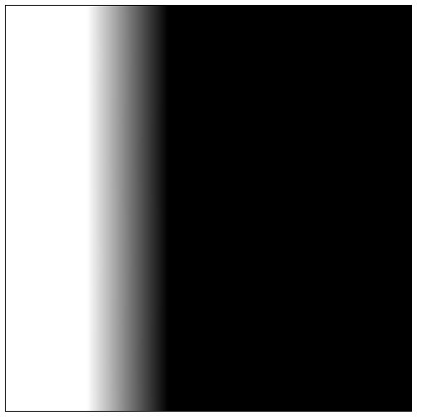

可以发现渐变样式是对整个画布生效的，所以如果你绘制的图形的位置和渐变的位置不一致，可能得不到你想要的渐变效果。

另外可以发现只有起点和终点之间的区域是存在渐变的，而这个范围之外并不是空白的，而是边界的颜色的填充，会无限延伸。

径向渐变则要复杂很多，我们定义的是两个圆，而这两个圆的位置和大小不同，最终出来的渐变效果也不同。

```js
const gradient = ctx.createRadialGradient(100, 100, 0, 100, 100, 100)
gradient.addColorStop(0, '#fff')
gradient.addColorStop(1, '#000')
ctx.fillStyle = gradient
ctx.fillRect(0, 0, canvasWidth, canvasHeight)
```

两个圆的中心点一样，起始圆的半径设为了`0`，结束圆的半径设为了`100`，最终的效果看起来就是从`(100,100)`这个点发散到半径为`100`的圆，这个结束圆的外面则是最后一个颜色的填充：

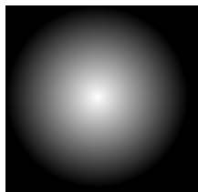

```js
const gradient = ctx.createRadialGradient(100, 100, 0, 100, 100, 100)
```

当把起始圆的半径改为了`50`，看起来就是从起始圆外开始渐变，而内部则是第一个渐变颜色的填充。

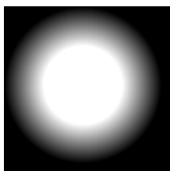

至于这两个圆的中心点位置不同的情况，各位可以自己进行尝试。

## 明暗效果

对于探照灯，我们想要的效果是圆的中心处最亮，然后向四周逐渐变暗，显然，我们可以使用径向渐变，起始圆的半径设为`0`，结束圆的半径和探照灯半径一致，然后定义两个渐变的颜色值，第一个是完全透明的颜色，第二个是黑色，这样就可以得到从亮到暗的渐变：

```js
class Searchlight {
    addBlur() {
        this.ctx.save()
        const style = this.ctx.createRadialGradient(
            this.cx,
            this.cy,
            0,
            this.cx,
            this.cy,
            this.radius
        )
        style.addColorStop(0, 'rgba(0,0,0,0)')
        style.addColorStop(1, 'rgba(0,0,0,1)')
        this.ctx.fillStyle = style
        this.ctx.arc(this.cx, this.cy, this.radius, 0, Math.PI * 2)
        this.ctx.fill()
        this.ctx.restore()
    }
}
```

创建一个渐变，然后创建一个和探照灯圆一样的圆路径，最后填充即可，这个方法需要在绘制完图像后调用，否则图像会把这个效果挡住：

```js
const draw = () => {
    searchlight.move()
    drawImage()
    searchlight.addBlur()
}
```

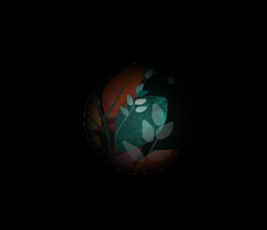

## 动画效果

接下来就是让探照灯动起来，我们要做的效果是给探照灯一个速度，当探照灯动起来后撞了几次墙就让探照灯停下来，并且半径慢慢变大，最终画面完全显示出来，整个动画随即结束。

首先给探照灯加上水平和垂直方向的速度属性：

```js
class Searchlight {
    constructor(opt) {
        // 速度
        this.speedX =
            opt.speedX === undefined ? this.createRandom(-5, 5) : opt.speedX
        this.speedY =
            opt.speedY === undefined ? this.createRandom(-5, 5) : opt.speedY
    }

    createRandom(min, max) {
        return Math.floor(Math.random() * (max - min) + min)
    }
}
```

然后再加一个移动的方法：

```js
class Searchlight {
    move() {
        this.cx += this.speedX
        this.cy += this.speedY
        this.clip()
    }
}
```

这样不断移动调用`mvoe`方法就会不断更新探照灯的位置，并且根据新的位置重新进行裁剪路径：

```js
const draw = () => {
    // ...
    ctx.save()
    searchlight.move()// ++
    drawImage()
    searchlight.addBlur()
    ctx.restore()
    requestAnimationFrame(draw)// ++
}
```

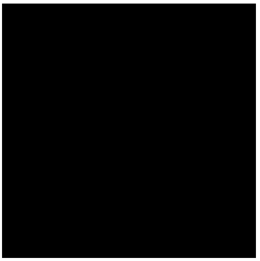

可以看到探照灯动起来了，但是它移出画布就不回来了，所以我们要判断一下，当探照灯的边缘和画布边缘接触了就让它的速度反向：

```js
class Searchlight {
    move() {
        this.cx += this.speedX
        this.cy += this.speedY
        this.clip()
        if (this.cx - this.radius < 0  || this.cx + this.radius > this.canvasWidth) {
            this.speedX = -this.speedX
        }
        if (this.cy - this.radius < 0  || this.cy + this.radius > this.canvasHeight) {
            this.speedY = -this.speedY
        }
    }
}
```

探照灯碰到了水平边界，那么水平速度反向，否则垂直速度反向：

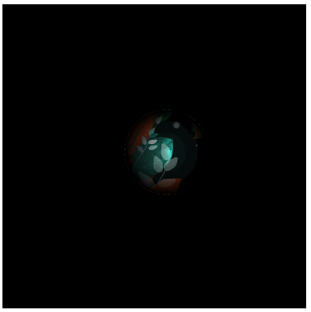

现在探照灯就不会移出画布了，接下来加个计数器，当它撞到几次墙后就停止移动，改为慢慢增加半径：

```js
class Searchlight {
    constructor(opt) {
        // 半径变大的速度
        this.radiusSpeed = opt.radiusSpeed === undefined
              ? this.createRandom(10, 20)
              : opt.radiusSpeed
        // 当前的动画类型
        this.currentAnimation = 'move'
        // 撞墙次数
        this.hitCount = opt.hitCount === undefined ? 2 : opt.hitCount
    }
}
```

增加了几个属性，其中`currentAnimation`代表当前的动画类型，默认为`move`，代表探照灯移动动画。

然后在`move`方法中根据`currentAnimation`类型判断：

```js
class Searchlight {
    move() {
        // 移动动画
        if (this.currentAnimation === 'move') {
            // ...
            let isHit = false
            if (
                this.cx - this.radius < 0 ||
                this.cx + this.radius > this.canvasWidth
            ) {
                isHit = true
            }
            if (
                this.cy - this.radius < 0 ||
                this.cy + this.radius > this.canvasHeight
            ) {
                isHit = true
            }
            // 如果撞墙了就更新撞墙剩余次数
            if (isHit) {
                this.hitCount--
                // 撞墙次数已用尽
                if (this.hitCount <= 0) {
                    this.currentAnimation = 'scale'
                }
            }
        } else if (this.currentAnimation === 'scale') {
            // 放大动画
            this.radius += this.radiusSpeed
            this.clip()
        }
    }
}
```

逻辑很简单，如果探照灯撞墙了就更新撞墙剩余次数，当次数为0时就将当前动画类型改为`scale`，代表是放大动画，这样就会走`scale`分支增加探照灯的半径：

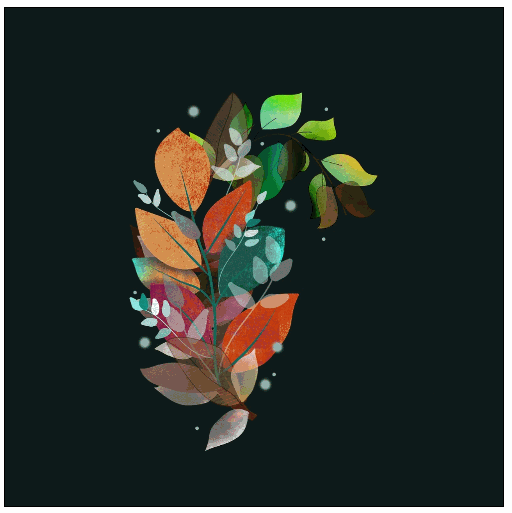

半径放大什么时候结束呢，很简单，当裁剪区域大于画布即可：

```js
class Searchlight {
    constructor(opt) {
        // 动画结束回调函数
        this.done = opt.done || function () {}
    }

    move() {
        if () {
			// ...
        }  else {
            this.radius += this.radiusSpeed
            this.clip()
            if (this.radius >= Math.max(this.canvasWidth, this.canvasHeight) * 1.5) {
                this.done()
            }
        }
    }
}
```

增加了一个动画结束后的回调函数，当发现探照灯的半径已经大于画布的宽和高的最大值的1.5倍，那么就通知调用方可以结束动画了：

```js
let isDone = false
const searchlight = new Searchlight({
    done() {
        isDone = true
    }
})
const draw = () => {
    if (isDone) return
    requestAnimationFrame(draw)
}
```

为什么要1.5倍呢，这是为了避免下面这种情况：

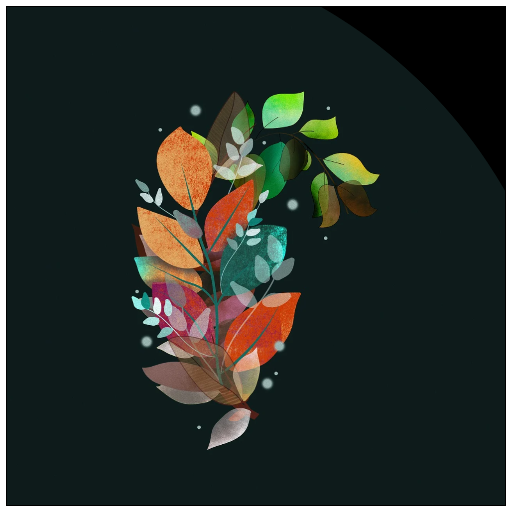

所以这个倍数不用太精确，确保裁剪区域能大于整个画布就行了。

到这里就结束了吗，并没有，因为动画结束后我们的明暗效果依旧存在：

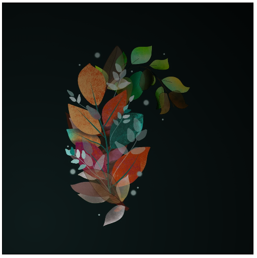

可以看到四周还是比较暗的，所以当动画结束后就应该去掉明暗效果：

```js
const draw = () => {
    searchlight.move()
    drawImage()
    // ++
    if (isDone) {
        ctx.restore()
        return
    }
    searchlight.addBlur()
    ctx.restore()
    requestAnimationFrame(draw)
}
```

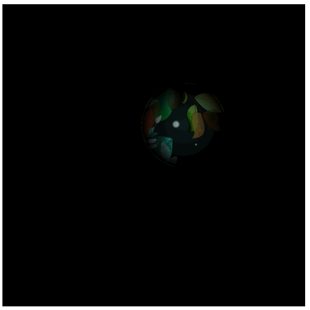

可以看到动画结束后确实去掉了明暗效果，但是它是一个跳变的过程，比较突兀，那么我们可以再加一个动画，当放大结束后，开始让明暗效果的透明度降低，当降到0时代表明暗效果就看不见了，此时动画再结束。

`canvas`提供了`globalAlpha `实现来设置绘图的透明度，接收`[0,1]`之间的小数。

```js
class Searchlight {
    constructor(opt) {
        this.opacity = 1
    }

    move() {
        if (this.currentAnimation === 'move') {

        } else if (this.currentAnimation === 'scale') {
            // 当放大动画结束后开始透明度动画
            if (this.radius >= Math.max(this.canvasWidth, this.canvasHeight)) {
                this.currentAnimation = 'opacity'
            }
        } else if (this.currentAnimation === 'opacity') {
            if (this.opacity - 0.1 >= 0) {
                this.opacity -= 0.1
            } else {
                this.opacity = 0
                this.currentAnimation = ''
                this.done()
            }
        }
    }
    
    addBlur() {
        this.ctx.save()
        this.ctx.globalAlpha = this.opacity
        // ...
    }
}
```

增加了一个`opacity`动画类型，当放大动画结束后就开始透明度动画，也就是在绘制渐变前通过`globalAlpha`属性设置一下透明度：

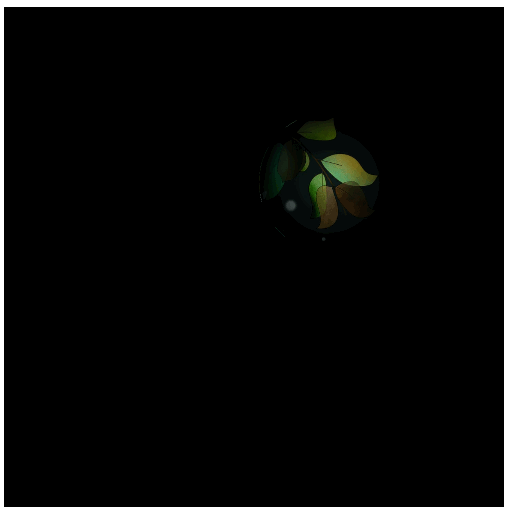

到这里，一个简单的探照灯效果就完成了。


## 总结

本节通过一个探照灯示例学习了裁剪、渐变、透明度、动画等知识点。

本节示例地址：[searchlight](https://wanglin2.github.io/canvas-demos/#/searchlight)。