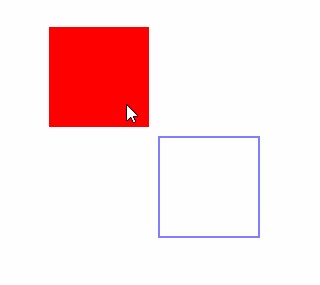

# 实现一个橡皮擦

## 实现

知道了`clearRect`方法可以擦除画布上的某个矩形区域后，我们就可以来实现一个简单的橡皮擦功能。具体来说是当鼠标按住画布拖动时清除以鼠标为中心点，宽高为50像素的矩形区域，鼠标松开后停止。

首先我们要监听三个事件，分别是`mousedown`、`mousemove`、`mouseup`，第一个事件绑定在画布元素上，另外两个绑定到`window`上，原因很简单，鼠标有可能会移出画布区域，如果都绑定到画布上，那么鼠标移出画布再松开就无法结束事件了。

```js
let isMousedown = false
canvas.addEventListener('mousedown', () => {
    isMousedown = true
})
window.addEventListener('mousemove', () => {
    if (!isMousedown) return
})
window.addEventListener('mouseup', () => {
    isMousedown = false
})
```

这是一个简单且通用的框架，常用于拖拽相关的功能，后面的很多章节都会用到。

我们的主要逻辑都在`mousemove`事件回调里。

首先要将鼠标相对于窗口的坐标转换成相对于画布的坐标，因为鼠标事件中获取到的位置是相对于浏览器窗口左上角的，而要调用画布的绘图方法需要相对于画布的坐标，所以需要一个转换过程：

```js
// 画布的位置信息
const rect = canvas.getBoundingClientRect()
window.addEventListener('mousemove', (e) => {
    // ...
    // 将鼠标位置转换成画布位置
    const ex = e.clientX - rect.left
    const ey = e.clientY - rect.top
})
```

转换很简单，鼠标的位置减去画布到窗口的距离即可。需要注意的是`getBoundingClientRect`方法我们没有放在事件回调里，因为该方法的调用会导致页面的回流，所以为了性能考虑最好不要放在频繁触发的事件里。

这个转换逻辑后面的章节也会经常用到，所以我们把它封装成一个函数：

```js
const rect = canvas.getBoundingClientRect()
const windowToCanvas = e => {
    const x = e.clientX - rect.left
    const y = e.clientY - rect.top
    return {
        x,
        y
    }
}
```

然后我们只要在鼠标移动事件中调用`clearRect`方法擦除画布即可：

```js
window.addEventListener('mousemove', (e) => {
    // ...
    const x = ex - 25
    const y = ey - 25
    ctx.clearRect(x, y, 50, 50)
})
```



## 总结

本节我们做了一个非常简单的橡皮擦效果，并且得到了一个基本的拖拽框架和一个鼠标位置的转换方法。目前这个橡皮擦只能擦除矩形区域，后面当我们学会了路径和剪切后，就可以实现任意形状的橡皮擦了。

本节示例地址：[eraser](https://wanglin2.github.io/canvas-demos/#/eraser)。

