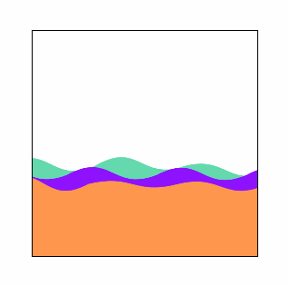

# 实现一个水波图

本节我们来做一个水波图，顾名思义，就是水波样式的图表：


一般用来表示百分比数据，水波的高度会根据百分比的数值变化，另外水波也会左右移动，就像真实的水波一样。

本节我们会介绍两种实现方式：正弦函数、三次贝塞尔曲线，并且会着重介绍第二种实现方式。

## 使用正弦函数

水波图其实就是一根水平波浪线，看到这种上下起伏的线会想到什么呢，是不是就是正弦波：


正弦曲线的公式如下：

```
y = A * sin(ωx + φ) + B
```

`A`代表振幅，值越大，曲线上下幅度就越大，`ω`代表频率，值越大，一个周期的宽度越小，曲线就越尖锐，`φ`代表初相位，即原点处曲线的位置，`B`本身不影响正弦曲线的形状，只会让曲线整体上下移动。

为了便于计算，我们可以把画布的坐标系改为笛卡尔坐标系，也就是原点在左下角，向右为`x`轴正方向，向上为`y`轴正方向，然后我们只要从`x=0`开始，根据正弦函数计算到`x=canvasWidth`之间的每个点的坐标，然后连接起来就是一条水波图：

```js
const A = 50
const ω = 1
const φ = 0
const B = 0
const draw = () => {
    // 清空画布
    ctx.clearRect(0, 0, canvasWidth, canvasHeight)
    ctx.save()
    // 修改坐标系
    ctx.translate(0, canvasHeight)
    ctx.scale(1, -1)

    ctx.beginPath()
    // 从左向右遍历x轴的点
    for (let x = 0; x < canvasWidth; x++) {
        // 根据正弦函数计算x对应的y
        const y = A * Math.sin(ω * degToRad(x) + φ) + B
        if (x === 0) {
            ctx.moveTo(x, y)
        } else {
            ctx.lineTo(x, y)
        }
    }
    // 连接画布右下角和左下角，然后闭合路径形成一个区域
    ctx.lineTo(canvasWidth, 0)
    ctx.lineTo(0, 0)
    ctx.closePath()
    ctx.fillStyle = '#63daad'
    ctx.fill()

    ctx.restore()
}
draw()
```

逻辑很简单，振幅、频率、初相、上下偏移等值都可以先写死，然后从左向右遍历`x`轴的每个点，根据正弦函数公式计算出对应的`y`坐标，然后连接起来就行了，需要注意的是`sin`函数接收的是弧度值，所以我们的`x`坐标要转成弧度，看一下效果：


因为正弦波是基于水平轴对称的，所以下面的看不见，很简单，我们修改一下`B`参数，让正弦波整体往上移动一点：

```js
const B = 100
```


实际上这个`B`值就是根据要显示数据的百分比来确定的。

另外频率太小了，一个完整的周期都看不见，调一下`ω`值：

```js
const A = 10
const ω = 3
```

同时也调小了幅度，否则会比较尖锐：


到现在我们要的水波图基本上就出来了，最后就是让它动起来的问题，这个也很简单，不断改变初相位`φ`然后重绘即可，`φ`增加往左移动，减少则往右移动，它同样也是弧度值：

```js
let φ = 0
const draw = () => {
    // ...
    φ += degToRad(5)
    requestAnimationFrame(draw)
}
draw()
```

最后再给`canvas`元素一个`50%`的圆角让它变成圆形，那么最终的水波图就完成了：


## 使用三次贝塞尔曲线

水波其实就是一条曲线，是曲线肯定可以使用三次贝塞尔曲线来绘制，我们可以在[https://cubic-bezier.com/](https://cubic-bezier.com/)这个网站上试一试，调一调控制点的位置，看它在什么位置比较像一条水波图，以下是一种情况：


是不是还不太明显，没关系，我们把它旋转一下：


控制点1在水波的上面，控制点2在下面，控制点的`x`坐标就是起点和终点的中间，`y`坐标控制曲线的幅度，可以随意调整，频率则通过起点和终点的距离来控制。

同样我们可以把画布的坐标系改为笛卡尔坐标系，然后从左向右通过一段段的贝塞尔曲线连接起来就是一条水波图。这一次我们通过类来组织代码，方便创建多个水波：

```js
class Wave {
    constructor(opt) {
        // 画布宽度
        this.canvasWidth = opt.canvasWidth
        // 画布高度
        this.canvasHeight = opt.canvasHeight
        // 绘图上下文
        this.ctx = opt.ctx
        // 幅度，也就是控制点的y坐标
        this.amplitude = opt.amplitude || 20
        // 频率，也就是起点和终点的距离
        this.frequency = opt.frequency || 100
        // 上下偏移量
        this.yOffset = opt.yOffset || 0
        // 填充样式
        this.fillStyle = opt.fillStyle || '#63daad'
        // 水波数组
        this.waveList = []
    }
}
```

定义了一些控制水波图形属性的变量，最后的`waveList`数组用来存储每一段三次贝塞尔曲线参数的数组，我们在`x`轴从左向右进行遍历创建贝塞尔曲线，如果发现起点已经超出了画布，那么就停止：

```js
class Wave {
    constructor(opt) {
        // ...
        this.createWave()
    }

    createWave() {
        for (let start = 0; start < this.canvasWidth; start += this.frequency) {
            this.waveList.push({
                // 起点
                p1: {
                    x: start,
                    y: this.yOffset
                },
                // 控制点1
                p2: {
                    x: start + this.frequency / 2,
                    y: this.yOffset + this.amplitude
                },
                // 控制点2
                p3: {
                    x: start + this.frequency / 2,
                    y: this.yOffset - this.amplitude
                },
                // 终点
                p4: {
                    x: start + this.frequency,
                    y: this.yOffset
                }
            })
        }
    }
}
```

然后根据创建的水波曲线参数进行绘制：

```js
class Wave {
    drawWave() {
        this.ctx.save()
        // 修改坐标系
        this.ctx.translate(0, canvasHeight)
        this.ctx.scale(1, -1)
        // 连接路径
        this.ctx.beginPath()
        this.waveList.forEach((item, index) => {
            if (index === 0) {
                this.ctx.moveTo(item.p1.x, item.p1.y)
            }
            this.ctx.bezierCurveTo(
                item.p2.x,
                item.p2.y,
                item.p3.x,
                item.p3.y,
                item.p4.x,
                item.p4.y
            )
        })
        // 闭合路径
        this.ctx.lineTo(canvasWidth, 0)
        this.ctx.lineTo(0, 0)
        this.ctx.closePath()
        // 填充
        this.ctx.fillStyle = this.fillStyle
        this.ctx.fill()
        this.ctx.restore()
    }
}
```

最后就可以创建一个水波实例，然后调用它的绘制方法进行绘制即可：

```js
class Wave {
    draw() {
        this.drawWave()
    }
}

const wave = new Wave({
    canvasWidth,
    canvasHeight,
    ctx,
    yOffset: 100
})
const draw = () => {
    ctx.clearRect(0, 0, canvasWidth, canvasHeight)
    wave.draw()
}
draw()
```


接下来就是让它动起来，前面的正弦函数动起来我们是通过修改它的初相位，这里我们修改的是每个水波曲线的四个点的`x`坐标：

```js
class Wave {
    draw() {
        this.waveList.forEach((item) => {
            item.p1.x -= 1
            item.p2.x -= 1
            item.p3.x -= 1
            item.p4.x -= 1
        })
        this.drawWave()
    }
}

const draw = () => {
    ctx.clearRect(0, 0, canvasWidth, canvasHeight)
    wave.draw()
    requestAnimationFrame(draw)// ++
}
```

每次更新时遍历水波列表，然后将每个水波的四个点的`x`坐标不断减少，这样水波就会向左移动：


可以看到水波确实已经动起来了，但是随着不断的向左移动，水波就慢慢的移走了，所以我们要做两个操作：

1.如果前面的水波已经移出画布，那么从水波数组里删除它。

2.根据最后一个水波的位置判断是否需要创建新的水波。

```js
class Wave {
    draw() {
        // 更新水波位置
        this.waveList.forEach(item => {
            item.p1.x -= 1
            item.p2.x -= 1
            item.p3.x -= 1
            item.p4.x -= 1
        })
        // 过滤掉已经移出画布的水波
        this.waveList = this.waveList.filter(item => {
            return item.p4.x > 0
        })
        // 根据最后一个水波的位置判断是否需要创建新的水波
        const lastWave = this.waveList[this.waveList.length - 1]
        if (lastWave.p4.x < this.canvasWidth) {
            this.waveList.push(this.createWaveData(lastWave.p4.x))
        }
        this.drawWave()
    }

    createWaveData(start) {
        return {
            // 起点
            p1: {
                x: start,
                y: this.yOffset
            },
            // 控制点1
            p2: {
                x: start + this.frequency / 2,
                y: this.yOffset + this.amplitude
            },
            // 控制点2
            p3: {
                x: start + this.frequency / 2,
                y: this.yOffset - this.amplitude
            },
            // 终点
            p4: {
                x: start + this.frequency,
                y: this.yOffset
            }
        }
    }
}
```

根据每个水波的终点坐标是否小于`0`判断是否已经移出画布，是的话就从数组里过滤掉，然后根据最后一个水波的终点坐标是否小于画布的宽度判断是否需要创建新的水波，是的话就以最后一个水波的终点坐标作为新创建水波的起点坐标，创建水波数据的逻辑和前面的`createWave`方法中的是一样的，所以提取成一个公共函数。


可以看到现在水波已经源源不断的出现了。

目前的水波只能向左移动，接下来实现一下向右移动的逻辑，首先将更新水波位置由原来写死的`+1`改为配置：

```js
class Wave {
    constructor(opt) {
        // ...  
        this.step = opt.step || -1
    }
    
    draw() {
        // 更新水波位置
        this.waveList.forEach(item => {
          item.p1.x += this.step
          item.p2.x += this.step
          item.p3.x += this.step
          item.p4.x += this.step
        })
    }
}
```

这样我们传正数水波就会向右移动：


和前面一样的问题，前面的判断是针对向左移动的水波，所以要增加右移的判断：

```js
class Wave {
    draw() {
        // 更新水波位置
        // 过滤掉已经移除画布的水波
        this.waveList = this.waveList.filter(item => {
          if (this.step > 0) {
            // 向右移动的水波
            return item.p1.x < this.canvasWidth
          } else {
            // 原有逻辑
          }
        })
        if (this.step > 0) {
          // 根据第一个水波的位置判断是否需要创建新的水波
          const firstWave = this.waveList[0]
          if (firstWave.p1.x > 0) {
            this.waveList.unshift(
              this.createWaveData(firstWave.p1.x - this.frequency)
            )
          }
        } else {
          // 原有逻辑
        }
    }
}
```

就是判断条件改为通过起点的位置，另外在创建新水波时是往前追加的，所以起点是当前第一个水波的起点减去一个完整周期的宽度。


目前每一个波浪的幅度都是一样的，看着不够真实，所以我们在创建水波参数时可以给幅度来一点随机值：

```js
class Wave {
    createWaveData(start) {
        return {
            // 起点
            // 控制点1
            p2: {
                y: this.yOffset + this.amplitude + this.getRandom(-10, 10)
            },
            // 控制点2
            p3: {
                y: this.yOffset - this.amplitude + this.getRandom(-10, 10)
            },
            // 终点
        }
    }

    getRandom(min, max) {
        return Math.floor(Math.random() * (max - min) + min)
    }
}
```

很简单，给控制点的`y`坐标增加一点随机值：


现在让我们再加一条水波，并给它设置不同的颜色和移动步长试试：

```js
const wave2 = new Wave({
    canvasWidth,
    canvasHeight,
    ctx,
    yOffset: 90,
    fillStyle: '#8f12fe',
    step: -2
})
```


你要是喜欢也可以让水波反向滚动：



最后，我们也让它变成圆形显得更好看一点，前面是直接给`canvas`元素设置`50%`的圆角来实现的，这里介绍一个新的`api`：`clip`。

`clip`方法可以将当前创建的路径设置为剪切路径，意味着后面绘制的内容只有在该剪切路径中才会显示，基于此，我们可以创建一个圆形路径：

```js
const clip = () => {
    ctx.beginPath()
    ctx.arc(
        canvasWidth / 2,
        canvasHeight / 2,
        canvasWidth / 2,
        0,
        Math.PI * 2
    )
    ctx.stroke()
    ctx.clip()
}

clip()
draw()
```

在开始绘制曲线前先通过`arc`方法创建了一个圆形路径，然后调用`clip`方法进行剪切，最后我们的水波就只会在这个剪切区域中绘制了：


通过`clip`方法我们可以创建任意形状的水波图，`clip`方法也可以接受一段`Path2D`路径作为参数，那么意味着也可以使用`SVG`的`path`路径：

```js
const clip = () => {
    let path = new Path2D('M367.855,xxx')
    ctx.lineWidth = 5
    ctx.strokeStyle = '#ff974d'
    ctx.stroke(path)
    ctx.clip(path)
}
```


到这里，一个相对完善的水波图就完成了。

## 总结

本文介绍了两种实现水波图的方式，通过正弦函数的方式相对来说简单一点，但是通过三次贝塞尔曲线的方式更为强大一点，可以根据你的实际需求选择哪种方式。

本节示例地址：[liquid](https://wanglin2.github.io/canvas-demos/#/liquid)。