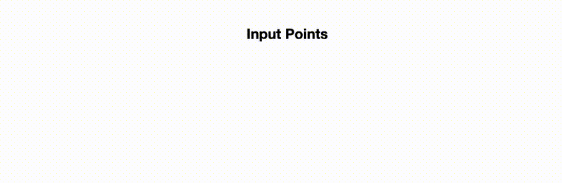

# 实现一个电子签名

## 简单分析

本案例我们来做一个比较实用的电子签名功能，也就是用鼠标来写字。

【橡皮擦】案例的基本框架可以直接搬过来：

```js
let isMousedown = false
canvas.addEventListener('mousedown', () => {
    isMousedown = true
})
window.addEventListener('mousemove', () => {
    if (!isMousedown) return
})
window.addEventListener('mouseup', () => {
    isMousedown = false
})
```

接下来思考一下具体的绘制逻辑，大体上有两种方式：

一：鼠标在实时移动过程中，我们通过一个变量来记录上一个位置的坐标，然后每次都创建一条新路径，将上一个坐标点和当前坐标点连接并绘制出来。

二：通过一个数组收集鼠标实时移动过程中的所有点，每次都先清空画布，然后从第一个坐标点开始遍历进行绘制。

两种方式其实都可以，不过各有优劣。

性能上第一种会更好一点，因为第一种无论我们绘制多长，每次都只是新建和绘制当前最新的一段直线段，而第二种方式随着我们绘制的长度增加，点位数量也会快速膨胀，那么每次都要从头开始遍历并创建路径可能会变得卡顿。

效果上第二种会更好一点，因为第一种其实是无数没有关联的小路径组成的图形，连接处肯定没有第二种完整的路径好，甚至还会出现间隙。

## 方式一

接下来先看一下第一种方式的具体实现代码：

```js
let lastPos = {
    x: 0,
    y: 0
}
canvas.addEventListener('mousedown', e => {
    lastPos = windowToCanvas(e)
})
window.addEventListener('mousemove', e => {
    ctx.beginPath()
    ctx.moveTo(lastPos.x, lastPos.y)
    lastPos = windowToCanvas(e)// 更新lastPos
    ctx.lineTo(lastPos.x, lastPos.y)
    ctx.lineWidth = 5
    ctx.stroke()
})
```

效果如下：


实现非常简单，不过正如前面所说，绘制出来的图形比较粗糙，还存在间隙，快速书写时问题不大，但当速度慢下来就很明显了。

## 方式二

接下来看一下第二种实现：

```js
let pointList = []
canvas.addEventListener('mousedown', e => {
    pointList.push(windowToCanvas(e))
})
window.addEventListener('mousemove', e => {
    pointList.push(windowToCanvas(e))
    ctx.clearRect(0, 0, canvasWidth, canvasHeight)
    ctx.beginPath()
    pointList.forEach((point, index) => {
        if (index === 0) {
            ctx.moveTo(point.x, point.y)
        } else {
            ctx.lineTo(point.x, point.y)
        }
    })
    ctx.lineWidth = 5
    ctx.stroke()
})
```


比前面好了很多，至少不会再出现间隙，但是当速度慢下来时同样比较粗糙。那么出现这个问题的原因是什么呢，其实很简单，当鼠标滑过同样的距离时，速度越快，`mousemove`事件触发的次数越少，反之越多，那么同一段距离我们所收集到的坐标点数量也就更多，最终的结果就是连接点变多了，当然就粗糙了。

知道了原因我们就可以减少坐标点的数量，具体的减少策略，你可以根据点的距离来判断，也可以根据当前的速度来判断，甚至可以重新取样，这里我们选择根据点的距离来判断，如果本次的坐标点和上次的坐标点距离小于指定数值，我们就跳过本次的坐标点：

```js
let lastPos = null
canvas.addEventListener('mousedown', e => {
    isMousedown = true
    lastPos = windowToCanvas(e)
    pointList.push(lastPos)
})
window.addEventListener('mousemove', e => {
    const curPos = windowToCanvas(e)
    // getTwoPointDistance是一个计算两个点的直线距离的方法
    const distance = getTwoPointDistance(curPos.x, curPos.y, lastPos.x, lastPos.y)
    // 当两点之间的距离小于4时跳过当前点
    if (distance <= 4) {
        return
    }
    lastPos = curPos
    pointList.push(curPos)
    // 省略原有逻辑
})
```

如上所示，当本次的坐标点距上次的坐标点小于4时就跳过，具体的数值你可以自己调整，现在的效果如下：


是不是比之前要好了一点？

## 使用曲线连接

其实除了用直线段连接每个点外，还可以通过曲线的方式来连接，我们可以使用二次贝塞尔曲线，但是问题来了，起点、控制点、终点分别怎么计算呢，这里介绍一种简单的算法，来源于后面会介绍的一个库：

1.前三个坐标点，使用`moveTo`方法移动到第一个坐标点，然后第二个点作为控制点，第二个和第三个点取平均值作为终点，使用`quadraticCurveTo`创建二次贝塞尔曲线路径，并且记录下控制点和终点坐标。

2.从第三个坐标点开始不断使用`quadraticCurveTo`创建路径，控制点取上一个控制点相对于上一个终点的对称点，终点取和下一个坐标的平均值，同样记录下控制点和终点。

3.不断重复第2步。

同样可以把前面根据距离减少点数量的逻辑加上，下面是具体的代码实现：

```js
let isMousedown = false
let points = []
let lastPos = null
canvas.addEventListener('mousedown', e => {
    isMousedown = true
    lastPos = windowToCanvas(e)
    pointList.push(lastPos)
})
window.addEventListener('mousemove', e => {
    if (!isMousedown) return
    const curPos = windowToCanvas(e)
    const distance = getTwoPointDistance(curPos.x, curPos.y, lastPos.x, lastPos.y)
    if (distance <= 4) {
        return
    }
    lastPos = curPos
    
    points.push(windowToCanvas(e))
    const len = points.length
    // 点位数量小于4个不处理
    if (len < 4) {
        return
    }
    // 上一个控制点
    const lastControlPoint = {
        x: 0,
        y: 0
    }
    // 上一个终点
    const lastEndPoint = {
        x: 0,
        y: 0
    }
    let a = points[0]
    let b = points[1]
    const c = points[2]

    ctx.clearRect(0, 0, canvasWidth, canvasHeight)
    ctx.beginPath()
    ctx.moveTo(a.x, a.y)

    // 记录控制点和终点
    lastControlPoint.x = b.x
    lastControlPoint.y = b.y
    lastEndPoint.x = average(b.x, c.x)// average是一个计算平均值的方法
    lastEndPoint.y = average(b.y, c.y)

    ctx.quadraticCurveTo(
        lastControlPoint.x,
        lastControlPoint.y,
        lastEndPoint.x,
        lastEndPoint.y
    )

    for (let i = 2, max = len - 1; i < max; i++) {
        a = points[i]
        b = points[i + 1]
        // 更新控制点和终点
        lastControlPoint.x =
            lastEndPoint.x + (lastEndPoint.x - lastControlPoint.x)
        lastControlPoint.y =
            lastEndPoint.y + (lastEndPoint.y - lastControlPoint.y)
        lastEndPoint.x = average(a.x, b.x)
        lastEndPoint.y = average(a.y, b.y)
        ctx.quadraticCurveTo(
            lastControlPoint.x,
            lastControlPoint.y,
            lastEndPoint.x,
            lastEndPoint.y
        )
    }

    ctx.lineWidth = 5
    ctx.stroke()
})
window.addEventListener('mouseup', () => {
    isMousedown = false
    points = []
})
```

代码比较长，但是基本就是对前面算法描述的实现，所以应该很容易理解，看一下现在的效果：


有没有感觉用曲线连接比用直接连接效果更好一点？

## 更好的效果

那么到这里就结束了吗，显然没有，目前我们绘制出来的线宽都是一样的，这不太符合现实，实际生活中我们写字时，用力写的地方线条会更粗一点，轻轻写的则会更细，要实现这个效果我们可以使用这个库[perfect-freehand](https://github.com/steveruizok/perfect-freehand)，它会把我们输入的点数组转换为线条对应的轮廓点数组，通过其仓库的这张动图应该很容易理解：



这个库会根据每个点的压力来计算对应位置的线条的粗细，如果你有支持压力输入的硬件，那么可以使用[Pointer events](https://developer.mozilla.org/zh-CN/docs/Web/API/Pointer_events)来代替我们前面使用的`mousemove`等鼠标事件来获取坐标点及坐标点对应的压力值，然后传递给`perfect-freehand`即可，但是我们的鼠标显然不支持输入压力，不过没关系，这个库会根据前后两个点的距离来模拟压力，进而改变线条的粗细。

这个库只提供了一个方法，就是将我们传入的点数组转换为对应的轮廓图形的点数组，所以我们只要收集鼠标滑过的坐标点，然后调用这个方法即可：

```js
import { getStroke } from 'perfect-freehand'

let isMousedown = false
let pointList = []
canvas.addEventListener('mousedown', e => {
    isMousedown = true
    pointList = []
    pointList.push(windowToCanvas(e))
})
window.addEventListener('mousemove', e => {
    if (!isMousedown) return
    pointList.push(windowToCanvas(e))
    const points = getStroke(pointList, {
        size: 16,
        thinning: 0.5,
        smoothing: 0.5,
        streamline: 0.5,
        start: {
            cap: true,
            taper: 0,
            easing: t => t
        },
        end: {
            cap: true,
            taper: 0,
            easing: t => t
        }
    })
    // ...
})
```

`perfect-freehand`支持一些配置选项，上面我们用了它示例的配置，配置的具体含义可以参考它的文档。

它返回的`points`也是一个点数组，那么我们要如何使用呢，其实就是我们前面通过二次贝塞尔曲线来连接的逻辑，只是最后我们是描边，而这里是填充，所以你可以直接复用前面的代码，也可以使用`perfect-freehand`提供示例代码，通过拼接`SVG`路径，然后通过`Path2D`来使用：

```js
window.addEventListener('mousemove', e => {
    // ...
    const points = getStroke(pointList, {
        size: 5
    })
    const pathData = getSvgPathFromStroke(points)
    const path = new Path2D(pathData)
    ctx.fill(path)
})

// 将点数组转换为svg路径字符串
const getSvgPathFromStroke = (points) => {
    const len = points.length
    if (len < 4) {
        return ''
    }
    let a = points[0]
    let b = points[1]
    const c = points[2]
    let result = `M${a[0]},${a[1]} Q${b[0]},${b[1]} ${average(b[0], c[0])},${average(b[1], c[1])} T`
    for (let i = 2, max = len - 1; i < max; i++) {
        a = points[i]
        b = points[i + 1]
        result += `${average(a[0], b[0])},${average(a[1], b[1])} `
    }
    result += 'Z'
    return result
}
```

`SVG`提供了非常多的[路径命令](https://developer.mozilla.org/zh-CN/docs/Web/SVG/Attribute/d#%E8%B7%AF%E5%BE%84%E5%91%BD%E4%BB%A4)，同样是创建二次贝塞尔曲线，`canvas`只提供了一个方法，而`SVG`提供了4个命令，实际上我们前面计算控制点的方法就参考自它的[T](https://developer.mozilla.org/zh-CN/docs/Web/SVG/Attribute/d#%E4%BA%8C%E6%AC%A1%E8%B4%9D%E5%A1%9E%E5%B0%94%E6%9B%B2%E7%BA%BF)命令。


可以看到粗细已经有了，但是图形却存在明显的锯齿，要解决这个问题，我们需要每次绘制前都清空画布然后重新绘制：

```js
window.addEventListener('mousemove', e => {
    if (!isMousedown) return
    pointList.push(windowToCanvas(e))
    ctx.clearRect(0, 0, canvasWidth, canvasHeight)// ++
    const points = getStroke(pointList, {})
    // ...
})
```


现在好了很多，但是又有新问题，就是之前绘制的图形都没了，这显然不行，解决方法有两个。

一是保存之前所绘制的路径，每次都进行重绘：

```js
let lineList = []// 保存所有绘制的线条路径
let line = null// 当前绘制中的线条路径

window.addEventListener('mousemove', e => {
    // ...
    ctx.clearRect(0, 0, canvasWidth, canvasHeight)
    // 重新绘制之前所有线条
    lineList.forEach(item => {
        ctx.fill(item)
    })
    // ...
    const path = new Path2D(pathData)
    line = path//++
    ctx.fill(path)
})
window.addEventListener('mouseup', () => {
    isMousedown = false
    lineList.push(line)// ++
})
```


这种方式的优点是实现很简单，缺点也很明显，就是性能不好，理论上之前绘制的线条不会再变化，不需要每次重新绘制。所以最好使用第二种方法，也就是通过创建两个重叠的`canvas`标签，之前的所有线条都绘制到  下层`canvas`上，当前正在绘制的线条绘制到第二个`canvas`上。

首先在之前的基础上再加一个`canvas`标签：

```html
<div class="canvasBox">
    <div class="canvasWrap">
        <canvas id="canvas2"></canvas>
        <canvas id="canvas"></canvas>
    </div>
</div>
```

```css
.canvasWrap {
    position: relative;
    width: 500px;
    height: 500px;
}
canvas {
    position: absolute;
    left: 0;
    top: 0;
    border: 1px solid;
}
```

`id`为`canvas2`的标签是我们新加的，用来绘制不变的线条，两个`canvas`标签都设为绝对定位，位置也一样，那么`id`为`canvas`的标签会在`id`为`canvas2`标签的上面。

然后要做的很简单，把之前在`mousemove`回调里重新绘制之前所有线条的逻辑移到`mouseup`回调里就可以了：

```js
window.addEventListener('mousemove', e => {
    // ...
    ctx.clearRect(0, 0, canvasWidth, canvasHeight)
    // 重新绘制之前所有线条 ----删除
    lineList.forEach(item => {
        ctx.fill(item)
    })
    // ----删除
    // ...
    const path = new Path2D(pathData)
})
window.addEventListener('mouseup', () => {
    isMousedown = false
    lineList.push(line)
    // 绘制完成后就将图形移到canvas2
    ctx.clearRect(0, 0, canvasWidth, canvasHeight)
    ctx2.clearRect(0, 0, canvasWidth, canvasHeight)
    lineList.forEach(item => {
        ctx2.fill(item)
    })
})
```

这样当前实时绘制的图形在上层`canvas`上进行绘制，当绘制结束后就清除两个`canvas`，然后把之前及本次绘制的图形再全部在下层`canvas`上绘制一遍，因为绘制速度很快，所以人眼基本感觉不到变化。


## 总结

本节介绍了几种实现电子签名的方法，实际项目中我们都可以选择最后一种方式。

本节示例地址：[signature](https://wanglin2.github.io/canvas-demos/#/signature)。