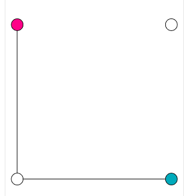

# 实现一个贝塞尔曲线编辑器

本节我们来做一个有趣的东西，通过`canvas`绘制一个三次贝塞尔曲线，可以拖拽修改控制点，生成新的贝塞尔曲线作为页面元素的过渡动画属性，然后可视化的查看当前贝塞尔曲线对应的动画效果，就像这个网站的功能一样：[https://cubic-bezier.com](https://cubic-bezier.com)。

## 元素动画效果

`CSS3`的过渡动画属性相信大家肯定都用过，它可以让元素的某些属性的变化以动画过渡的方式进行，极大的提升了使用体验，下面来看一个简单的示例：

```html
<div class="wrap">
    <div class="boxWrap">
        <div id="box"></div>
    </div>
    <button id="start">开始</button>
</div>
```

```less
.boxWrap {
    width: 400px;
    height: 100px;
    position: relative;

    #box {
        position: absolute;
        width: 100px;
        height: 100px;
        background-color: lightcoral;
        left: 0;
        top: 0;
        transition-property: left;
        transition-duration: 1s;
        transition-timing-function: ease-in-out;

        &.move {
            left: 300px;
        }
    }
}
```

`box`元素是一个正方形，相对于父元素绝对定位，初始位置为`0,0`，提供了一个`move`类名来改变它的水平位置，为了让位置改变有动画效果，我们设置了`transition`相关的属性。

```js
const box = document.getElementById('box')
const start = document.getElementById('start')
start.addEventListener('click', () => {
    if (box.classList.contains('move')) {
        box.classList.remove('move')
    } else {
        box.classList.add('move')
    }
})
```

点击开始按钮后给`box`元素添加或删除`move`类名，这样就可以达到修改`box`元素位置的目的：


动画的时间曲线可以通过`transition-timing-function`属性设置，除了可以设置为`ease-in-out`、`linear`等等关键词，也可以设置为三次贝塞尔曲线：

```css
transition-timing-function: cubic-bezier(0.1, 0.7, 1, 0.1);
```

`cubic-bezier`是`CSS3`中定义三次贝塞尔曲线的函数：

1.三次贝塞尔曲线需要四个点：`P0`、`P1`、`P2` 和 `P3`，分别是：起点、控制点1、控制点2、终点，在`CSS3`中，起点和终点是固定的，分别为：`(0,0)`、`(1,1)`，代表起始状态和结束状态，所以`cubic-bezier`函数四个参数代表的是`P1`、`P2`两个控制点坐标。

2.`P1` 和 `P2` 两个控制点的横坐标必须要在 `[0, 1]` 范围内。

3.`P1` 和 `P2` 两个控制点的纵坐标可以在 `[0, 1]` 范围外，这样会形成折返的效果。


横轴代表时间，纵轴代表进度。

我们可以动态改变`box`元素的`transition-timing-function`属性：

```js
const setCubicBezier = (x1, y1, x2, y2) => {
    box.style.transitionTimingFunction = `cubic-bezier(${x1}, ${y1}, ${x2}, ${y2})`
}
```

这样就可以更新并查看各个时间曲线的效果，比如匀速`linear`关键词对应的控制点如下：

```js
setCubicBezier(0, 0, 1, 1)
```


接下来我们要做的就是通过`canvas`来绘制上面图中的贝塞尔曲线，并且可以鼠标拖动两个控制点修改控制点的位置，然后将新的贝塞尔曲线设置为`box`元素的时间曲线，查看动画效果。

## 绘制贝塞尔曲线


我们的思路是参考上图把`canvas`的坐标系修改成图中所示的坐标系，然后把图中的相关图形绘制出来，包括：坐标轴、起点、终点、控制点1、控制点2，控制点到起止点的连线，以及形成的三次贝塞尔曲线。

然后通过鼠标事件实现控制点的拖动，拖动时实时清空画布并重新绘制所有内容达到更新的效果，当然坐标轴、起点、终点是不变的，其实没有必要重绘，那么可以创建两个大小一样，重叠在一起的`canvas`标签，一个用来绘制会更新的内容，一个用来绘制不变的内容，简单起见，我们这里通过全部重绘的方式。

因为控制点的横坐标必须在`[0,1]`范围内，所以画布的宽度就全部用来表示`[0,1]`的范围，而纵坐标可以超出`[0,1]`，所以让坐标系垂直居中，如下图所示：


当然我们的画布宽度不可能是`1`，比如宽度为`300`，那么这些点的坐标最终就需要一个`/300`的转换过程。

另外，因为起止点、控制点绘制出来都是一个圆，为了防止当圆贴边时圆显示不完全，我们需要加个内边距：


### 绘制坐标系

因为我们要修改坐标系，所以为了方便的清空画布，需要保存状态和恢复状态：

```js
const padding  = 20// 内边距
const contentWidth = canvasWidth - padding * 2// 实际可用宽高
const contentHeight = canvasHeight - padding * 2
const draw = () => {
    // 清空画布
    ctx.clearRect(0, 0, canvasWidth, canvasHeight)

    ctx.save()

    // 修改坐标系
    ctx.translate(padding, padding + contentWidth + (contentHeight - contentWidth) / 2)
    ctx.scale(1, -1)

    ctx.restore()
}
```


先向下移动画布原点，然后翻转`y`轴到上面就得到了我们要的坐标系。

然后就可以轻松的把横轴和纵轴绘制出来了：

```js
const draw = () => {
    ctx.save()
    	
    // 绘制坐标轴
    ctx.beginPath()
    ctx.moveTo(0, contentWidth)
    ctx.lineTo(0, 0)
    ctx.lineTo(contentWidth, 0)
    ctx.stroke()
    
    ctx.restore()
}
```


### 绘制起点和终点

起点和终点就是两个圆形，起点在坐标轴原点，终点在起点的对角线位置，坐标都是已知的：

```js
const draw = () => {
    ctx.save()
    	
    // 绘制起点和终点
    drawCircle(0, 0)
    drawCircle(contentWidth, contentWidth)
    
    ctx.restore()
}

const drawCircle = (x, y) => {
    ctx.save()
    ctx.beginPath()
    ctx.arc(x, y, 10, 0, Math.PI * 2)
    ctx.fillStyle = '#fff'
    ctx.fill()
    ctx.stroke()
    ctx.restore()
}
```

因为绘制圆的逻辑都是一样的，所以提取成了一个公共函数。


### 绘制控制点

控制点其实也是两个圆，只是它们的位置是可变的，我们可以给它们一个初始坐标，另外为了区分我们把它们填充成不同的颜色：

```js
const p1 = {
    x: 0,
    y: contentWidth
}
const p2 = {
    x: contentWidth,
    y: 0
}

const draw = () => {
    ctx.save()

    // 绘制控制点
    drawCircle(p1.x, p1.y, '#ff0088')
    drawCircle(p2.x, p2.y, '#00aabb')

    ctx.restore()
}

const drawCircle = (x, y, color = '#fff') => {
    // ...
    ctx.fillStyle = color
    // ...
}
```

因为控制点的坐标我们后面会通过拖拽来修改，所以提取成了变量：




### 绘制控制点到起止点的连线

控制点`1`和起点相连、控制点`2`和终点相连：

```js
const draw = () => {
    ctx.save()

    // 绘制控制点
    drawLine(p1.x, p1.y, 0, 0, '#ff0088')
    drawLine(p2.x, p2.y, contentWidth, contentWidth, '#00aabb')

    ctx.restore()
}

const drawLine = (x1, y1, x2, y2, color = '#000') => {
    ctx.save()
    ctx.beginPath()
    ctx.moveTo(x1, y1)
    ctx.lineTo(x2, y2)
    ctx.strokeStyle = color
    ctx.stroke()
    ctx.restore()
}
```

同样绘制线段的逻辑也是通用的可以提取成一个公共函数。


可以看到连线在圆的上面，不太好看，解决很简单，先绘制连线，再绘制圆：

```js
const draw = () => {
    ctx.save()

    // 绘制坐标轴
    // 绘制控制点到起止点的连线
    // 绘制起点和终点
    // 绘制控制点

    ctx.restore()
}
```

按如上顺序绘制即可：


### 绘制贝塞尔曲线

贝塞尔曲线的四个点都有了，那么直接调用`bezierCurveTo`方法把曲线绘制出来就行了：

```js
const draw = () => {
    ctx.save()

    // 绘制坐标轴
    // 绘制控制点到起止点的连线
    // 绘制贝塞尔曲线
    ctx.beginPath()
    ctx.moveTo(0, 0)
    ctx.bezierCurveTo(p1.x, p1.y, p2.x, p2.y, contentWidth, contentWidth)
    ctx.stroke()
    // 绘制起点和终点
    // 绘制控制点

    ctx.restore()
}
```

在绘制起点和终点之前绘制，否则曲线又会盖在圆上面：


到这里所有图形都绘制完毕了，接下来就可以实现拖拽逻辑了。

### 拖动控制点

要想拖动控制点，首先要知道鼠标是否按到了控制点，根据上一节的学习，我们知道可以通过`isPointInPath`方法来检测，检测的点是相对于画布的，所以鼠标坐标转换函数必不可少：

```js
const rect = canvas.getBoundingClientRect()
const windowToCanvas = e => {
    const x = e.clientX - rect.left
    const y = e.clientY - rect.top
    return {x, y}
}
```

这是我们的老朋友了。

接下来给`canvas`元素绑定一下`mousedown`事件：

```js
canvas.addEventListener('mousedown', e => {
    const pos = windowToCanvas(e)
})
```

然后当鼠标点击时重新绘制一遍控制点的路径进行检测：

```js
canvas.addEventListener('mousedown', e => {
    // 控制点1的路径
    drawCirclePath(p1.x, p1.y)
    let isInPoint1 = isPointInPath(pos.x, pos.y)// isPointInPath为上一节中封装的方法
    let isInPoint2 = false
    if (!isInPoint1) {
        // 控制点2的路径
        drawCirclePath(p2.x, p2.y)
        isInPoint2 = isPointInPath(pos.x, pos.y)
    }
    console.log(isInPoint1, isInPoint2)
})

const drawCirclePath = (x, y) => {
    ctx.beginPath()
    ctx.arc(x, y, 10, 0, Math.PI * 2)
}
```

因为使用`isPointInPath`方法检测时只需要路径，不需要实际绘制出来，所以我们新增了一个`drawCirclePath`方法来绘制圆的路径。

首先检测控制点`1`，如果没有点击到控制点`1`再检测控制点`2`，接下来看看效果：


我分别点击了一次控制点`1`和控制点`2`，但是结果全部都是`false`，这是为什么呢，其实不要忘了我们前面绘制控制点的方法是在修改后的坐标系上进行的，而前面的所有逻辑又都是在`save`和`restore`之间的，并不会影响其他地方，所以这里我们相当于在画布原有坐标系上绘制，当然就检测不到了，所以这里也要加上修改坐标系的逻辑：

```js
canvas.addEventListener('mousedown', e => {
    const pos = windowToCanvas(e)
    ctx.save()

    // 修改坐标系
    ctx.translate(
        padding,
        padding + (contentHeight - contentWidth) / 2 + contentWidth
    )
    ctx.scale(1, -1)

    // 控制控制点1的路径
    // ...
    console.log(isInPoint1, isInPoint2)

    ctx.restore()
})
```


可以看到已经能检测到了。

因为修改坐标系的逻辑是完全一样的，所以可以提取成一个公共函数：

```js
const drawInNewCoordSystem = fn => {
    ctx.save()

    // 修改坐标系
    ctx.translate(
        padding,
        padding + (contentHeight - contentWidth) / 2 + contentWidth
    )
    ctx.scale(1, -1)

    fn()

    ctx.restore()
}

canvas.addEventListener('mousedown', e => {
    const pos = windowToCanvas(e)

    drawInNewCoordSystem(() => {
        // 控制控制点1的路径
        // ...
        console.log(isInPoint1, isInPoint2)
    })
})
```

能检测到我们按住了哪个控制点，接下来就可以在鼠标移动时实时更新该控制点的坐标，然后重绘所有图形就可以了：

```js
// 当前按住的控制点
let mousedownPoint = ''
// 鼠标按下的坐标
const mousedownPos = {
    x: 0,
    y: 0
}
// 当前按住的控制点此刻的坐标
const mousedownPointPos = {
    x: 0,
    y: 0
}

canvas.addEventListener('mousedown', e => {
    const pos = windowToCanvas(e)
    mousedownPos.x = pos.x
    mousedownPos.y = pos.y

    drawInNewCoordSystem(() => {
        // ...
        if (isInPoint1) {
            mousedownPointPos.x = p1.x
            mousedownPointPos.y = p1.y
            mousedownPoint = 'point1'
        } else if (isInPoint2) {
            mousedownPointPos.x = p2.x
            mousedownPointPos.y = p2.y
            mousedownPoint = 'point2'
        }
    })
})
```

鼠标按下时如果按到了某个控制点，那么记录下具体是哪个控制点，另外也要把该控制点的此刻的坐标缓存一下，后面我们会计算鼠标拖动的距离，然后加上这个初始坐标作为控制点新的坐标：

```js
window.addEventListener('mousemove', e => {
    if (!mousedownPoint) return
    const pos = windowToCanvas(e)
    // 鼠标拖动的距离
    const dx = pos.x - mousedownPos.x
    const dy = pos.y - mousedownPos.y
    // 当前被拖拽控制点新的坐标
    const newX = mousedownPointPos.x + dx
    const newY = mousedownPointPos.y - dy
    // 更新控制点坐标
    if (mousedownPoint === 'point1') {
        p1.x = newX
        p1.y = newY
    } else if (mousedownPoint === 'point2') {
        p2.x = newX
        p2.y = newY
    }
    // 重绘
    draw()
})
```

逻辑应该很简单，这里解释一下计算新的坐标时，为什么横坐标是加上鼠标拖动距离，而纵坐标是减去，这是因为鼠标事件的坐标是相对于浏览器窗口，窗口的坐标系和我们贝塞尔曲线的坐标系是不一样的：


可以看到横轴方向是一致的，而纵轴相反，所以需要减去鼠标纵坐标的差值。

不出意外的话控制点已经可以成功被拖动了：


非常不错，不过不要忘了我们控制点的`x`坐标是不能超过`[0,1]`范围的，所以还得加个限制：

```js
window.addEventListener('mousemove', e => {
    // ...
    let newX = mousedownPointPos.x + dx
    const newY = mousedownPointPos.y - dy
    newX = newX < 0 ? 0 : newX > contentWidth ? contentWidth : newX
    // ...
})
```

如果新的`x`坐标小于`0`就直接设置为`0`，如果大于`contentWidth`就直接设置为`contentWidth`：


纵坐标因为不限制，所以拖出去了也无所谓，当然你也可以同样加上限制。

最后，当鼠标松开时我们就可以生成新的三次贝塞尔曲线了：

```js
window.addEventListener('mouseup', () => {
    if (!mousedownPoint) return
    mousedownPoint = ''
    const x1 = (p1.x / contentWidth).toFixed(2)
    const y1 = (p1.y / contentWidth).toFixed(2)
    const x2 = (p2.x / contentWidth).toFixed(2)
    const y2 = (p2.y / contentWidth).toFixed(2)
    setCubicBezier(x1, y1, x2, y2)
})
```

因为最终设置到`CSS3`上的控制点坐标必须在`[0,1]`之间，所以除以坐标轴的宽度转换为`[0,1]`之间的小数，另外防止小数位数过多，也限制成了两位：


你也可以像图中一样再创建一个输入框把生成的贝塞尔曲线显示出来，这样就可以复制到你的项目中进行使用了。

## 总结

本节我们通过一个有趣又实用的小案例来巩固了一下`canvas`事件检测及其他相关的知识点，因为这个案例中的路径相对来说比较简单，所以我们检测点是通过直接重新绘制一遍路径的方式，如果你的项目中路径比较复杂，推荐可以尝试使用`Path2D`来创建路径。

本节示例地址：[bezierEditor](https://wanglin2.github.io/canvas-demos/#/bezierEditor)。