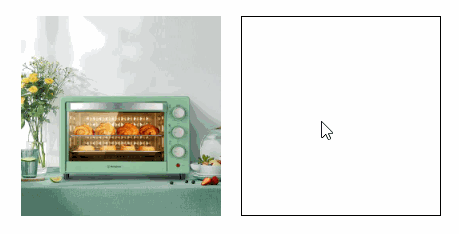

# 实现商品图片放大镜效果

如果你逛过PC端的电商网站，那么肯定在商品详情页用过商品图片放大镜的效果，也就是鼠标移到商品主图上时，会出现一个悬浮的大图，放大显示原图的一小块区域，这个功能可以通过`canvas`轻松的实现。

首先基本的HTML结构如下所示：

```html
<div id="imgBox">
    
    <div id="area"></div>
</div>
<canvas id="canvas"></canvas>
```

`imgBox`元素就是商品图片容器，相对定位，`img`的宽高和`imgBox`一致，`area`元素绝对定位，当鼠标在图片上移动时会跟随鼠标移动，指示要放大查看的区域，样式如下：

```less
#imgBox {
    width: 200px;
    height: 200px;
    position: relative;
    overflow: hidden;

    img {
        width: 100%;
        height: 100%;
    }

    #area {
        position: absolute;
        width: 50px;
        height: 50px;
        background-color: rgba(0, 0, 0, 0.3);
    }
}
```

接下来获取一下所需元素：

```js
// 图片容器元素
const imgBox = document.getElementById('imgBox')
const imgBoxRect = imgBox.getBoundingClientRect() // 尺寸和位置信息
const imgBoxSize = imgBoxRect.width // 尺寸
// 图片元素
const img = document.getElementById('img')
// 指示器元素
const area = document.getElementById('area')
const areaSize = 50 // 指示器元素的大小
```

然后我们的逻辑是当鼠标移入`imgBox`元素时让`area`元素跟随鼠标，并在`canvas`上渲染这一区域的放大图片，当鼠标移出`imgBox`元素时隐藏指示器和清除`canvas`绘制的图片。

基本框架如下：

```js
let isInImgBox = false
imgBox.addEventListener('mouseover', () => {
    isInImgBox = true
    area.style.display = 'block'
})
imgBox.addEventListener('mousemove', e => {
    if (!isInImgBox) return
    // 转换鼠标位置，然后减去指示器元素大小的一半
    let left = e.clientX - imgBoxRect.left - areaSize / 2
    let top = e.clientY - imgBoxRect.top - areaSize / 2
    // 左边界限制
    left = Math.max(left, 0)
    // 右边界限制
    left = Math.min(left, imgBoxSize - areaSize)
    // 同理
    top = Math.max(top, 0)
    top = Math.min(top, imgBoxSize - areaSize)
    // 更新指示器位置
    area.style.left = left + 'px'
    area.style.top = top + 'px'
})
imgBox.addEventListener('mouseleave', () => {
    isInImgBox = false
    area.style.display = 'none'
})
```

鼠标移入时显示指示器元素，移出隐藏，然后当鼠标移动时根据鼠标当前位置计算出指示器元素的位置，因为指示器元素的位置是相对于图片容器元素的，所以也需要一个转换过程，因为我们要让鼠标在指示器元素的中心，所以还需要减去指示器大小的一半。

另外指示器也不能移出容器元素，所以做了边界判断，目前效果如下：



接下来就是如何在`canvas`上绘制指示器对应的放大图片，首先肯定要用到`drawImage`方法九个参数的形式：

```js
drawImage(image, sx, sy, sWidth, sHeight, dx, dy, dWidth, dHeight)
```

图像源、以及最后四个参数都很简单，关键是要计算出`sx, sy, sWidth, sHeight`四个参数，也就是在原图的什么位置裁剪多大的区域。

如果页面上显示的是商品小图，那么还需要通过`new Image`加载一下对应的大图作为图像源。

这里我们假设页面上显示的就是原图，那么可以直接使用该元素作为图像源，绘制到`canvas`上的位置和大小也是确定的：

```js
ctx.drawImage(img, sx, sy, sWidth, sHeight, 0, 0, canvasWidth, canvasHeight)
```

`sx`、`sy`代表从图片的什么位置开始裁剪，`sWidth`、`sHeight`代表裁剪多大的区域，计算其实也很简单，我们把图片容器元素想象成是原图，把指示器想象成是要裁剪的区域，那么`sx`、`sy`就是指示器元素的位置，`sWidth`、`sHeight`就是指示器元素的宽高，但是因为图片容器元素和图片原图是不一样大的，所以需要根据它们的比例做一个缩放：

```js
imgBox.addEventListener('mousemove', e => {
    // ...
    const originWidth = img.naturalWidth// 图片原宽度
    const widthRatio = originWidth / imgBoxSize// 原宽度和显示宽度的比值
    const originHeight = img.naturalHeight// 图片原高度
    const heightRatio = originHeight / imgBoxSize// 原高度和显示高度的比值
    // 将指示器元素的位置和大小根据比例缩放
    const sx = left * widthRatio
    const sy = top * heightRatio
    const sWidth = areaSize * widthRatio
    const sHeight = areaSize * heightRatio
    // 绘制到canvas上
    ctx.drawImage(img, sx, sy, sWidth, sHeight, 0, 0, canvasWidth, canvasHeight)
})
```

直接通过`img`标签的`width`和`height`获取到的大小是它的显示大小，要获取图片真正的大小需要使用`naturalWidth`和`naturalHeight`属性。

最终效果如下：


# 总结

本节介绍了如何通过`canvas`实现商品图片放大镜的效果。

本节示例地址：[imgMagnifier](https://wanglin2.github.io/canvas-demos/#/imgMagnifier)。
