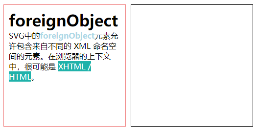
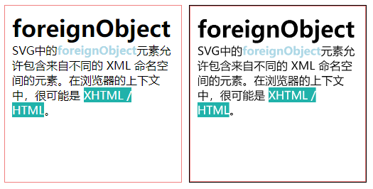
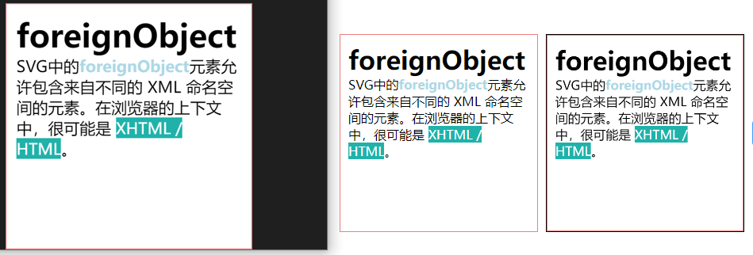

# 将DOM节点转换为图片

在这个案例里我们会实现将页面中的一部分DOM节点转换为图片并下载到本地的效果，原理如下：

1.利用`SVG`的[foreignObject](https://developer.mozilla.org/zh-CN/docs/Web/SVG/Element/foreignObject)元素能嵌入`html`元素的特性，将要导出的DOM节点嵌入到`SVG`中；

2.通过`img`元素渲染`svg`；

3.通过`canvas`绘制`img`，调用导出方法导出为`blob`或`data:url`数据；

4.通过`a`标签下载到本地；

首先来一段简单的`DOM`结构作为要导出的节点：

```html
<div
     id="el"
     style="
            border: 1px solid lightcoral;
            padding: 10px;
            width: 250px;
            height: 250px;
            background-color: #fff;
            "
     >
    <h1>foreignObject</h1>
    <p>
        SVG中的<span style="font-weight: bold; color: lightblue"
                   >foreignObject</span
        >元素允许包含来自不同的 XML 命名空间的元素。在浏览器的上下文中，很可能是
        <span style="background-color: lightseagreen; color: #fff"
              >XHTML / HTML</span
            >。
    </p>
</div>
```



然后我们将这个节点克隆一下，并拼接成`SVG`字符串：

```js
const el = document.getElementById('el')
// 获取节点大小
const rect = el.getBoundingClientRect()
// 克隆一份
const clone = el.cloneNode(true)
// 添加xhtml命名空间
clone.setAttribute('xmlns', 'http://www.w3.org/1999/xhtml')
// 拼接svg字符串
const svgStr = `<svg xmlns="http://www.w3.org/2000/svg" width="${rect.width}" height="${rect.height}">
	<foreignObject width="${rect.width}" height="${rect.height}">${clone.outerHTML}</foreignObject>
</svg>`
```

首先获取了一下要导出节点的大小，然后设置到`svg`节点上，接下来我们还给克隆的节点添加了命名空间的属性，这个是必要的，否则最后导出将是空白的，最后我们将被导出的DOM节点的`html`字符串拼接到`foreignObject`标签中即可。

接下来使用`Blob`对象将`svg`字符串转换为`blob`数据：

```js
const blob = new Blob([svgStr], {
    type: 'image/svg+xml'
})
```

因为`img`标签并不能直接渲染`blob`数据，所以我们还要把`blob`转换为`data:url`数据：

```js
const reader = new FileReader()
reader.onload = evt => {
    // evt.target.result
}
reader.readAsDataURL(blob)
```

现在就可以像渲染一张普通的图片到`canvas`上一样：

```js
const img = new Image()
img.onload = () => {
    ctx.drawImage(img, 0, 0)
}
img.src = svgUrl
```



可以看到已经在`canvas`中把`DOM`节点绘制出来了，最后让我们调用`canvas`的导出方法导出再下载就行了：

```js
const imgData = canvas.toDataURL()
downloadFile(imgData, '图片.png')

const downloadFile = (file, fileName) => {
    const a = document.createElement('a')
    a.href = file
    a.download = fileName
    a.click()
}
```



## 总结

本节介绍了一种非常简单的方式来将DOM节点转换为图片，当然，以上实现是非常粗糙的，实际情况中的DOM节点可能非常复杂，有各种情况需要处理，比如存在外联样式、伪元素、字体文件、图片等等，所以最好选择使用[html2canvas](https://github.com/niklasvh/html2canvas)、[dom-to-image-more](https://github.com/1904labs/dom-to-image-more)等库来实现。

本节示例地址：[domToImg](https://wanglin2.github.io/canvas-demos/#/domToImg)。