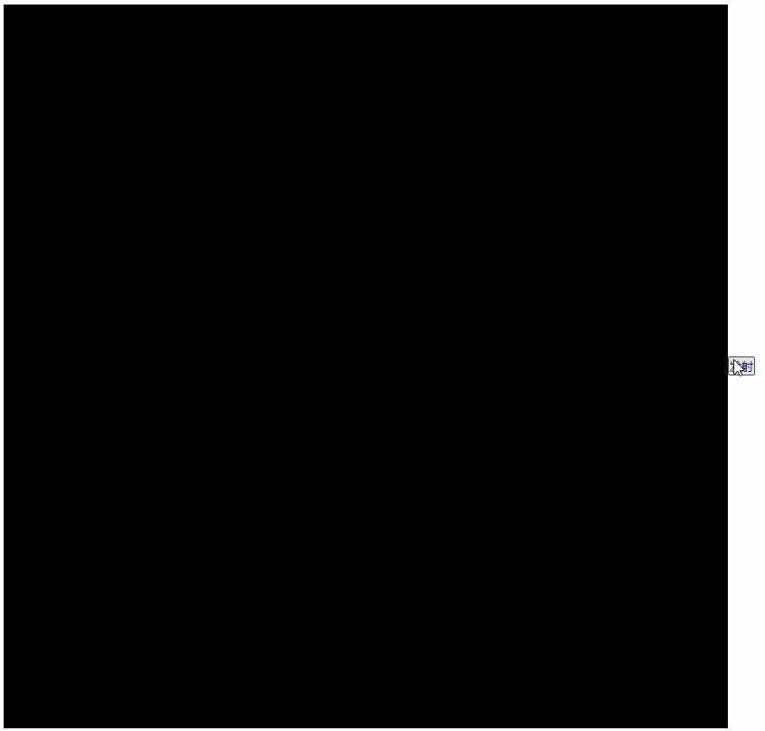

# 放一个烟花

本节我们来做一个浪漫的烟花效果。

## 基本框架

首先动画循环必不可少：

```js
// 动画循环
const draw = () => {
    // 使用半透明填充画布，形成拖尾效果
    ctx.fillStyle = 'rgba(0,0,0,0.2)'
    ctx.fillRect(0, 0, canvasWidth, canvasHeight)

    ctx.save()

    // ...动画更新逻辑

    ctx.restore()

    requestAnimationFrame(draw)
}
draw()
```

所有的动画都会在这个循环里进行更新。另外可以看到我们又使用了半透明的颜色来填充画布，因为烟花的火焰在天上移动肯定会形成拖尾效果，拖尾的长度可以通过透明度来调整，透明度约大，拖尾越长，反之越短，你可以根据自己的喜好来调整。

然后又因为烟花是从底部往上发射的，所以为了方便计算我们把画布的坐标系改成笛卡尔坐标系：

```js
const draw = () => {
    ctx.fillStyle = 'rgba(0,0,0,0.2)'
    ctx.fillRect(0, 0, canvasWidth, canvasHeight)

    ctx.save()
    
    // 修改坐标系
    ctx.translate(0, canvasHeight)
    ctx.scale(1, -1)

    // ...动画更新逻辑

    ctx.restore()

    requestAnimationFrame(draw)
}
```

最后再添加一个按钮，用来发射烟花：

```html
<button id="launcherBtn">发射</button>
```

```js
launcherBtn.addEventListener('click', () => {
    // ...
})
```

到这里，基本的框架就完成了。

## 烟花

一个基本的烟花包含两部分：发射器、爆炸器，爆炸器会随着发射器发射到天上，发射器运动停止后爆炸器爆炸形成绚烂的烟花，所以我们创建一个烟花类来管理这两个部分：

```js
// 烟花类
class Firework {
    constructor(opt = {}) {
        // 颜色，tinycolor是一个颜色工具库
        this.color = opt.color || tinycolor.random().toHexString()
        // 发射器
        this.launcher = null
        // 爆炸器
        this.explosive = null
        // 烟花状态：waiting（等待发射）、launching（发射中）、bursting（爆炸中）、end（烟花结束）
        this.status = 'waiting'
    }
}
```

`color`用来存储烟花的颜色，严格来说是主颜色，可能会添加少量的其他颜色，如果没有指定会随机生成一个颜色，这个颜色会作为发射器和爆炸器的颜色。

然后添加了两个属性用来存储发射器和爆炸器。

最后添加了一个状态字段用来指示烟花当前所处的阶段。

接下来添加几个方法：

```js
class Firework {
    // 发射
    launch() {}

    // 爆炸
    burst() {}

    // 更新
    update() {}
}
```

一个发射方法一个爆炸方法，`update`方法用来更新动画，会在动画循环里进行调用：

```js
 // 烟花列表
  const fireworkList = []
  
  const draw = () => {
  	// ...
    ctx.save()
    // 修改坐标系
    // ...

    fireworkList.forEach(firework => {
      firework.update()
    })
      
    ctx.restore()
    requestAnimationFrame(draw)
  }
```

定义了一个数组用来存放烟花列表，因为同一时间可能发射了多个烟花，然后在动画循环里遍历这个数组调用烟花的更新方法更新烟花动画。

当我们点击发射按钮时，只要新建一个烟花类，添加到烟花数组里，然后调用烟花的发射方法就可以了：

```js
launcherBtn.addEventListener('click', () => {
    const firework = new Firework()
    fireworkList.push(firework)
    firework.launch()
})
```

## 发射

发射就是火药被发射到天上，我们使用一个圆形来代表火药，填充颜色就是烟花的颜色，火药上天是一个先加速后减速的过程，如果你数学和物理学的比较好，可以自己来计算这个速度和加速度，这里我们直接使用前面章节所介绍的缓动函数，因此还需要定义发射器的起始位置、结束位置、发射持续时间等等属性。那么一个基本的发射器类如下：

```js
// 发射器类
class Launcher {
    constructor(opt = {}) {
        // 所属的烟花实例
        this.firework = opt.firework
        // 颜色
        this.color = opt.color
        // 初始位置
        this.x = opt.x || canvasWidth * getRandom(0.2, 0.8)
        this.y = opt.y || 0
        // 目标位置
        this.ty = canvasHeight * getRandom(0.6, 0.8)
        // 半径
        this.radius = opt.radius || getRandom(2, 5)
        // 发射的持续时间
        this.duration = opt.duration || getRandom(2000, 3500)
        // 发射时的时间
        this.startTime = 0
    }
}
```

各种数值都设置为一定范围内的随机值，接下来是对应的方法：

```js
class Launcher {
    start() {
        this.startTime = Date.now()
    }

    update() {
        const x = this.x
        let y = easingFunctions.easeOutCubic(
            Date.now() - this.startTime,
            this.y,
            this.ty - this.y,
            this.duration
        )
        y = Math.min(y, this.ty)
        this.draw(x, y)
        return {
            x,
            y,
            isEnd: y >= this.ty //返回true代表发射结束
        }
    }

    draw(x, y) {
        // 外圆，烟花的颜色
        drawCircle({
            x: x,
            y: y,
            radius: this.radius,
            color: this.color
        })
        // 内圆，白色
        drawCircle({
            x: x,
            y: y,
            radius: this.radius / 2,
            color: '#fff'
        })
    }
}
```

`start`方法里记录发射时的时间。

`update`方法用于更新动画，使用了`easeOutCubic`缓动函数来实现逐渐减速的动画效果，并且会返回一个对象，里面保存了当前发射器的位置，因为后续的动画可能会依赖这个位置，以及一个发射是否结束的标志，烟花类可以根据这个标志判断是否进入爆炸阶段。

`draw`方法用于绘制发射器，可以看到我们绘制了两个圆，一个大圆填充的是烟花的颜色，另外还在大圆上面绘制了一个半径一半的小圆，填充为白色，这样会显示出发射器中心比较亮的效果。

考虑到绘制圆是一个很通用的逻辑，所以我们提取成了一个公共函数`drawCircle`：

```js
const drawCircle = ({ x, y, radius, color }) => {
    ctx.save()
    ctx.beginPath()
    ctx.arc(x, y, radius, 0, Math.PI * 2)
    ctx.fillStyle = color
    ctx.fill()
    ctx.restore()
}
```

接下来完善一下烟花类，加上发射和更新的逻辑：

```js
class Firework {
    // 发射
    launch() {
        this.launcher = new Launcher({
            firework: this,
            color: this.color
        })
        this.launcher.start()
        this.status = 'launching'
    }

    // 更新
    update() {
        if (this.status === 'launching') {
            const res = this.launcher.update()
            if (res.isEnd) {
                this.status = 'bursting'
                this.burst(res)
            }
        }
    }
}
```

在`launch`方法里创建了一个发射器实例，然后调用了发射器的`start`方法，并且将当前状态设置为`launching`，代表发射中。

在`update`方法里判断当前状态是否是发射中，是的话就调用发射器的更新方法，并且根据返回值判断发射器是否发射结束，结束了就更新状态为`bursting`，并开启爆炸，当然爆炸的逻辑我们还没写。

现在点击发射按钮应该就能看到发射效果了：



我们设想的中心最亮、拖尾效果都有了，但是最后阶段过于清晰明亮了，理论上来说此时应该已经快消失了才对，所以我们需要给发射器加上透明度的变化：

```js
class Launcher {
    update() {
        // ...
        y = Math.min(y, this.ty)
        // 透明度变小
        const opacity = 1 - 1 * (y / this.ty)
        if (opacity < 0) opacity = 0
        this.draw(x, y, opacity)
        // ...
    }

    draw(x, y, opacity) {
        drawCircle({
            opacity: opacity,
        })
        drawCircle({
            opacity: opacity,
        })
    }
}

const drawCircle = ({ opacity = 1, x, y, radius, color, opacity = 1 }) => {
    ctx.save()
    ctx.globalAlpha = opacity
    // ...
}
```

我们让透明度随着动画的进度逐渐减小，另外因为`y`有可能会大于`ty`，所以透明度可能计算出小数，所以要判断一下：


可以看到现在效果好了很多，但还是不够，实际上发射器划过的地方或多或少都会留下一些碎片，我们称之为痕迹碎片，现在划过不留痕，显然不够合理，痕迹碎片我们也用圆形来表示，给它一个初始位置，然后就随着重力下落，颜色的话跟随烟花的颜色，碎片透明度肯定不会太高，所以给一个小一点的随机数，最重要的是一会就会消失，所以给一个短一点的生存时间，时间到了就让它消失，也就是不再绘制它。这样我们的痕迹碎片类如下：

```js
// 痕迹碎片类
class Debris {
    constructor(opt = {}) {
        // 颜色
        this.color = opt.color || '#fff'
        // 透明度
        this.opacity = getRandom(0.1, 0.5)
        // 半径
        this.radius = 1
        // 存在时间
        this.time = getRandom(0.5, 1)
        // 加速度，px/s2
        this.g = opt.g || 0.98
        // 位置
        this.x = opt.x
        this.y = opt.y
        // 创建的时间
        this.startTime = 0
    }
}
```

重力加速度默认为`0.98px/s2`，接下来是它的开始及更新方法：

```js
class Debris {
    start() {
        this.startTime = Date.now()
    }

    update() {
        const duration = (Date.now() - this.startTime) / 1000
        this.y -= this.g * duration
        drawCircle({
            opacity: this.opacity,
            x: this.x,
            y: this.y,
            radius: this.radius,
            color: this.color
        })
        return {
            x: this.x,
            y: this.y,
            isEnd: duration > this.time
        }
    }
}
```

基本框架和前面的是一样的，`start`方法记录开始时间，`update`方法更新及绘制，`y`坐标会随着重力逐渐减小，代表下落，使用的是自由落体的公式：

```
v = gt // v：当前的速度、g：重力加速度、t：运动以来持续的时间
```

最后当时间超过了该碎片的生存时间就返回`true`，代表碎片消失了。

接下来要做的就是在发射器发射的过程中随机掉落一些痕迹碎片，但是有一个问题，这个碎片存储在烟花类上，还是发射器类上呢，其实都可以，但是存储在烟花类上会更好一点，因为碎片和发射器其实并没有强关联，有可能发射器已经消失了，但是碎片还没有，并且后面爆炸时也会产生痕迹碎片，所以一起保存到烟花类上会更方便。

```js
class Launcher {
    update() {
        // ...
        this.draw(x, y, opacity)
        // 添加痕迹碎片
        if (Math.random() > 0.7 && opacity >= 0.1) {
            this.firework.addDebris({
                x: x + getRandom(-2, 2),// x坐标添加一段随机量
                y
            })
        }
        // ...
    }
}
```

使用随机数来实现随机掉落，另外当发射器透明度小于`0.1`就不再掉落了，因为此时速度已经很慢，位移很小，如果继续掉落同一位置会聚集很多碎片，不是很好看。另外还给`x`坐标添加了一点随机量，否则碎片都在同一条直线上不够自然。

接着在烟花类上增加添加和更新碎片的方法：

```js
class Firework {
    constructor(opt = {}) {
        // ...
        // 痕迹碎片列表
        this.debrisList = []
    }

    // 添加痕迹碎片
    addDebris(opt = {}) {
        const debris = new Debris({
            ...opt,
        	color: opt.color || this.color
        })
        debris.start()
        this.debrisList.push(debris)
    }

    // 更新痕迹碎片
    updateDebris() {
        const list = [...this.debrisList]
        list.forEach(debris => {
            const res = debris.update()
            // 如果该痕迹碎片已经消失，那么需要从列表里删除
            if (res.isEnd) {
                deleteFromList(this.debrisList, debris)
            }
        })
    }
}

// 从数组里移除指定项
const deleteFromList = (list, target) => {
    const index = list.findIndex(item => {
        return item === target
    })
    list.splice(index, 1)
}
```

首先新增了一个数组来保存痕迹碎片，然后就是碎片实例的创建、启动、收集以及更新，如果某个碎片已经消失了，那么从碎片列表里把它删除。

最后在烟花的更新方法里调用痕迹碎片的更新方法即可：

```js
class Firework {
    update() {
        // ...
        // 更新痕迹碎片
        this.updateDebris()
    }
}
```

现在再来看一下效果：


可以看到效果还是很不错的，发射器部分到这里就结束了，接下来就是爆炸效果了。

## 爆炸

爆炸其实是很多碎片从同一个初始点向四周运动，这个碎片和前面的痕迹碎片有一点不一样，前面的痕迹碎片只有`y`方向的速度，这里的碎片`x`和`y`方向都存在速度，另外也存在一些特有的功能，所以我们会新增一个爆炸碎片类，以及一个用来管理碎片类的爆炸器类，先看爆炸碎片类：

```js
// 爆炸碎片类
class ExplosiveDebris {
    constructor(opt) {
        this.firework = opt.firework
        this.x = opt.x
        this.y = opt.y
        this.color = Math.random() > 0.2 ? opt.color : '#fff'
        this.radius = opt.radius || 2
        this.angle = getRandom(0, 2 * Math.PI)
        this.speed = opt.speed || getRandom(0.1, 4)
        this.vx = Math.cos(this.angle) * this.speed
        this.vy = Math.sin(this.angle) * this.speed
        this.g = opt.g || 0.98
        this.time = getRandom(0.5, 1)
        this.startTime = 0
    }
}
```

字段比较多，但是基本上和前面的痕迹碎片类差不多，主要是多了一个`angle`角度，因为我们说了爆炸碎片是从同一个点向四周发散的，也就是360度，所以我们随机一个角度值， 然后再给它一个随机的速度，速度最大值和最小值相差的比较大，这样才能达到从圆心到最外层都分布了碎片的效果，否则所有碎片都接近的速度，最后就是一个圆环运动的效果了。

有了角度和速度就可以根据三角函数计算出水平和垂直方向的速度。

同样，我们还设置了碎片的重力加速度默认为`0.98px/s2`、生存时间为一个比较短的时间。

接下来是碎片的开始以及更新方法：

```js
class ExplosiveDebris {
    start() {
        this.startTime = Date.now()
    }

    update() {
        // 更新位置
        const duration = (Date.now() - this.startTime) / 1000
        const vy = this.vy - this.g * duration
        this.x += this.vx
        this.y += vy
        // 更新透明度
        const progress = duration / this.time
        let opacity = progress > 0.7 ? 1 - 1 * progress : 1
        if (opacity < 0) opacity = 0
        // 绘制
        drawCircle({
            x: this.x,
            y: this.y,
            color: this.color,
            radius: this.radius,
            opacity: opacity
        })
        return {
            x: this.x,
            y: this.y,
            isEnd: progress >= 1
        }
    }
}
```

`start`方法依旧只记录一个开始时间。

`update`方法会更新碎片的位置，以及绘制碎片。水平位置只根据水平速度更新，垂直位置会叠加一个重力加速度，公式如下：

```js
v = v0 + gt
```

`v0`代表初始速度，`g`代表重力加速度，`t`代表运动开始以来持续的时间。

这里的透明度设置和之前的碎片不一样，我们设置为当碎片已经走过了生命的`70%`以后才开始应用透明度属性，这是考虑到爆炸的时候碎片是非常亮的，没有必要一开始就加上透明度。

爆炸碎片类到这里就结束了，其实也很简单，接下来是管理爆炸碎片的爆炸器类：

```js
class Explosive {
    constructor(opt) {
      this.firework = opt.firework
      this.x = opt.x
      this.y = opt.y
      this.color = opt.color
      // 爆炸碎片数量
      this.debrisNum = opt.debrisNum || getRandom(50, 400)
      // 爆炸碎片列表
      this.debrisList = []
    }
}
```

定义了爆炸器的初始位置、颜色，以及爆炸碎片的数量，碎片实例会存储到`debrisList`数组里。

同样还是开始以及更新的方法：

```js
class Explosive {
    start(debrisNum, opt = {}) {
        // 碎片数量、初始位置没有特别指定则使用爆炸器的数据
        const num = debrisNum || this.debrisNum
        opt.x = opt.x || this.x
        opt.y = opt.y || this.y
        // 创建指定数量的爆炸碎片
        for (let i = 0; i < num; i++) {
            const explosiveDebris = new ExplosiveDebris({
                firework: this.firework,
                color: this.color,
                ...opt
            })
            explosiveDebris.start()
            this.debrisList.push(explosiveDebris)
        }
    }

    update() {
        const list = [...this.debrisList]
        list.forEach(debris => {
            const res = debris.update()
            if (res.isEnd) {
                deleteFromList(this.debrisList, debris)
            }
        })
        return {
            isEnd: list.length <= 0
        }
    }
}
```

`start`方法里主要是创建指定数量的碎片实例，并且调用碎片的开始方法，以及收集到碎片数组里。

`update`方法用来更新碎片动画，如果某个碎片消失了就从数组里删除，当所有碎片都消失了，代表这个爆炸器动画全部结束。

爆炸器和爆炸碎片都有了，接下来就可以在烟花类里使用了：

```js
// 烟花类
class Firework {
    // 爆炸
    burst({ x, y }) {
        this.explosive = new Explosive({
            firework: this,
            x,
            y,
            color: this.color
        })
        this.explosive.start()
    }

    // 更新
    update() {
        if (this.status === 'launching') {
            const res = this.launcher.update()
            if (res.isEnd) {
                this.status = 'bursting'
                this.burst(res)
            }
        } else if (this.status === 'bursting') {
            const res = this.explosive.update()
            if (res.isEnd) {
                this.status = 'end'
            }
        }
        // ...
    }
}
```

首先在爆炸方法里创建了一个爆炸器的实例，传入了发射器最后位置坐标，以及烟花的颜色，然后调用开始方法即可。

在更新方法里添加了一个`bursting`状态的分支，调用爆炸器的更新方法，当爆炸器动画结束，会设置烟花状态为`end`，代表这个烟花放完了。

现在看一下效果：


已经挺像那么回事了，一个最简单的烟花到这里其实就已经完成了，不过我们还可以再继续完善一下。

### 痕迹碎片

爆炸碎片划过地方肯定也会留下一些痕迹，我们可以通过创建痕迹碎片来实现：

```js
// 爆炸碎片类
class ExplosiveDebris {
    constructor(opt) {
        // 痕迹碎片数量
        this.debrisCount = opt.debrisCount || 3
    }

    update() {
        // ...
        // 添加痕迹碎片
        if (this.debrisCount > 0 && Math.random() > 0.8) {
            this.debrisCount--
            this.firework.addDebris({
                x: this.x + getRandom(-2, 2),
                y: this.y + getRandom(-2, 2),
                color: this.color,
                radius: 0.5,
                g: 0.1
            })
        }
        return {
            x: this.x,
            y: this.y,
            isEnd: progress >= 1
        }
    }
}
```

新增了一个`debrisCount`来设置爆炸碎片能产生的痕迹碎片数量，为什么要限制呢，主要是因为爆炸碎片数量可能已经比较大，如果某个爆炸碎片继续产生很多的痕迹碎片，那么痕迹碎片的数量可能会非常庞大，会对动画造成卡顿，所以通过限制数量来使动画不至于太卡。

痕迹碎片的`x`和`y`坐标都添加了一定的随机值，另外半径和重力都减小了，否则痕迹碎片会喧宾夺主。


### 二次爆炸

二次爆炸也就是爆炸的碎片还会再产生一次爆炸，一般在爆炸碎片消失的瞬间进行，这个实现其实也很简单，只要在爆炸碎片消失的位置再创建一些爆炸碎片进行爆炸即可：

```js
// 爆炸器类
class Explosive {
    constructor(opt) {
        // ...
        // 是否要二次爆炸
        this.secondBurst = opt.secondBurst || this.debrisNum <= 100
        // 是否是第一次爆炸
        this.isFirstBurst = true
    }
}
```

给爆炸器类新增了两个属性，一个代表是否要进行二次爆炸，默认当爆炸碎片数量小于100时进行，另一个代表是否是第一次爆炸，主要是传递给爆炸碎片类，用于判断该碎片是否需要二次爆炸的行为。

```js
// 爆炸器类
class Explosive {
    start(debrisNum, opt = {}) {
        // ...
        opt.secondBurst = this.secondBurst && this.isFirstBurst
        for (let i = 0; i < num; i++) {
            // ...
        }
        this.isFirstBurst = false
    }
    
    update() {
        list.forEach(debris => {
            if (res.isEnd) {
                // 二次爆炸
                if (debris.secondBurst) {
                    this.start(5, {
                        x: res.x,
                        y: res.y,
                        speed: 1
                    })
                }
            }
        })
        return {
            isEnd: list.length <= 0
        }
    }
}

// 爆炸碎片类
class ExplosiveDebris {
    constructor(opt) {
        // ...
        // 是否要进行二次爆炸
        this.secondBurst = opt.secondBurst || false
    }
}
```

我们二次爆炸也是通过调用`start`方法完成的，只要指定二次爆炸碎片的初始位置为爆炸碎片的消失位置即可，二次爆炸的碎片数量和速度都设置的非常小，否则就跟正常的爆炸没有区别了。

在创建爆炸碎片实例时会传入该碎片是否要二次爆炸的设置，主要是根据是否是第一次爆炸来设置，如果你想进行三次爆炸，那么也阔以设置成一个计数器，一定要记得更新标志或计数器，否则会产生死循环。


到这里，一个相对完整的烟花就完成了，接下来，享受自己的烟花吧。

## 总结

本节我们从头实现了一个简单的烟花效果，需要说明的是其中用到了很多魔法数字，也就是各种数值、范围，其实都来源于测试，你完全可以修改它们查看对应的效果，另外你也可以在目前烟花的基础上继续实现更多的烟花效果。

本节示例：[firework](https://wanglin2.github.io/canvas-demos/#/firework)。


