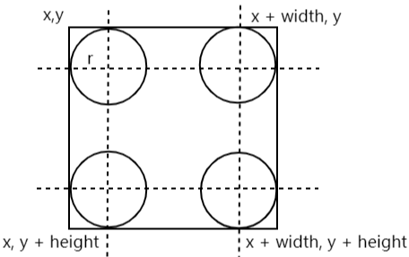
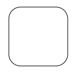
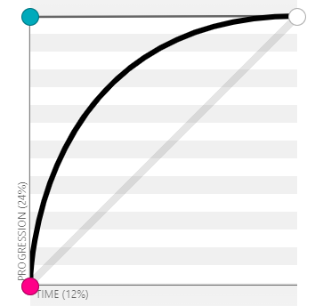
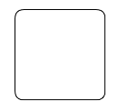
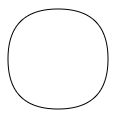
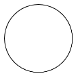

# 绘制一个圆角矩形

在HTML里我们可以使用`css`的`border-radius`属性轻松实现一个圆角矩形，但是在`canvas`中却没有现成的方法，虽然提供了绘制矩形的方法，但是并不能接收参数来创建圆角。

圆角其实就是圆弧，也是曲线，所以可以使用绘制圆弧路径的方法，也可以使用绘制贝塞尔曲线路径的方法。我们会分别用这两种方法来实现圆角，不过在此先问大家一个问题，圆角的大小具体指的是什么？

没错，其实就是圆角所在圆的半径大小，所以一个圆角也就是一个四分之一大小的圆弧。除了四个圆弧，剩下的就是四段线段，无论用哪种方法，绘制线段的逻辑都是一样的，所以可以先写个基本的框架：

```js
const createRoundedRect = (x, y, width, height, borderRadius) => {
    ctx.beginPath()
    // 上
    ctx.moveTo(x + borderRadius, y)
    ctx.lineTo(x + width - borderRadius, y)

    // 右
    // 圆角1
    ctx.lineTo(x + width, y + height - borderRadius)

    // 下
    // 圆角2
    ctx.lineTo(x + borderRadius, y + height)

    // 左
    // 圆角3
    ctx.lineTo(x, y + borderRadius)
    
    // 圆角4
    
    ctx.stroke()
}
```

注释部分就是需要我们使用弧线连接的部分。

## 使用arc方法

`arc`方法需要传递圆的中心点、半径、起止角度。半径就是圆角大小，中心点其实就是下面四个圆的中心点，在四个角坐标的基础上加减圆角大小即可得到：



从上图中也可以很清晰的看出每个圆角弧线的起止角度，比如右下角的圆弧，起始点在`x`轴正方向，那么为`0`弧度，而终点在y轴正方向，为`Math.PI / 2`弧度。

那么我们就可以补充如下代码：

```js
const createRoundedRect = (x, y, width, height, borderRadius) => {
    ctx.beginPath()
    // 上
    ctx.moveTo(x + borderRadius, y)
    ctx.lineTo(x + width - borderRadius, y)

    // 右
    ctx.arc(x + width - borderRadius, y + borderRadius, borderRadius, 3 * Math.PI / 2, 0)
    ctx.lineTo(x + width, y + height - borderRadius)

    // 下
    ctx.arc(x + width - borderRadius, y + height - borderRadius, borderRadius, 0, Math.PI / 2)
    ctx.lineTo(x + borderRadius, y + height)

    // 左
    ctx.arc(x + borderRadius, y + height - borderRadius, borderRadius, Math.PI / 2, Math.PI)
    ctx.lineTo(x, y + borderRadius)

    ctx.arc(x + borderRadius, y + borderRadius, borderRadius, Math.PI, 3 * Math.PI / 2)

    ctx.stroke()
}
```



## 使用quadraticCurveTo方法

绘制圆弧使用二次贝塞尔曲线就可以了，它需要一个控制点和终点，终点很简单，关键是控制点怎么计算，你可以通过数学公式来计算，当然更简单的方法是直接在这个网站是进行尝试：[https://cubic-bezier.com](https://cubic-bezier.com/#.01,-0.02,0,1)，你可以把一个控制点拖回起止点，然后只拖拽另一个控制点来查看二次贝塞尔曲线控制点的效果，经过简单的尝试你应该会发现控制点在这个位置会形成一段圆弧：



实际上四段圆弧的四个控制点分别就是矩形的四个顶点，那么就很容易写出下面的代码了：

```js
function createRoundedRect2(x, y, width, height, borderRadius) {
    ctx.beginPath()
    // 上
    ctx.moveTo(x + borderRadius, y)
    ctx.lineTo(x + width - borderRadius, y)

    // 右
    ctx.quadraticCurveTo(x + width, y, x + width, y + borderRadius)
    ctx.lineTo(x + width, y + height - borderRadius)

    // 下
    ctx.quadraticCurveTo(x + width, y + height, x + width - borderRadius, y + height)
    ctx.lineTo(x + borderRadius, y + height)

    // 左
    ctx.quadraticCurveTo(x, y + height, x, y + height - borderRadius)
    ctx.lineTo(x, y + borderRadius)

    ctx.quadraticCurveTo(x, y, x + borderRadius, y)

    ctx.stroke()
}
```



当把矩形宽高设置为相同的大小，再把圆角大小设置为宽高的一半，按理说可以得到一个正圆：



但实际上只是近似的，这是因为我们用二次贝塞尔曲线绘制出来的并不是完美的四分之一圆角，如果你想要得到绝对的正圆，那么可以使用第一种绘制圆角的方法：



## 总结

本节我们使用了两种方式来实现圆角矩形，你可以根据实际需求进行选择。

本节示例地址：[roundedRect](https://wanglin2.github.io/canvas-demos/#/roundedRect)。