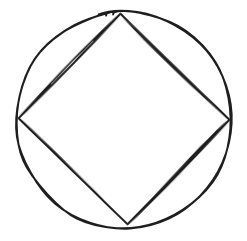
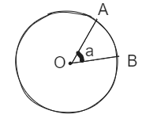
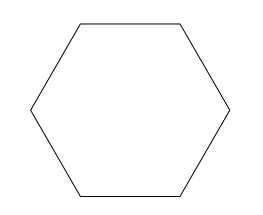
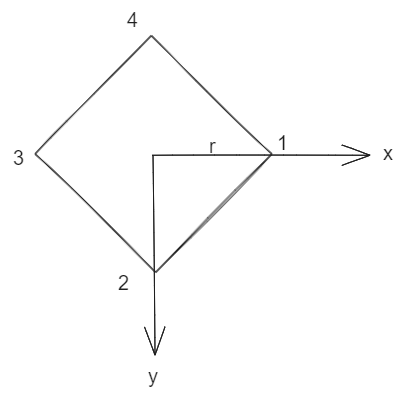
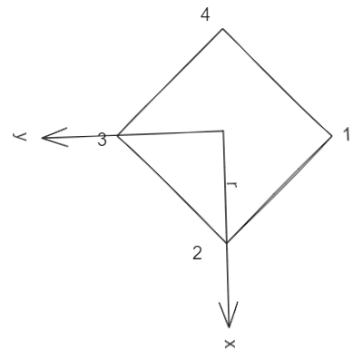
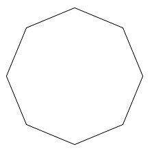

# 绘制一个正多边形

每一个正多边形都有一个外接圆:



给定圆的中心点坐标和半径，可以绘制出任意的正多边形，本节我们会使用两种方式来实现正多边形的绘制。

## 通过三角函数

假设AB为圆上的一段圆弧，那么AB两端会和圆心形成两条线段，这两条线段的夹角称为圆弧AB的圆心角：




对于正多边形来说，每条边也都对应着一段圆弧，因为每条边都相等，所以圆弧也相等，那么也意味着它们的圆心角也相等：


对于正N边形来说，圆心角为：

```js
const a = Math.PI * 2 / n
```

角度知道了，顶点到圆心的距离就是半径也是已知的，那么通过三角函数很容易计算出`dx`和`dy`：

```js
const dx = Math.cos(a) * r
const dy = Math.sin(a) * r
```

那么加上圆心的坐标就能得到顶点的坐标：

```js
const tx = x + dx
const ty = y + dy
```

不同的顶点，只是角度不一样而已，通过一个循环就能计算出所有顶点，最终实现如下：

```js
const drawRegularPolygon = (n, x, y, r) => {
    ctx.beginPath()
    const a = (Math.PI * 2) / n
    for (let i = 0; i < n; i++) {
        const dx = Math.cos(a * i) * r
        const dy = Math.sin(a * i) * r
        const tx = x + dx
        const ty = y + dy
        ctx.lineTo(tx, ty)
    }
    ctx.closePath()
    ctx.stroke()
}
drawRegularPolygon(6, 200, 200, 100)
```



## 通过变换

使用变换我们完全不需要计算每个顶点的坐标，我们的任务就是修改坐标系，剩下的事情交给`canvas`就行了。

首先我们把画布的原点移动到圆心的位置，此时坐标系如下：



对于第1个顶点，`[r, 0]`就是它的坐标，所以直接使用`moveTo(r, 0)`移动过去就行了。

那么第2个顶点呢，很简单，我们把坐标系顺时针旋转90度就行了（如果是其他多边形，移动对应的圆心角度数）：



你会发现，对于现在的坐标系来说，第2个点的坐标仍旧为`[r, 0]`，那么直接使用`lineTo(r, 0)`连接。

对于剩下的顶点也是一样的，所以我们只要一个循环就搞定了，实现代码如下：

```js
const drawRegularPolygon2 = (n, x, y, r) => {
    const a = (Math.PI * 2) / n
    ctx.beginPath()
    ctx.translate(x, y)
    for (let i = 0; i < n; i++) {
        if (i === 0) {
            ctx.moveTo(r, 0)
        } else {
            ctx.rotate(a)
            ctx.lineTo(r, 0)
        }
    }
    ctx.closePath()
    ctx.stroke()
}
drawRegularPolygon2(8, 250, 250, 100)
```

因为只循环到最后一个顶点，没有回到第一个顶点，所以要使用`closePath`来闭合路径。



## 总结

本节介绍了两种绘制正多边形的方式，可以发现巧用变换可以非常简单的实现复杂图形的绘制，当然正多边形相对来说比较简单，实际开发中可能更多是不规则的图形，但是原理其实是一样的，所以大家在绘制图形时都可以优先思考是否能使用变换的方式来绘制。

本节示例地址：[regularPolygon](https://wanglin2.github.io/canvas-demos/#/regularPolygon)。