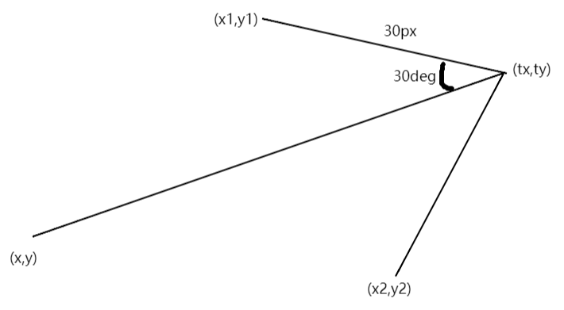
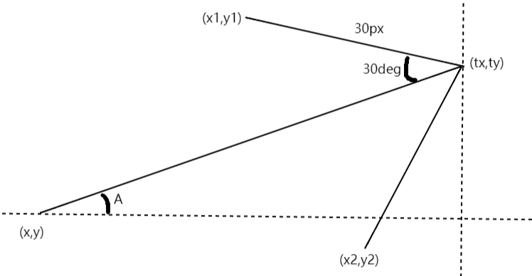
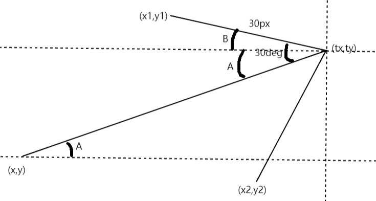
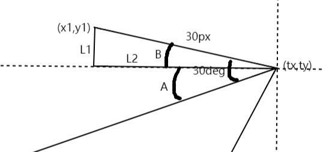
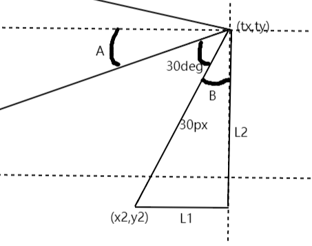
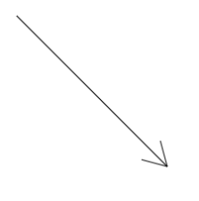

# 绘制一个箭头

## 绘制

箭头是一个很常见和常用的图形，实际上就是三根线段，一根长的，两根短的，短的和长的一个端点重合，短的分布在长的两侧，存在一定夹角。

长的线段很容易绘制，给定两个端点的坐标即可，关键是如何计算出另外两根小线段的坐标，夹角我们假设为`30度`，短的线段长度假设为`30px`：

```js
const l = 30
const deg = 30
```




如图所示，已知长线段的两个端点坐标为：`(x,y)`、`(tx,ty)`，两根短的线段有一个端点是和长线段`(tx,ty)`重合的，所以我们只要求出`(x1,y1)`和`(x2,y2)`即可。

先来看`(x1,y1)`：



首先我们可以使用`Math.atan2`函数计算出长线段和水平线的夹角`A`，`atan2`函数可以计算任意一个点和原点的连线与`X`轴正半轴的夹角大小，我们可以把长线段的端点`(x,y)`当做原点，那么`(tx,ty)`对应的坐标就是`(tx-x, ty-y)`，那么可以求出夹角`A`为：

```js
const A = radToDeg(Math.atan2(ty - y, tx - x))// atan2计算出来为弧度，我们把它转成角度
```

那么长线段另一侧与`X`轴的夹角也是`A`：



已知短线段和长线段的夹角为`30度`，那么两者相减就可以计算出短线段和`X`轴的夹角`B`：

```js
const B = deg - A
```

箭头线段作为斜边，可以和`X`轴形成一个直角三角形，然后使用勾股定理就可以计算出对边`L2`和邻边`L1`：




```js
const l1 = l * Math.sin(degToRad(B))// 角度要先转成弧度
const l2 = l * Math.cos(degToRad(B))
```

最后，我们将`tx`减去`L2`即可得到`x1`的坐标，`ty`加上`L1`即可得到`y1`的坐标：

```js
const x1 = tx - l2
const y1 = ty + l1
```

计算另一侧的`(x2,y2)`坐标也是类似，我们可以先计算出和`Y`轴的夹角，然后同样是勾股定理计算出对边和邻边，再使用`(tx,ty)`坐标相减：



角度`B`为：

```js
const B2 = 90 - A - deg
```

`(x2,y2)`坐标计算如下：

```js
const x2 = tx - l * Math.sin(degToRad(B2))// L1
const y2 = ty - l * Math.cos(degToRad(B2))// L2
```

坐标都计算出来了，接下来就是创建路径和描边了，完整代码如下：

```js
const drawArrow = (x, y, tx, ty, deg, l) => {
    const A = radToDeg(Math.atan2(ty - y, tx - x))
    const B = deg - A
    // 短线段1
    const l1 = l * Math.sin(degToRad(B))
    const l2 = l * Math.cos(degToRad(B))
    const x1 = tx - l2
    const y1 = ty + l1

    // 段线段2
    const B2 = 90 - A - deg
    const x2 = tx - l * Math.sin(degToRad(B2))
    const y2 = ty - l * Math.cos(degToRad(B2))

    // 创建路径
    ctx.beginPath()
    ctx.moveTo(x, y)
    ctx.lineTo(tx, ty)

    ctx.moveTo(tx, ty)
    ctx.lineTo(x1, y1)

    ctx.moveTo(tx, ty)
    ctx.lineTo(x2, y2)

    ctx.stroke()
}

drawArrow(30, 30, 200, 200, 30, 30)
```



## 总结

本节我们绘制了一个箭头形状，其中用到了简单的数学知识：三角函数，想要发挥`Canvas`的强大威力，良好的数学能力是必不可少的，除了三角函数，向量、矩阵等也是经常会用到的，所以如果这些都忘光了的朋友可以复习一下，老话还是说的有道理的，学好数理化，走遍天下都不怕。

本节示例地址：[arrow](https://wanglin2.github.io/canvas-demos/#/arrow)。