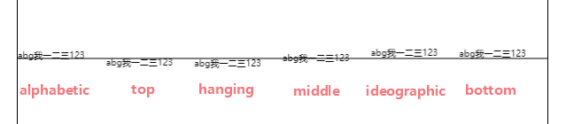

# 绘制文本

`canvas`提供了两个方法来绘制文本：`fillText`、`strokeText`，一个填充文本，一个描边文本，它们的参数都是一样的：

```js
text, x, y, maxWidth
```

分别表示要绘制的文本、绘制的坐标，第四个参数是可选的，提供一个宽度的最大值，也就是当文本的宽度超出了这个值，会通过缩小的方式来显示为这个宽度，一般不用它。

## 文本基线

接下来我们绘制个文本试试：

```js
ctx.fillText('Canvas实战', 0, 0)
```


你会发现文本跑到画布外了，这是为啥呢，明明我们是在`0,0`处绘制的，这其实是因为绘制的位置指定的是文本的基线位置，可以通过`textBaseline`属性来修改，它的默认值为`alphabetic`，代表文本基线是标准的字母基线，其他几个可选值为：

- `top`：文本基线在文本块的顶部
- `hanging`：文本基线是悬挂基线。(藏文和其他印度文字使用）
- `middle`：文本基线在文本块的中间
- `ideographic`：文字基线是表意字基线；如果字符本身超出了 `alphabetic` 基线，那么`ideograhpic` 基线位置在字符本身的底部(用于中文、日文和韩文)
- `bottom`：文本基线在文本块的底部。与 `ideographic` 基线的区别在于 `ideographic` 基线不需要考虑下行字母

`top`、`middle`、`bottom`三个相对容易理解，剩下的让人一头雾水，所以我们直接将它们绘制出来看看：

```js
// 水平线
ctx.beginPath()
ctx.moveTo(0, canvas.height / 2)
ctx.lineTo(canvas.width, canvas.height / 2)
ctx.stroke()

// 文本
;['alphabetic', 'top', 'hanging', 'middle', 'ideographic', 'bottom'].forEach(
    (item, index) => {
        ctx.textBaseline = item
        ctx.fillText('abg我一二三123', 100 * index, canvasHeight / 2)
    }
)
```



现在应该能一眼就看出它们的区别了，也能理解为什么最开始我们的文本跑到画布外了，实际开发中你可以根据你的需求选择合适的基线值。

## 字体样式

`canvas`也支持设置文本的字体、字号、斜体等等样式，但是它不像`css`一样支持设置单个属性，比如`font-family`、`font-size`等等，它只提供了一个综合属性`font`，规则和`css`的[font](https://developer.mozilla.org/zh-CN/docs/Web/CSS/font)属性是一样的，规则如下：


所以在`canvas`中设置字体样式是比较麻烦的，虽然我只想设置一个字体，但是字号却不能少，所以一般会写成一个函数来拼接：

```js
const getFont = ({
    fontSize = 16,
    fontFamily = '楷体, 楷体_GB2312, SimKai, STKaiti',
    fontWeight = '',
    fontStyle = ''
} = {}) => {
    return `${fontStyle} ${fontWeight} ${fontSize}px ${fontFamily}`
}
```

```js
ctx.font = getFont({
    fontStyle: 'italic',
    fontWeight: 'bold'
})
ctx.fillText('Canvas实战', 100, 100)
```


为什么没写`line-height`呢，因为行高属性对于`canvas`来说并没有意义，因为它本身不提供文本排版功能，它不像`HTML`中文本太长了会自动换行，在`canvas`中文本换行和每行文本的位置都需要我们自己来计算。

## 文本方向

文本默认是从左向右进行绘制，如果你想从右往左绘制的话那么可以通过设置`direction`属性来实现，它有如下几个值：

- `ltr`：文本方向从左向右
- `rtl`：文本方向从右向左
- `inherit`：继承自`canvas`或`document`标签

这个属性一般来说大家应该很少用。

## 文本对齐

可以通过`textAlign`属性来设置文本的对齐方式，它有如下几个值：

- `left`：文本左对齐
- `right`：文本右对齐
- `center`：文本居中对齐
- `start`：根据`direction`的设置来决定
- `end`：根据`direction`的设置来决定

需要注意的是，这个文本对齐和`CSS`的文本对齐是不一样的，`CSS`中的文本对齐是在当前容器中对齐，但是这个属性设置的是文本基于我们绘制的位置的`x`值来对齐的，并不是相对于画布：

```js
// textAlign默认为left
ctx.fillText('Canvas实战', 100, 100)

ctx.textAlign = 'center'
ctx.fillText('Canvas实战', 100, 120)

ctx.textAlign = 'right'
ctx.fillText('Canvas实战', 100, 140)
```


所以如果你想实现在画布的行中对齐，需要将`x`设置为画布的左中右三个位置。

# 文本测量

前面提到在`canvas`中实现文本换行需要自己来计算，那么肯定需要知道文本的尺寸信息，`canvas`提供了一个方法来获取：

```js
const textMetrics = ctx.measureText('文本')
```

因为文本的字体、字号等属性都会影响大小，所以需要先设置这些样式之后再调用该方法来进行测量。

返回的是一个[TextMetrics](https://developer.mozilla.org/zh-CN/docs/Web/API/TextMetrics)对象，包含很多属性，最常用的是`width`，也就是所测量文本的宽度，但是并没有一个`height`属性来不是文本高度，需要通过其他属性共同来计算，这里就不详细介绍每个属性了，直接给出宽度和高度的计算方法：

```js
// 获取宽度
textMetrics.width
textMetrics.actualBoundingBoxLeft + textMetrics.actualBoundingBoxRight
```

获取宽度有以上两种方法，最好使用第二种，因为在文本倾斜情况下第二种更准确。

```js
// 获取高度
textMetrics.actualBoundingBoxAscent + textMetrics.actualBoundingBoxDescent
textMetrics.fontBoundingBoxAscent + textMetrics.fontBoundingBoxDescent
```

获取高度也有两种方法，但是这两种是不一样的，如果你想要获取你传入的文本的实际高度，那么使用第一种，如果你想要获取当前字体中所有文本的最高值，那么可以使用第二种方法，那么问题来了，在计算换行的场景中，应该使用哪一种呢？

没错，应该使用第二种，如果使用第一种，可能随着该行文字的增加，高度会发生突变。

# 总结

本节我们了解了`canvas`中的文本绘制方法，以及如何获取文本的尺寸信息，下一节让我们来用所学的东西做一个简单的文本排版引擎。

本节示例地址：[text](https://wanglin2.github.io/canvas-demos/#/text)。