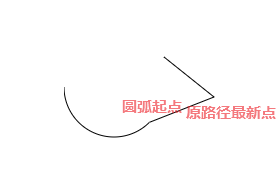
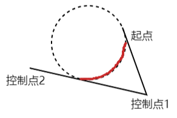
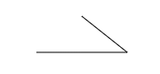
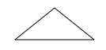
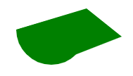
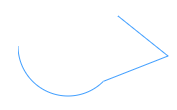
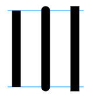
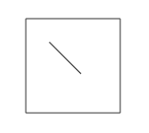
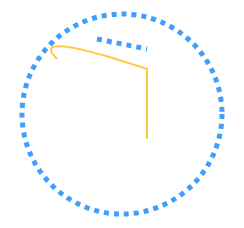

# 路径

## 创建路径

上一篇中提到了`Canvas`默认只提供了绘制矩形的方法，那么如果我们要绘制其他形状要怎么办呢，这就需要使用本篇要介绍的路径。

路径就是一组由直线段或曲线段组成的形状，举个例子，路径就像我们画画时先用铅笔勾勒出的要画的物体的形状，有了形状就可以使用其他色彩笔进行填充或描边。

要开始创建一段路径，需要先调用`beginPath`方法：

```js
ctx.beginPath()
```

然后调用`moveTo`方法将新创建的这段路径的起始点移到你想要的位置，就像你移动铅笔一样：

```js
ctx.moveTo(20, 20)
```

接下来，如果你要画一条直线，那么就调用`lineTo`方法：

```js
ctx.lineTo(30, 30)
```

这样就会从起点`[20,20]`创建一条到点`[30,30]`的路径，你可以继续调用任意次的`lineTo`方法绘制更多线段。

如果你想要紧接着创建一条曲线路径，那么可以使用二次或三次贝塞尔曲线。

二次贝塞尔曲线有一个控制点，可以通过如下方法在当前的路径中添加：

```js
ctx.quadraticCurveTo(cpx, cpy, x, y)
```

前两个参数代表控制点，后两个参数代表终点，而起点是当前路径上最后的点。

添加三次贝赛尔曲线路径的方法为：

```js
ctx.bezierCurveTo(cp1x, cp1y, cp2x, cp2y, x, y)
```

不同之处在于多了一个控制点。

除了曲线还可以创建圆弧路径，提供了两个方法，第一个是通过圆心和半径来创建的：

```js
ctx.arc(x, y, radius, startAngle, endAngle, anticlockwise)
```

第三、四个参数表示圆弧的起始和结束角度，从`x`轴正方向开始，单位为弧度，角度转弧度的公式如下：

```js
弧度 = (Math.PI / 180) * 角度
```

最后一个参数是可选的，布尔值，默认为`false`，代表顺时针创建圆弧，设为`true`，则为逆时针。

这段圆弧的起点会和原有路径最后的点相连：



第二个方法可能不太直观和常用，它是通过两个控制点及半径来创建圆弧：

```js
ctx.arcTo(x1, y1, x2, y2, radius)
```

起点同样是当前路径的最后的点，然后起点和控制点1会形成一条直线，控制1和控制点2也会形成一条直线，然后就可以得到一个和这两条直线相切的指定半径的圆，最后圆上面在这两条直线之间的圆弧就是我们得到的：



如图所示，创建出的就是红色部分的圆弧路径。

最后两个创建路径的方法是用于创建椭圆和矩形的，这里就一笔带过了：

```js
ctx.ellipse(x, y, radiusX, radiusY, rotation, startAngle, endAngle, anticlockwise)
ctx.rect(x, y, width, height)
```

和`beginPath`方法对应的还有一个`closePath`方法，如果你要绘制闭合的路径可以调用它，它会帮你把路径的最后一个点和第一个点相连：

```js
ctx.closePath()
```

没有调用`closePath`：

```js
ctx.beginPath()
ctx.moveTo(100, 20)
ctx.lineTo(150, 60)
ctx.lineTo(50, 60)
```



调用了`closePath`：

```js
// ...
ctx.closePath()
```



所以如果你不需要路径闭合，那么可以省略。

如果你想创建一条新的路径，那么直接再次调用`beginPath`即可，建议绘制和原有路径不相关的新路径时最好都通过`beginPath`方法开始新路径，否则你的新路径很可能和之前的路径相连着。

## 绘制路径

单纯的创建路径并不会在画布上渲染出任何可见的东西，想要图形可见需要调用填充或描边方法。

填充或描边都只针对当前路径，所以如果你想给不同的图形应用不同的样式，需要使用`beginPath`方法开启新的路径。

### 填充

填充路径可以使用`fill`方法：

```js
ctx.beginPath()
ctx.moveTo(100, 20)
ctx.lineTo(150, 60)
ctx.arc(50, 50, 50, Math.PI / 4, Math.PI)
ctx.closePath()

ctx.fillStyle = 'green'
ctx.fill()
```



即使没有手动调用`closePath`闭合路径，`fill`方法也是有效的，它会自动进行闭合，你可以试试把`ctx.closePath()`去掉。

### 描边

描边路径可以使用`stroke`方法：

```js
ctx.beginPath()
ctx.moveTo(100, 20)
ctx.lineTo(150, 60)
ctx.arc(50, 50, 50, Math.PI / 4, Math.PI)

ctx.strokeStyle = '#409eff'
ctx.stroke()
```



### 线段样式

除了前面涉及到的`strokeStyle`属性用于描边颜色外，还有其他几个属性可以控制描边的样式。

- 通过`lineWidth `属性可以设置描边的线宽。

- 通过`lineJoin `属性可以设置不同的线段连接处的样式，有三个可选值：`round`、`bevel`、`miter`，默认为`miter`。
- 通过`lineCap `属性可以设置线段末端的样式，也有三个可选值：`butt`、`round`、`square`，默认为`butt`。

- 通过`setLineDash`方法和`lineDashOffset `属性设置线段的虚线效果。

```js
ctx.strokeStyle = '#409eff'
ctx.lineWidth = 5
ctx.lineJoin = 'round'
ctx.lineCap = 'square'
ctx.setLineDash([5, 10])
ctx.stroke()
```


需要注意的是`lineCap`除`butt`外的另外两个属性都会在外绘制额外的形状：



所以如果虚线的间隙值设置的太小的话有可能会让它变回实线：

```js
ctx.lineCap = 'square'
ctx.setLineDash([5, 5])
```


## Path2D

前面我们创建路径都是通过`canvas`的上下文对象来直接创建的，这样创建的路径无法重用，你只能再次按顺序创建一遍，`Path2D`就是用来解决这个问题，我们通过调用`Path2D`的方法创建路径，然后就可以不断的调用填充或描边方法绘制这条路径。

`Path2D`是一个构造函数，所以需要先创建一个实例：

```js
const path = new Path2D()
```

接收一个参数，可以是另一个`Path2D`实例， 也可以是`SVG`的[路径](https://developer.mozilla.org/zh-CN/docs/Web/SVG/Tutorial/Paths)字符串。所以不但可以复用`canvas`的路径，还可以很轻松的直接复用`SVG`的路径。

然后前面介绍过的`moveTo`、`bezierCurveTo`、`arc`方法它都有，使用上也是完全一样，当然，还是有一点不同的：

1.没有`beginPath`方法，因为创建`Path2D`实例就相当于创建了一条新路径。

2.多了一个`addPath`方法，可以把其他`Path2D`路径添加到当前路径中。

```js
const p1 = new Path2D()
p1.moveTo(80, 80)
p1.lineTo(120, 120)

const p2 = new Path2D()
p2.rect(50, 50, 120, 120)

p1.addPath(p2)

ctx.stroke(p1)
```



## 状态保存和恢复

你可能会有这种需求，绘制第一个图形时，给它设置了一些填充或描边的样式，然后再绘制第二个图形时，你又想给它设置不同的样式，再绘制第三个图形时又想和第一个图形的样式一样，目前为止你需要这么做：

```js
ctx.beginPath()
ctx.moveTo(100, 50)
ctx.lineTo(150, 60)
ctx.strokeStyle = '#409eff'
ctx.lineWidth = 5
ctx.setLineDash([5, 5])
ctx.stroke()

ctx.beginPath()
ctx.moveTo(150, 150)
ctx.lineTo(150, 80)
ctx.quadraticCurveTo(30, 40, 60, 70)
ctx.strokeStyle = '#FFC942'
ctx.lineWidth = 2
ctx.setLineDash([])
ctx.stroke()

ctx.beginPath()
ctx.arc(125, 125, 100, 0, Math.PI * 2)
ctx.strokeStyle = '#409eff'
ctx.lineWidth = 5
ctx.setLineDash([5, 5])
ctx.stroke()
```



因为样式属性的设置会对后面所有的绘制操作都生效，所以你只能手动把之前的样式清除或修改，然后再设置或者恢复，上面只是几个图形，也许你还能接受，但是如果要绘制的图形数量更多，样式设置更加复杂，相信你很容易就迷失在这些状态中了，但是还好，`canvas`提供了两个方法用来帮我们保存状态和恢复状态，改写如下：

```js
ctx.beginPath()
ctx.moveTo(100, 50)
ctx.lineTo(150, 60)
ctx.strokeStyle = '#409eff'
ctx.lineWidth = 5
ctx.setLineDash([5, 5])
ctx.stroke()

ctx.save()// ++

ctx.beginPath()
ctx.moveTo(150, 150)
ctx.lineTo(150, 80)
ctx.quadraticCurveTo(30, 40, 60, 70)
ctx.strokeStyle = '#FFC942'
ctx.lineWidth = 2
ctx.setLineDash([])
ctx.stroke()

ctx.restore()// ++

ctx.beginPath()
ctx.arc(125, 125, 100, 0, Math.PI * 2)
ctx.stroke()
```

`save`方法会将画布当前的状态保存到栈中，无论你接下来设置了什么状态，在调用`restore`方法后都会恢复到上一次的状态，因为是通过栈来保存，所以可以嵌套：

```js
ctx.save()

// ...
ctx.save()

// ...
ctx.restore()

ctx.restore()
```

每次调用`restore`都会恢复到上一次的状态，也就是当前栈顶的状态。

建议每次在设置画布状态前都通过`save`方法来保存当前的状态。

## 总结

本节我们了解了一下路径的创建、绘制、重用以及状态的保存与恢复，现在你应该可以绘制出各种你想要的图形，并且使用各种样式对路径填充或描边，接下来会通过一些常见的实战案例来进一步加深了解。

本节示例地址：[path](https://wanglin2.github.io/canvas-demos/#/path)。